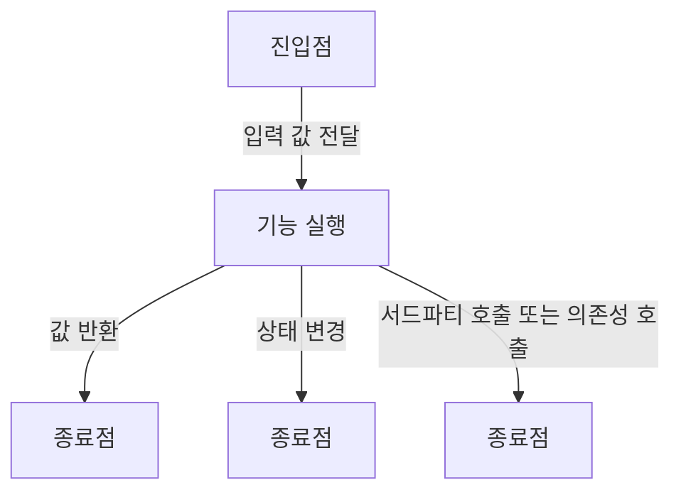

## Summary
- 단위 테스트는 진입점을 통해 작업 단위를 호출한 후 그 종료점을 확인하는 자동화된 코드를 의미하며 
여기서 말하는 작업 단위는 진입점의 호출부터 하나 이상의 종료점이다.
- 통합 테스트는 실제 실행에 영향을 주면서 현재 실행 환경 외부에 있는 의존성을 사용하는 테스트를 의미한다.
- 모든 테스트에서 중요한 속성은 가독성, 유지보수성, 신뢰성이다.

## Concept
### 테스트를 작성해야할 대상

- Subject(주제)
- System(시스템)
- Suite Under Test(테스트 대상)

### 단위 테스트에서의 단위

- 단위는 시스템 내 `작업 단위` 또는 `유스케이스`를 의미한다.
- 작업 단위에는 `항상` 시작과 끝이 있고 이를 각각 `진입점`과 `종료점`이라 한다.

### 진입점과 종료점

- 작업 단위를 외부 환경(테스트 코드 또는 실제 코드)에서 실행할 수 있는 `진입점`이 존재한다.
- 단순히 값을 반환하거나 어떤 상태를 변경 또는 서드파티 코드를 호출하는 등의 의미있는 작업을 하고 이런 동작들을 `종료점`이라고 한다.
- 서드파티 코드를 호출하는 종료점은 `의존성 호출`이라고도 한다.




### 의존성

- 의존성은 단위 테스트 중 외부에 주도권이 있어 온전히 제어할 수 없는 것을 의미한다.
- 의존성 예시
    - 파일에 무언가를 기록
    - 네트워크와 통신
    - 다른 팀이 관리하는 코드
    - 데이터베이스에 접근하는 행위
    - 오래 걸리는 계산 작업

### 좋은 테스트의 특징

- 작성자의 의도를 이해하기 쉬움
- 읽고 쓰기 쉬움
- 자동화할 수 있음
- 같은 조건에서 실행 결과는 항상 같음
- 의미있는 테스트여야 하고, 구체적인 결과를 제공하여 문제를 쉽게 파악하고 해결할 수 있음.
- 누구나 쉽게 실행할 수 있어야 함.
- 실패할 경우 무엇이 잘못되었는지 쉽게 알 수 있어야 함.

### 좋은 단위테스트의 특징

- **빠르게 실행되어야 함.**
- 테스트 환경을 일관되게 유지하고, 테스트 결과가 항상 예측 가능해야 함.
- 다른 테스트와 완전히 독립적으로 실행되어야 함.
- 시스템 파일, 네트워크, 데이터베이스가 없어도 메모리 내에서 실행되어야 함.
- 가능한 한 동기적인 흐름으로 실행되어야 함.

### 통합 테스트

- 통합 테스트는 좋은 단위테스트 조건 중 하나라도 충족하지 않는 모든 테스트를 의미한다.
- 통합 테스트는 다른 팀이 만든 모듈, 외부 API나 서비스, 네트워크, 데이터베이스, 스레드 등 `실제 의존성`을 완전히 제어할 수 없는 상태에서 작업 단위를 테스트 하는 것이다.

## Advantages
<span style="color:gray">발표 주제를 적용했을 때 얻을 수 있는 이점이나 해결할 수 있는 문제 상황들에 대해 설명합니다.</span>
## Disadvantages
<span style="color:gray">발표 주제를 적용했을 때 발생할 수 있는 side effect나 trade-off에 대해 설명합니다.</span>

## Wrap-up
- 단위 테스트는 작업 단위를 의존성에서 격리시킨다.
- 통합테스트는 실제 의존성을 사용한다.
- 잘 작성된 단위 테스트는 신뢰성이 높고 가독성이 좋아서 유지보수하기에 용이하다.

## 기억에 남는 것

- 좋은 단위 테스트 조건 중 테스트 환경을 일관되게 유지하라는 문장을 보면서 예전에 [jsdom을 사용하면서 노드환경과 브라우저환경에서 다르게 동작하는 문제가 있었다는 내용의 글](https://ui.toast.com/posts/ko_20220624)이 생각났다.
- 모든 테스트가 좋은 단위 테스트의 특성을 전부 만족하는 것은 사실상 불가능에 가깝다. 그렇기에 항상 모든 조건을 만족할 필요는 없다.
- 조건문이나 계산 같은 논리가 포함되지 않는 코드는 테스트하고자 하는 작업 단위에서 사용될 수는 있지만 직접 테스트할 필요는 없다.
- 종료점을 각각 분리해 테스트 검증 목표로 사용하는 것이 각 테스트끼리 영향을 주지 않고 더 읽기 쉬우며, 디버깅하기 쉽다고 이야기한다.

다음과 같이 isObject라는 assertion함수를 검증하기 위한 테스트 코드를 작성한다고 했을때는
```tsx
export const isObject = <T>(val: T): val is T =>
  isNonNull(val) && typeof val === 'object' && !isArray(val);
```

`isNonNull`와 `isArray`를 **별도로 명확하게 테스트하고**, `isObject`에서는 `isNonNull`와 `isArray`를 신뢰하는 방식으로 테스트를 작성하면 결과적으로 디버깅이 쉬워진다. 

- `isNonNull`이 **잘못 구현된 경우**, `isNonNull`의 테스트만 실패하고, `isObject`는 원인을 파악하기 쉬움.
- `isArray`이 **잘못 구현된 경우**, `isArray`의 테스트만 실패하고, `isObject`는 원인을 파악하기 쉬움.
- `isObject`가 잘못 구현된 경우, `isNonNull`과 `isArray` 에 관계없이 `isObject`의 테스트만 실패함.