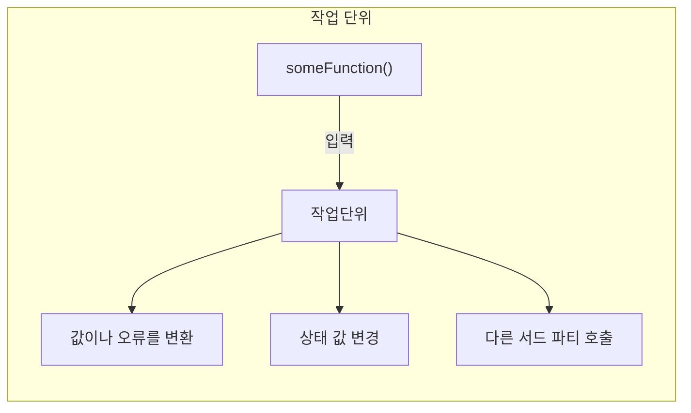

<!-- 단순한 책 내용만 정리하는 스터디에서 벗어나 자신의 생각을 정리하고, 그걸 바탕으로 실무에 적용할 수 있는 내용을 찾는 스터디가 되었으면 좋겠습니다. -->
<!-- 참고한 글 - https://tech.kakaopay.com/post/frontend-study-journey/ -->

> [!Note] > </br>ch1. 단위 테스트의 기초

## Summary

<!-- 한 줄 요약을 통해 발표자는 본인이 주제를 정확하게 이해했는지 점검하고, 스터디원들은 한 눈에 주제를 파악할 수 있습니다. -->

- 단위 테스트란
- 작업 단위 : 진입점과 종료점
- 좋은 단위 테스트의 특징
- vs TDD

## Concept

### 단위 테스트

컴퓨터 프로그래밍에서 특정 모듈이 의도된 대로 작동하는지 검증하는 절차</br>
작업 단위를 호출하고, 그 작업 단위의 최종 결과로서 하나의 특정 종료점을 테스트 목표로 삼는다.

### 작업 단위

- 단위 테스트에서 단위(unit)을 의미함
- 함수 ~ 여러가지 모듈까지 다양한 범위를 포함
- 작업 단위에는 시작과 끝이 존재하는데, 이를 **진입점**과 **종료점** 이라고 한다

> 진입점 : 작업 단위를 시작하는 public 함수, 기본적인 로직을 실행하는 시작점</br>
> 종료점 : 테스트로 검사할 수 있는 지점, 작업단위의 결과

```js
const sum = (numbers) => {
  // 함수의 선언 : **진입점**
  // 함수의 body : 작업 단위의 전체 or 일부
  const [a, b] = numbers.split(",");
  const result = parseInt(a) + parseInt(b);

  return result; // 함수의 출력(=실행 결과) : **종료점**
};
```

#### 다이어그램



### 종료점의 종류

- 반환 값이 있는 종료점
  - 진입점과 동일함
  - 함수가 undefined가 아닌 값을 반환
  - 테스트하기 가장 쉬운 타입
- 상태 값을 변경하는 종료점
  - 많은 작업이 필요하다(호출하고 확인, 재호출하며 확인)
- 서드 파티를 호출하는 종료점
  - 가장 많은 작업이 필요
  - 실행 주도권이 없음
  - 모의 객체를 만들어 테스트 결과를 임의로 조작

> => 가능한 모의 객체를 사용하는 테스트는 피하는 것이 좋다.</br>
> => 각 종료점 별도로 테스트를 만들고, 각 종료점 유형에 따라 다른 테스트 기법이 필요

<!-- 책을 바탕으로 발표 주제의 이론적 개념 및 필요한 배경 지식을 설명합니다. -->

### 프레임워크 없이 테스트코드 작성하기

- 테스트 프레임워크 없이도 충분히 테스트 코드를 작성할 수 있다.
  - check, assert 등 헬퍼 메서드를 만들어 재사용할 수도 있음.
  - node.js 에서 빌트인 함수로 assert 함수를 제공하기도 함
  - Jest 등의 프레임워크는 훨씬 범용적인 헬퍼 함수를 제공.

### 좋은 단위 테스트의 특징

**우선적으로 왜 좋은 테스트를 작성해야 하는지를 알고 있어야 한다**

1. 빠르게 실행되어야 함
2. 테스트 환경을 일관되게 유지, 결과가 예측 가능해야 함
3. 다른 테스트와 독립적으로 실행되어야 함
4. 메모리 내에서 실행되어야 함
5. 가능한 동기적 흐름을 지킨다

> => 가독성, 유지 보수성, 신뢰성

### vs TDD

TDD의 가장 큰 장점은 테스트 정확성을 검증하는 것</br>
=> 테스트가 실패하는 것을 먼저 확인하면 이후에 코드가 추가되거나 수정될 때 그 테스트가 기능을 정확히 검증할 수 있음

> but,
>
> - 테스트를 먼저 작성한다고 해서 가독성 좋고 유지 보수도 쉬운 테스트(=좋은 테스트)를 만들 수 있는 것은 아니다.
> - 좋은 테스트여도 TDD 의 장점까지 얻을 수 있는 것은 아니다.
> - 테스트를 먼저 작성하고, 그 테스트가 읽기 쉽고 유지 보수가 가능하다고 해서(=좋은 테스트) 좋은 설계를 바탕으로 코드를 만들었다는 것은 아니다.

## Advantages

<!-- (선택) 발표 주제를 적용했을 때 얻을 수 있는 이점이나 해결할 수 있는 문제 상황들에 대해 설명합니다. -->

## Disadvantages

<!-- (선택) 발표 주제를 적용했을 때 발생할 수 있는 side effect나 trade-off에 대해 설명합니다. -->

## Example Case

<!-- 발표 주제가 적용되어 있는 라이브러리, 실제 업무에 적용되어 있는 코드, 직접 만든 예시 코드, 자신의 느낀점 등을 첨부하여 이해를 돕습니다. -->

## Wrap-up

테스트 코드를 작성해야하는 이유와 함께 단위 테스트의 기본적인 지식 소개

<!-- 발표를 마무리하며 발표 주제를 다시 요약하고 정리합니다. -->
