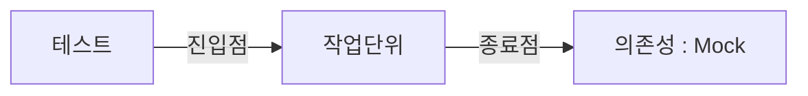
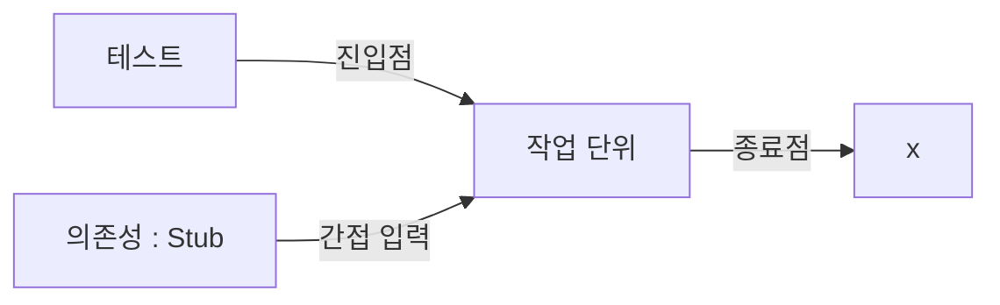
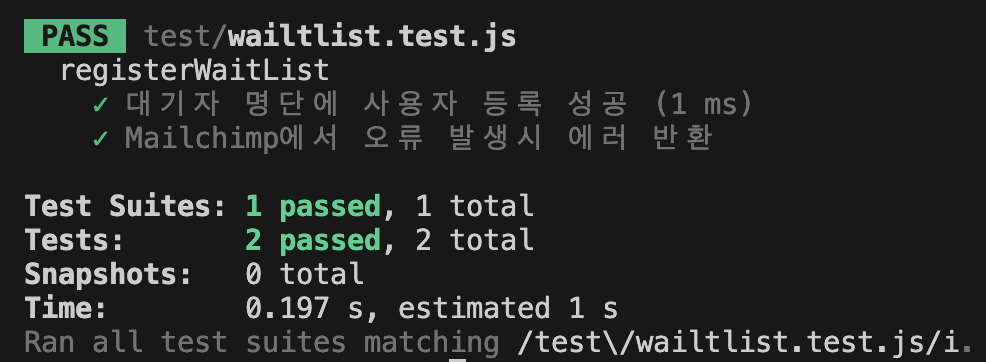

<!-- 단순한 책 내용만 정리하는 스터디에서 벗어나 자신의 생각을 정리하고, 그걸 바탕으로 실무에 적용할 수 있는 내용을 찾는 스터디가 되었으면 좋겠습니다. -->
<!-- 참고한 글 - https://tech.kakaopay.com/post/frontend-study-journey/ -->

> [!Note]
> 정리한 챕터나 페이지 등을 자유롭게 기록

## Summary

<!-- 한 줄 요약을 통해 발표자는 본인이 주제를 정확하게 이해했는지 점검하고, 스터디원들은 한 눈에 주제를 파악할 수 있습니다. -->

- 코드에서 의존하는 외부 요소들(외부 모듈, 특정 함수, 네트워크 등)을 **의존성**이라고 한다.
- 작업단위에서 사용하는 의존성에는 두가지 유형이 존재함(외부 / 내부)
- **스텁**은 내부로 들어오는 의존성(간접 입력)을 끊어 준다.
- **목**은외부로 나가는 의존성(간접 출력 or 종료점)을 끊어준다.
- 의존성 주입에는 다양한 방법이 존재한다.

## Concept

<!-- 책을 바탕으로 발표 주제의 이론적 개념 및 필요한 배경 지식을 설명합니다. -->

### 작업단위에서의 두가지 의존성 유형

#### 외부로 나가는 의존성

- 작업 단위의 종료점을 나타냄.
  - logger 함수 호출
  - DB 저장
  - 이메일 발송



#### 내부로 들어오는 의존성

- 종료점을 나타내지 않음.
  - 외부 모듈(day.js) 호출
  - DB 쿼리 결과
  - 네트워크 응답



> [!Note]
> 외부로 나가는 의존성이면서 동시에 내부로 들어오는 의존성일 수 있음

### 용어 정리

- 테스트 더블 : 스텁과 목을 포함한 일반적인 이름(= 페이크 fake)
- 스텁 : 가짜 모듈이나 객체, 데이터 등을 코드 내부로 보내는 가짜 함수
  - 외부 시스템에 의존하지 않고 동작할 수 있도록 함 -> **테스트 독립성을 높여준다.**
  - 스텁은 검증하지 않으므로 하나의 테스트에서 여러 스텁을 사용해도 무방함
- 묙 : 가짜 모듈이나 객체 및 호출 여부를 검증하는 함수
  - 단위테스트에서 **종료점**을 나타내므로 하나의 테스트에는 하나의 목을 권장

> [!Note]
> 현업에서는 두 용어를 _'mock'_ 으로 혼용하여 사용한다.

### 스텁을 사용하는 이유

#### 예제 함수

```js
const moment = require("moment");
const SUNDAY = 0;
const SATURDAY = 6;

const verifyPassword = (input, rules) => {
  const dayOfWeek = moment().day();
  if ([SATURDAY, SUNDAY].includes(dayOfWeek)) {
    throw Error("It's the weekend!");
  }
  // more code goes here...
  // return list of errors found..
  return [];
};
```

#### 테스트 코드(스텁 사용 X)

```js
const moment = require("moment");
const { verifyPassword } = require("./password-verifier-time00");

const SUNDAY = 0;
const SATURDAY = 6;
const MONDAY = 2;

describe("verifier", () => {
  const TODAY = moment().day();

  // test is always executed, but might not do anything
  test("on weekends, throws exceptions", () => {
    if ([SATURDAY, SUNDAY].includes(TODAY)) {
      expect(() => verifyPassword("anything", [])).toThrowError(
        "It's the weekend!"
      );
    }
  });

  // test is not even executed on week days
  if ([SATURDAY, SUNDAY].includes(TODAY)) {
    test("on a weekend, throws an error", () => {
      expect(() => verifyPassword("anything", [])).toThrow("It's the weekend!");
    });
  }
});
```

=> **일관성** 원칙이 지켜지지 않는 테스트 코드 ---> **스텁으로 외부 의존성을 주입**한다.

#### 스텁을 주입하는 방법

> 1.  매개변수를 통한 방식
> 2.  함수를 통한 방식
> 3.  모듈을 이용한 방식
> 4.  객체 지향을 이용한 방식

#### 1. 매개변수를 통한 방식

데이터(currentDay)를 의존성으로 직접 받는다.

```js
const verifyPassword2 = (input, rules, currentDay) => {
  if ([SATURDAY, SUNDAY].includes(currentDay)) {
    throw Error("It's the weekend!");
  }
  // more code goes here...
  // return list of errors found..
  return [];
};

describe("verifier2 - dummy object", () => {
  test("on weekends, throws exceptions", () => {
    expect(() => verifyPassword2("anything", [], SUNDAY)).toThrowError(
      "It's the weekend!"
    );
  });
});
```

#### 2. 함수를 통한 방식

이번에는 데이터를 의존성으로 직접 받는 대신 데이터를 반환하는 함수를 매개변수로 받는다.

```js
const verifyPassword3 = (input, rules, getDayFn) => {
  const dayOfWeek = getDayFn();
  if ([SATURDAY, SUNDAY].includes(dayOfWeek)) {
    throw Error("It's the weekend!");
  }
  // more code goes here...
  // return list of errors found..
  return [];
};

describe("verifier3 - dummy function", () => {
  test("on weekends, throws exceptions", () => {
    const alwaysSunday = () => SUNDAY;
    expect(() => verifyPassword3("anything", [], alwaysSunday)).toThrowError(
      "It's the weekend!"
    );
  });
  test("on week days, works fine", () => {
    const alwaysMonday = () => MONDAY;

    const result = verifyPassword3("anything", [], alwaysMonday);

    expect(result.length).toBe(0);
  });
});
```

=> 특정 상황에서 예외를 만들어 내는 등의 동작이 가능해진다.

#### 3. 모듈을 이용한 방식

모듈을 직접 가져오거나 (require), 불러올때(import) 의존성을 주입하는 방식
해당 의존성을 다른 것으로 대체할 수 있는 **심**을 만들어야한다.

```js
const originalDependencies = {
  moment: require("moment"),
};

let dependencies = { ...originalDependencies };

const inject = (fakes) => {
  Object.assign(dependencies, fakes);
  return function reset() {
    dependencies = { ...originalDependencies };
  };
};

const SUNDAY = 0;
const SATURDAY = 6;

const verifyPassword = (input, rules) => {
  const dayOfWeek = dependencies.moment().day();
  if ([SATURDAY, SUNDAY].includes(dayOfWeek)) {
    throw Error("It's the weekend!");
  }
  // more code goes here...
  // return list of errors found..
  return [];
};

module.exports = {
  SATURDAY,
  verifyPassword,
  inject,
};
```

> - originalDependencies 객체로 외부 의존성을 끊어냄
> - dependencies 객체를 추가
> - inject() 함수가 반환하는 rest() 함수로 가짜 의존성을 초기화

```js
const {
  inject,
  verifyPassword,
  SATURDAY,
} = require("./password-verifier-time00-modular");

const injectDate = (newDay) => {
  const reset = inject({
    moment: function () {
      // we're faking the moment.js module's API here.
      return {
        day: () => newDay,
      };
    },
  });
  return reset;
};

describe("verifyPassword", () => {
  describe("when its the weekend", () => {
    it("throws an error", () => {
      const reset = injectDate(SATURDAY);

      expect(() => verifyPassword("any input")).toThrowError(
        "It's the weekend!"
      );

      reset();
    });
  });
});
```

#### 4. 객체 지향을 이용한 방식

- 생성자 주입
- 함수 대신 객체 주입
- 공통 인터페이스 추출

## Advantages

<!-- (선택) 발표 주제를 적용했을 때 얻을 수 있는 이점이나 해결할 수 있는 문제 상황들에 대해 설명합니다. -->

## Disadvantages

<!-- (선택) 발표 주제를 적용했을 때 발생할 수 있는 side effect나 trade-off에 대해 설명합니다. -->

## Example Case

<!-- 발표 주제가 적용되어 있는 라이브러리, 실제 업무에 적용되어 있는 코드, 직접 만든 예시 코드, 자신의 느낀점 등을 첨부하여 이해를 돕습니다. -->

티저 사이트 개발 당시 서드파티 모듈인 Mailchimp를 이용해 waitlist 등록 api를 만들었었는데, 이를 리팩토링하고 테스트코드를 작성해보자 !

#### 기존 API (route handler)

```js
import { NextRequest, NextResponse } from 'next/server'
import mailchimp from '@mailchimp/mailchimp_marketing'
import AUDIENCE_LIST from '@/constants/audienceList'

mailchimp.setConfig({
    apiKey: process.env.MAILCHIMP_API_KEY,
    server: process.env.MAILCHIMP_SERVER,
})

export async function PUT(
    req: NextRequest,
    { params }: { params: { id: string } },
) {
    const { id: subscriber_hash } = params
    const { listId, email, countryCode } = await req.json()

    try {
        const response = await mailchimp.lists.setListMember(
            listId,
            subscriber_hash,
            {
                email_address: email,
                status_if_new: 'subscribed', // create -> 새로운 이메일
                status: 'subscribed', // update -> 이미 등록한 이메일
                merge_fields: {
                    ADDRESS: {
                        // required fields
                        addr1: '-',
                        addr2: '-',
                        city: '-',
                        state: '-',
                        zip: '-',
                        country: countryCode,
                    },
                },
            },
        )

        return NextResponse.json(
            {
                response,
            },
            { status: 200 },
        )
    } catch (error: any) {
        const { title, status } = error.response.body
        return NextResponse.json({ error: title }, { status: status })
    }
}
```

먼저 원활한 테스트를 위해, 순수 로직을 js 함수로 변경

```js
import mailchimp from "@mailchimp/mailchimp_marketing";

mailchimp.setConfig({
  apiKey: process.env.MAILCHIMP_API_KEY,
  server: process.env.MAILCHIMP_SERVER,
});

export async function registerWaitList({ subscriberHash, listId, email }) {
  try {
    const response = await mailchimp.lists.setListMember(
      listId,
      subscriberHash,
      {
        email_address: email,
        status_if_new: "subscribed",
        status: "subscribed",
      }
    );

    return { success: true, data: response };
  } catch (error) {
    const { title, status } = error?.response?.body || {};
    return {
      success: false,
      error: {
        title: title || "Unknown error",
        status: status || 500,
      },
    };
  }
}
```

이후, 모듈 의존성 주입을 위해 리팩토링 진행 (테스트 환경이 CommonJS 방식이여서, 이에 맞추어 리팩토링)

```js
const originalDependencies = {
  mailchimp: require("@mailchimp/mailchimp_marketing"),
};

let dependencies = { ...originalDependencies };

const inject = (fakes) => {
  Object.assign(dependencies, fakes);
  return function reset() {
    dependencies = { ...originalDependencies };
  };
};

const mailchimp = dependencies.mailchimp;

mailchimp.setConfig({
  apiKey: process.env.MAILCHIMP_API_KEY,
  server: process.env.MAILCHIMP_SERVER,
});

async function registerWaitList({ subscriberHash, listId, email }) {
  try {
    const response = await dependencies.mailchimp.lists.setListMember(
      listId,
      subscriberHash,
      {
        email_address: email,
        status_if_new: "subscribed",
        status: "subscribed",
      }
    );

    return { success: true, data: response };
  } catch (error) {
    const { title, status } = error?.response?.body || {};
    return {
      success: false,
      error: {
        title: title || "Unknown error",
        status: status || 500,
      },
    };
  }
}

module.exports = { inject, registerWaitList };
```

간단하게 성공 / 에러 케이스에 대한 테스트 코드 작성

```js
const { inject, registerWaitList } = require("./waitlist");

describe("registerWaitList", () => {
  let reset;
  let mockSetListMember;

  beforeEach(() => {
    mockSetListMember = jest.fn();
    reset = inject({
      mailchimp: {
        lists: {
          setListMember: mockSetListMember,
        },
      },
    });
  });

  afterEach(() => {
    reset();
  });

  it("대기자 명단에 사용자 등록 성공", async () => {
    // Mailchimp에서 반환될 응답을 모의(mock) 처리
    const mockResponse = {
      id: "mockId",
      email_address: "test@example.com",
      status: "subscribed",
    };

    mockSetListMember.mockResolvedValue(mockResponse);

    const response = await registerWaitList({
      subscriberHash: "mockHash",
      listId: "mockListId",
      email: "test@example.com",
    });

    expect(response.success).toBe(true);
    expect(response.data.email_address).toBe("test@example.com");
    expect(response.data.status).toBe("subscribed");
  });

  it("Mailchimp에서 오류 발생시 에러 반환", async () => {
    // Mailchimp에서 발생할 오류를 모의(mock) 처리
    const mockError = {
      response: {
        body: {
          title: "Error",
          status: 400,
        },
      },
    };

    mockSetListMember.mockRejectedValue(mockError);

    const response = await registerWaitList({
      subscriberHash: "mockHash",
      listId: "mockListId",
      email: "test@example.com",
    });

    expect(response.success).toBe(false);
    expect(response.error.title).toBe("Error");
    expect(response.error.status).toBe(400);
  });
});
```



## Wrap-up

<!-- 발표를 마무리하며 발표 주제를 다시 요약하고 정리합니다. -->

- 책에서도 언급된 것처럼, 처음에는 '스텁'과 '목'을 모두 'mock'이라고 혼용해서 알고 있어서 내가 알고 있던 내용과 헷갈렸는데, 이제는 그 차이를 구분할 수 있게 된 것 같다.
- 의존성 주입이라는 개념은 예전에 객체지향을 공부할 때 들었던 용어였는데, 이번에 테스트 코드와 연결되는 부분에서 다시 접하게 되었다.
- 평소에 객체지향에 대한 이해가 부족했던 탓인지, 객체지향을 활용한 스텁 주입 방식이 가장 어려웠다.
