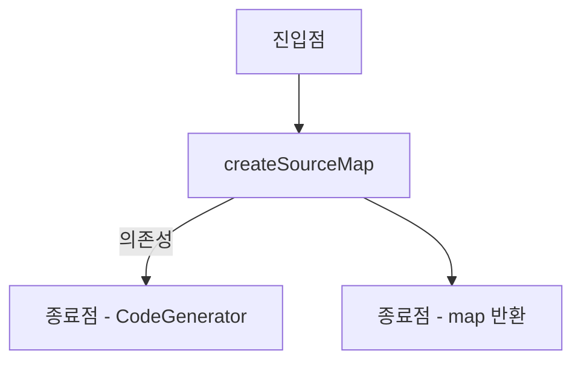
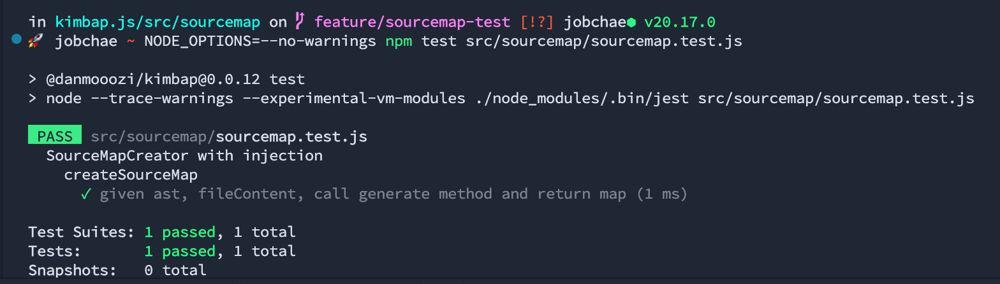
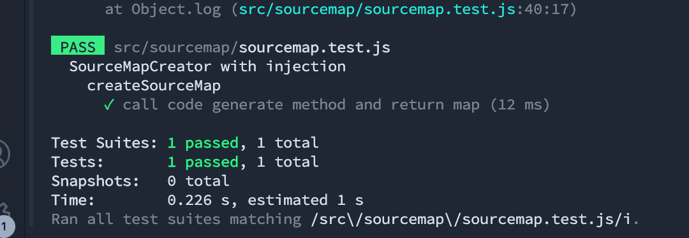

<!-- 단순한 책 내용만 정리하는 스터디에서 벗어나 자신의 생각을 정리하고, 그걸 바탕으로 실무에 적용할 수 있는 내용을 찾는 스터디가 되었으면 좋겠습니다. -->
<!-- 참고한 글 - https://tech.kakaopay.com/post/frontend-study-journey/ -->

> [!NOTE]   
> ch04 모의 객체를 사용한 상호 작용 테스트 (p156 ~ p184)

## Summary
<!-- 한 줄 요약을 통해 발표자는 본인이 주제를 정확하게 이해했는지 점검하고, 스터디원들은 한 눈에 주제를 파악할 수 있습니다. -->
- 목(mock)은 외부로 나가는 의존성과 연결 고리를 끊는 데 사용한다.
- 하나의 테스트에는 하나의 목만 사용하는 것이 좋다.
- 함수형에서는 커링, 고차 함수로 변환하는 스타일로 목을 주입할 수 있다.
- 모듈 의존성을 추상화해 목을 주입할 수 있다.
- 객체 지향에서는 생성자를 통한 의존성 주입, 인터페이스 주입을 활용해 목을 주입할 수 있다.


## Concept
<!-- 책을 바탕으로 발표 주제의 이론적 개념 및 필요한 배경 지식을 설명합니다. -->
### 목, 스텁 구분하기
#### 목 (mock)
- 목은 **외부로 나가는 의존성**과 연결 고리를 끊는 데 사용한다.
- 목은 가짜로 만든 모듈이나 객체 및 함수로 단위 테스트에서 종료점을 나타낸다.
- 목은 어떤 대상을 흉내 내어 만들었기 때문에 호출 되었는지 검증하는 것이 중요하다.

#### 스텁 (stub)
- 스텁은 **내부로 들어오는 의존성**과 연결 고리를 끊는 데 사용한다.
- 테스트에서 가짜 데이터나 동작을 제공하는 가짜 모듈, 객체, 함수를 의미한다.
- 스텁은 종료점을 나타내지 않고, 작업 단위로 들어오는 경유지를 나타낸다.
- 스텁은 검증할 필요가 없고, 테스트에 여러개 존재할 수 있다.

#### 목과 스텁을 구분하지 않으면 ...
- 스텁을 검증하는 경우가 생긴다. -> 무의미한 테스트
- 예를 들어 데이터 베이스 쿼리를 검증 하는 작업이 있다면 이는 쿼리가 아닌 쿼리 결과가 특정 값을 반환하는 지를 검증해야 한다.
- 하나의 테스트에 여러개의 목이 있을 경우 첫 번째 목 검증 단계에서 실패 시 다음 목은 검증될 수 없다.

> [!TIP]   
> 대부분의 테스트 프레임워크가 목과 스텁을 구분하지 않고 목이라는 단어를 써 헷갈리지만 사실 목이라고 표현하는 것들이 스텁인 경우가 많다고 한다.


### 가짜 객체를 주입 하는 방법
| 스타일 | 기법 |
| ---- | --- |
| 표준 | 매개변수 추가 |
| 함수형 | 커링 사용, 고차 함수로 변환 |
| 모듈형 | 모듈 의존성 추가 |
| 객체 지향형 | 타입이 없는 객체 주입, 인터페이스 주입 |

### 모듈 스타일의 목
```js
const { info, debug } = require('./complicated-logger');
const { getLogLevel } = require('./configuration-service');

const log = (text) => {
    if (getLogLevel() === 'info') {
        info(text);
    }
    if (getLogLevel() === 'debug') {
        debug(text);
    }
}

const verifyPassword = (input, rules) => {
    const failed = rules
        .map(rule => rule(input))
        .filter(result => result === false);

    if (failed.length === 0) {
        log("PASSED");
        return true;
    }
    log("FAIL");
    return false;
}

module.exports = { verifyPassword };
```
아래 두가지의 의존성을 가지는 예제 코드이다.
- 로거 함수 호출
- 설정 서비스를 통한 로그 레벨 조회

이 코드를 모듈 주입 방식으로 리팩터링 해보자.
```js
const originalDependencies = { 
    log: require('./complicated-logger')
};
// module을 직접 사용하지 않고 중간 계층을 이용하도록 함
let dependencies = { ...originalDependencies };

// module 의존성 초기화 함수
const resetDependencies = () => {
    dependencies = { ...originalDependencies };
};

const injectDependencies = (fakes) => {
    Object.assign(dependencies, fakes); // 기존 의존성을 새로운 의존성으로 대체 
}

const verifyPassword = (input, rules) => {
    const failed = rules
        .map(rule => rule(input))
        .filter(result => result === false);

    if (failed.length === 0) {
        dependencies.log.info("PASSED");
        return true;
    }
    dependencies.log.info("FAIL");
    return false;
}

module.exports = { 
    verifyPassword, 
    injectDependencies, 
    resetDependencies  // 외부에서 의존성을 결정할 수 있도록 export 필요
};
```

- 코드가 더 많아 보이지만 이렇게 모듈 방식으로 의존성을 추상화 하면 테스트 코드에서 아래처럼 쉽게 가짜 모듈을 주입할 수 있다.
```js
const { 
    verifyPassword, 
    injectDependencies, 
    resetDependencies 
} = require('./password-verifier');

describe('password verifier', () => {
    afterEach(resetDependencies); // 각 테스트 종료 시 의존성 초기화

    describe('given logger and passing scenario', () => {
        it('calls the logger with PASS', () => {
            let logged = '';
            const mockLog = { info: (text) => (logged = text) };

            injectDependencies({ log: mockLog }); // 가짜 log 의존성 주입

            verifyPassword('anything', []);

            expect(logged).toMatch(/PASSED/);
        });
    }); 
});
```

### 함수형 스타일에서 목
#### 커링 스타일
- 커링 스타일로 로거 함수를 함수형 스타일로 주입할 수도 있다.
- lodash [curry](https://lodash.com/docs/4.17.15#curry) 함수를 통해 쉽게 커링 구현이 가능하다.

```js
const verifyPassword = _.curry((rules, logger, input) => {
    const failed = rules
        .map(rule => rule(input));
        .filter(result => result === false);
    
    if (failed.length === 0) {
        logger.info('PASSED');
        return true;
    }

    logger.info('FAIL');
    return false;
});
```
이렇게 함수형 커링 스타일로 코드가 변경되면 테스트 코드에서는 아래처럼 목을 전달 할 수 있다.
```js
describe('password verifier', () => {
    describe('given logger and passing scenario', () => {
        it('calls the logger with PASS', () => {
           let logged = '';
           const mockLog = { info: (text) => (logged = text) };
           const injectedVerify = verifyPassword([], mockLog);
           
           // 커링 함수는 로거를 미리 매개 변수로 전달했기 때문에
           // 이후에 로거를 다시 주입하지 않아도 코드의 다른 부분에 전달 할 수 있다.
           injectedVerify('anything');

           expect(logged).toMatch(/PASSED/);
        });
    }); 
});
```

#### 커링 없이 고차 함수 사용
- 함수형 스타일에서 커링을 사용하지 않고 고차 함수로도 의존성 주입이 가능하다.
```js
const makeVerifier = (rules, logger) => {
    return (input) => { // 미리 설정해 놓은 검증 함수 반환
         const failed = rules
        .map(rule => rule(input));
        .filter(result => result === false);
    
        if (failed.length === 0) {
            logger.info('PASSED');
            return true;
        }

        logger.info('FAIL');
        return false;
    }
}
```
- 보다 명시적으로 함수를 반환하는 팩토리 함수를 만들었다.
- `rules`, `logger`를 매개변수로 받아 이를 클로저 내부에 저장하고, 이러한 설정을 포함한 익명 함수를 반환한다.
```js
describe('password verifier', () => {
    describe('given logger and passing scenario', () => {
        it('calls the logger with PASS', () => {
           let logged = '';
           const mockLog = { info: (text) => (logged = text) };
           
           const passVerify = makeVerifier([], mockLog); // 팩토리 함수 호출

           passVerify('anything'); // 결과 값으로 전달된 함수를 호출

           expect(logged).toMatch(/PASSED/);
        });
    }); 
});
```
### 객체 지향 스타일의 목
- 객체 지향 스타일의 목을 위해 코드를 객체 지향적으로 변경해보자.
```js
class PasswordVerifier {
    _rules;
    _logger;

    constructor(rules, logger) {
        this._rules = rules;
        this._logger = logger;
    }

    verify(input) {
        const failed = this._rules
            .map(rule => rule(input));
            .filter(result => result === false);
        
        if (failed.length === 0) {
            this._logger.info('PASSED');
            return true;
        }

        this._logger.info('FAIL');
        return false;
    }
}
```
- 이제 생성자를 통해 의존성 logger를 주입 받아 사용할 수 있다.
- 테스트 코드에서는 아래 처럼 가짜 logger를 주입할 수 있다.
```js
describe('password verifier with duck typing injection', () => {
    describe('given logger and passing scenario', () => {
        it('calls the logger with PASS', () => {
           let logged = '';
           const mockLog = { info: (text) => (logged = text) };
           const verifier = new PasswordVerifier([], mockLog);

           verifier.verify('anything');

           expect(logged).toMatch(/PASSED/);
        });
    }); 
});
```
- 객체 생성 시 생성자를 통해 가짜 logger를 주입해 쉽게 테스트가 가능하다.
- 또한 생성자를 통해 주입 시 필요한 의존성을 명확히 알 수 있다.
#### 인터페이스 주입
- JS는 덕 타이핑[^1].을 허용하는 언어이므로 위 코드처럼 특정 인터페이스 없이도 가짜 객체를 주입할 수 있다.
- TS에서는 인터페이스를 활용해볼 수 있다.

[^1]: '어떤 새가 오리처럼 꽥꽥 거리고 헤엄친다면 그 새를 오리라고 부른다는 아이디어'로 동적 타이핑의 한 종류


```js
export interface ILogger {
    info(text: string): void;  // 새로운 logger 인터페이스
}

class SimpleLogger implements ILogger {
    info(text: string): void {
        // 로그 처리 로직
    }
}

export class PasswordVerifier {
    private _rules: any[];
    private _logger: ILogger; 

    // _logger 멤버 변수는 ILogger의 구현체여야한다.
    constructor(rules: any[], logger: ILogger) {
        this._rules = rules;
        this._logger = logger;
    }

    verify(input: string): boolean { 
        const failed = this._rules
            .map(rule => rule(input));
            .filter(result => result === false);
        
        if (failed.length === 0) {
            this._logger.info('PASSED');
            return true;
        }

        this._logger.info('FAIL');
        return false;
    }
}
```
- 이제 테스트에서 가짜 로거를 주입하기 위해선 `ILogger` 인터페이스를 구현하는 가짜 logger 클래스가 필요하다.
```js
class FakeLogger implements ILogger {
    written: string;
    info(text: string) {
        this.written = text;
    }
}

describe('password verifier with interfaces', () => {
    test('verify, with logger, calls logger', () => {
        const mockLog = new FakeLogger();
        const verifier = new PasswordVerifier([], mockLog);

        verifier.verify('anything');

        expect(mockLog.written).toMatch(/PASSED/);
    });
});
```
- `ILogger` 인터페이스의 메서드를 오버라이드 하는 `FakeLogger`를 만들어 가짜 로거가 호출되는지 검증할 수 있다.

### 복잡한 인터페이스 
```js
export interface IComplicatedLogger {
    info(text: string)
    debug(text: string, obj: any)
    warn(text: string)
    error(text: string, location: string, stackTrace: string)
}
```
- 위 `IComplicatedLogger` 처럼 보다 복잡한 인터페이스가 있을 경우 위에서 작성했던 테스트 코드 처럼 수작업으로 `FakeLogger를` 만들 시 모든 메서드를 오버라이드 해야해 반복 코드가 생기고 코드가 길어지는 문제가 있다.
- 이 경우 인터페이스가 변경될 때마다 테스트도 변경해야하는 문제가 자주 생긴다.

### 부분 모의 객체
- 대부분의 언어나 프레임워크는 기존 객체와 함수를 감시(spy) 하는 것이 가능하다.
- 이를 통해 해당 객체나 함수가 호출 되었는지, 어떤 인수로 호출되었는지 등 확인이 가능하다.
- 이 방식을 사용하면, 실제 객체의 **일부**를 모의 함수로 변환하고 나머지 부분은 실제 객체로 유지할 수도 있다.
  - 이렇게 할 경우 테스트가 불안정해질 수 있지만, 레거시 코드를 다룰 때 괜찮은 선택일 수 있다.

#### 부분 모의 객체를 함수형 방식으로 풀어 보기
```js
describe('password verifier with interfaces', () => {
    test('verify, with logger, calls logger', () => {
        const testableLog: RealLogger = new RealLogger(); // 실제 logger 클래스의 인스턴스를 생성한다.
        let logged = '';
        testableLog.info = (text) => (logged = text); // 메서드 중 한개를 덮어쓴다.

        const verifier = new PasswordVerifier([], testableLog);
        verifier.verify('anything');

        expect(logged).toMatch(/PASSED/);
    });
});
```
- 부분 모의 객체 `testableLog`는 실제 Logger 클래스로 생성한 인스턴스로 테스트가 필요한 메서드만 가짜 함수로 대체한다.
- `testableLog` 는 `info` 함수 이외에 다른 함수는 실제 의존성을 포함한다.

#### 부분 모의 객체를 객체 지향 방식으로 풀어 보기
- 객체 지향 방식으로 부분 모의 객체를 사용하려면 실제 클래스의 메서드를 오버라이드하는 방식을 사용하면 된다.

```js
class TestableLogger extends RealLogger { // RealLogger 클래스 상속
    logged = '';
    info(text) {
        this.logged = text; // 실제 Logger 중 info 메서드만 오버라이드
    }
}

describe('password verifier with interfaces', () => {
    test('verify, with logger, calls logger', () => {
        const mockLog: TestableLogger = new TestableLogger();

        const verifier = new PasswordVerifier([], mockLog);
        verifier.verify('anything');

        expect(mockLog.logged).toMatch(/PASSED/);
    });
});
```
- `TestableLogger` class는 실제 메서드와 오버라이드한 메서드가 공존하는 형태이다.

## Advantages
<!-- (선택) 발표 주제를 적용했을 때 얻을 수 있는 이점이나 해결할 수 있는 문제 상황들에 대해 설명합니다. -->
- 함수의 종료점을 나타내는 외부로 나가는 의존성을 테스트 하기 위해 mock을 사용하면 쉽게 의존성을 끊어낼 수 있다.
- 함수형, 객체 지향, 부분 모의 객체 등 다양한 방식으로 mock을 주입할 수 있다.

## Disadvantages 
<!-- (선택) 발표 주제를 적용했을 때 발생할 수 있는 side effect나 trade-off에 대해 설명합니다. -->
- 단점이라기 보다는 테스트를 적용하려는 프로젝트의 코드 스타일(ex. 함수형, 객체 지향 등)에 따라 알맞는 목 주입 방식을 선택해야 각 방식의 장점을 극대화 할 수 있을 것 같다.
## Example Case
<!-- 발표 주제가 적용되어 있는 라이브러리, 실제 업무에 적용되어 있는 코드, 직접 만든 예시 코드, 자신의 느낀점 등을 첨부하여 이해를 돕습니다. -->
- 목이랑 스텁 정말 헷갈린다.
- 오늘은 뭐라도 직접 해보면 좋을 것 같아 예전에 [kimbap.js](https://github.com/danmooozi/kimbap.js/blob/main/src/sourcemap/index.js) 에서 만들었던 sourcemap creator 코드를 사용해 책에 나온 객체 지향 방식으로 변경해 익혀보았다.
```js
// 원래 코드

import { CodeGenerator } from '@babel/generator';
import PathUtil from '../util/path.js';

export const createSourceMap = ({
    ast,
    fileContent,
    filePath,
    entryPath,
    outputPath
}) => {
    const sourceFileName = PathUtil.relative(outputPath, filePath);

    const generator = new CodeGenerator(ast, { sourceMaps: true, sourceFileName, sourceRoot: entryPath }, fileContent);
    const { map } = generator.generate(ast, {}, fileContent);

    return map;
}
```
- 코드를 읽어보며 책에서 언급한대로 의존성을 찾아보았다.

- 헷갈리는 점 ; `CodeGenerator`는 외부로 나가는 의존성일까? 결국 map 이라는 값을 받아오기 위한 내부로 들어오는 의존성일까? (훈수 부탁드려요)
- 일단 나는 외부로 나가는 의존성이라 생각했다. (서드파티 호출)

```js
export class SourceMapCreator {
  _codeGenerator;

  constructor(codeGenerator) {
    this._codeGenerator = codeGenerator;
  }

  createSourceMap(ast, fileContent) {
    const { map } = this._codeGenerator.generate(ast, {}, fileContent);

    return map;
  }
}
```
- 객체 지향 방식으로 의존성을 주입받기 위해 클래스형으로 변경하고 생성자를 통해 `codeGenerator`를 주입 받도록 리팩터링 했다.
- 의존성을 외부에서 제어하도록 하니 생각보다 안에 있는 많은 로직이 없어졌다. -> 외부에서 제어하기 쉬워짐

```js
import { SourceMapCreator } from './sourcemap.js';

class FakeCodeGenerator {
    generate(ast, opts, code) {
        return { map: 'sourcemap' };
    }
}

describe('SourceMapCreator with injection', () => {
  describe('createSourceMap', () => {
    test('given ast, fileContent, call generate method and return map', () => {
        const fakeCodeGenerator = new FakeCodeGenerator(); // 가짜 의존성 객체 생성
        const sourcemapCreator = new SourceMapCreator(fakeCodeGenerator); // 테스트를 위해 가짜 의존성을 주입

        const sourcemap = sourcemapCreator.createSourceMap('ast', 'code');

        expect(sourcemap).toMatch(/sourcemap/);
    });
  });
});
```
- 책에 나온 방식대로 의존성을 대체할 `FakeCodeGenerator` 클래스를 만들어주었다. 이 클래스를 검증하는 것이 아니므로 `generate` 함수는 특정 map 문자열을 반환하도록만 구성했다.
- 테스트 내부에서는 `fakeCodeGenrator` 인스턴스를 `SourceMapCreator` 생성 시 주입 시켜주었다.
- 이제 테스트 하려는 `createSourceMap` 함수를 호출하고 검증을 위해 종료점의 반환 값이 의도한 값이랑 동일한지 검증한다.
- 가짜 의존성의 `generate` 함수를 호출한 후 의도한 값을 반환했는지 검증할 수 있다.



- 두번째로는 새롭고 아직 익숙치 않아서 모듈 주입 방식으로 한번 리팩터링 해보았다.
- 책에서 나온건 CommonJS 인데 kimbap은 ESM 이라 약간 달라져서 GPT 랑 같이 해결해보았다!
```js
let dependencies;

// ESM에서는 import 가 비동기 함수임 따라서 async-await 필요
const initDependencies = async () => {
  dependencies = {
    pathUtil: await import('../util/path.js'),
    codeGenerator: await import('@babel/generator'),
  };
};

// 의존성을 대체할 수 있는 주입 함수
const injectDependencies = (fakes) => {
  Object.assign(dependencies, fakes);
};

// 초기 의존성으로 돌아가는 reset 함수
const resetDependencies = async () => {
    await initDependencies();
}

const createSourceMap =  ({
  ast,
  fileContent,
  filePath,
  entryPath,
  outputPath,
}) => {
    // dependencies 객체에서 사용할 의존성 가져옴
    const { pathUtil, codeGenerator } = dependencies; 

    // 실제 의존성을 바로 가져다 쓰는게 아니라 dependencies 객체를 통하도록 추상화
    const sourceFileName = pathUtil.relative(outputPath, filePath);

    const generator = new codeGenerator(
        ast,
        { sourceMaps: true, sourceFileName, sourceRoot: entryPath },
        fileContent,
    );

    const { map } = generator.generate(ast, {}, fileContent);

    return map;
};

// 테스트에서 사용 가능하도록 export
export {
  initDependencies, 
  injectDependencies,
  resetDependencies,
  createSourceMap,
};
```
- 모듈 의존성을 직접 별도의 객체로 분리해 외부에서도 주입 가능하게 리팩터링 해보았다.
- 특히 ESM에서는 `require()`를 지원하지 않아 `import()`를 사용해야하는데 `import()` 메서드가 비동기로 동작해서 이 점 유의해야한다.

```js
import {
  initDependencies, 
  createSourceMap,
  injectDependencies,
  resetDependencies,
} from './sourcemap'; 

// CodeGenerator 클래스를 위한 가짜 대체 클래스
class FakeCodeGenerator {
    generate(ast, opts, code) {
        return { map: 'sourcemap' };
    }
}

describe('SourceMapCreator with injection', () => {
  describe('createSourceMap', () => {
    beforeAll(async () => {
        await initDependencies();  // 시작 전 꼭 init dependencies 필요
    });

    afterEach(async () => { 
        await resetDependencies(); // 테스트 종료 시 의존성 reset
    });

    test('call code generate method and return map', () => {
        const stubPathUtil = { relative: (from, to) => 'path' }; // pathUtil stub 

        // 테스트를 위해 가짜로 만든 의존성으로 대체 시킨다.
        injectDependencies({
          codeGenerator: FakeCodeGenerator, // 가짜 클래스로 대체
          pathUtil: stubPathUtil, // stub으로 대체
        });

        const testParams = {
            ast: 'ast',
            fileContent: 'code',
            filePath: '/path',
            entryPath: '/entry',
            outputPath: '/output'
        }
        // 테스트 하려는 함수 호출
        const sourcemap = createSourceMap(testParams);

        // 의도한 generate 함수가 호출되었는지 검증
        expect(sourcemap).toMatch(/sourcemap/);
    });
  });
});
```
- 테스트 코드에서는 두가지 의존성을 대체해 주입했다.
1. `path` 유틸 함수
  - `pathUtil.relative()`는 필요한 데이터를 들여보내주는, 즉 내부로 들어오는 의존성으로 보아 stub으로 주입했다.
2. `CodeGenerator` 
  - 원본 의존성은 `@babel/generator` 지만 내가 만든 가짜 `FakeCodeGenerator`로도 사용가능하게 mock으로 주입했다.



- 직접 객체 지향 방식과 모듈 주입 방식으로 예전에 구현한 코드를 리팩터링 하고 테스트 코드까지 작성해보니 **테스트 하기 좋은** 코드를 만든다는게 얼마나 힘든건지.. 아니 중요한건지 조금 느껴진다. 
- 개인적으론 객체 지향 방식의 의존성 주입이 좀 더 간편하고 손에 익은 것 같다.
- 함수형이 젤 어려운 것 같다. 뭔가 기존에 생각하던 방식이 아닌 것 같은.. (고차 함수 같은 내용이 들어있어서)
- 아무튼 앞으로는 **테스트 하기 좋은** 코드를 위해 의존성에 대해서 깊이 생각하며 코드를 구현해야겠다.
## Wrap-up
<!-- 발표를 마무리하며 발표 주제를 다시 요약하고 정리합니다. -->
- 목은 외부로 나가는 의존성을 끊어준다.
- 함수형 스타일에서는 커링, 고차 함수 변환 등으로 목을 주입할 수 있다.
- 객체 지향 스타일에서는 생성자를 통한 주입, 인터페이스 활용을 통한 주입이 가능하다.
- 복잡한 인터페이스일 경우 실제 의존성은 상속 받고 일부 메서드만 오버라이드하는 부분 모의 객체 방식을 사용할 수 있다.

## etc...
- 커링
  - 함수가 하나의 매개변수를 받아 여러 단계에 걸쳐 호출되는 방식
  - ex. `f(a)(b)(c)` 처럼 인자를 하나씩 받는 여러 함수로 변환하는 방식
- 부분 적용
  - 여러 매개변수를 받는 함수에서 일부 매개변수를 고정한 새로운 함수를 만드는 방식
  - ex. `f(a, b, c)` 에서 a, b를 고정한 새로운 함수 `g(c)`를 만드는 방식

```js
const addNumbers = (a, b, c) => {
    return a + b + c;
}

// 커링
const addNumbersInCurrying = (a) => (b) => (c) => {
    return a + b + c;
}

// 부분 적용
const addNumbersInPartialApplication = (a) => (b, c) => {
    return a + b + c;
}
```
- 고차 함수를 사용해 함수를 만드는 공통점이 있다.