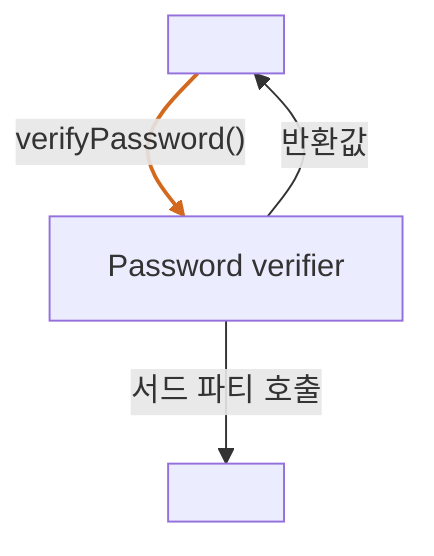

<!-- 단순한 책 내용만 정리하는 스터디에서 벗어나 자신의 생각을 정리하고, 그걸 바탕으로 실무에 적용할 수 있는 내용을 찾는 스터디가 되었으면 좋겠습니다. -->
<!-- 참고한 글 - https://tech.kakaopay.com/post/frontend-study-journey/ -->

> [!Note]
> 정리한 챕터나 페이지 등을 자유롭게 기록

## Summary

<!-- 한 줄 요약을 통해 발표자는 본인이 주제를 정확하게 이해했는지 점검하고, 스터디원들은 한 눈에 주제를 파악할 수 있습니다. -->

스텁을 사용하여 상호작용 테스트를 할 수 있고, 목과 스텁의 차이에 대해 이해할 수 있다.

## Concept

<!-- 책을 바탕으로 발표 주제의 이론적 개념 및 필요한 배경 지식을 설명합니다. -->

### 상호 작용 테스트

> 작업 단위가 가질 수 있는 세가지 종료점
>
> - 값을 반환
> - 시스템의 상태를 변경
> - **서트 파티 함수나 모듈, 객체를 호출** -> 작업 단위가 제어할 수 없는 영역

상호 작용 테스트 : 작업 단위가 제어할 수 없는 영역에 있는 어떻게 의존성과 상호 작용하는지 확인하는 방법, **모의 함수와 모의 객체**를 통해 검증

### 로거 함수를 통한 상호 작용 테스트

```js
// 기존의 의존성 주입 방식으로는 테스트할 수 없다.
const _ = require("lodash");
const log = require("./complicated-logger");

const verifyPassword = (input, rules) => {
  const failed = rules
    .map((rule) => rule(input))
    .filter((result) => result === false);

  console.log(failed);
  if (failed.length === 0) {
    // 이 줄은 전통적인 주입 기법으로는 테스트할 수 없다.
    log.info("PASSED"); // 종료점
    return true;
  }
  // 이 줄은 전통적인 주입 기법으로는 테스트할 수 없다.
  log.info("FAIL"); // 종료점
  return false;
};

module.exports = {
  verifyPassword,
};
```



=> 로거 함수의 호출 여부를 알 수 없으므로, **심**을 통해 의존성을 처리

```js
const verifyPassword2 = (input, rules, logger) => {
  const failed = rules
    .map((rule) => rule(input))
    .filter((result) => result === false);

  if (failed.length === 0) {
    logger.info("PASSED");
    return true;
  }
  logger.info("FAIL");
  return false;
};

module.exports = { verifyPassword2 };
```

```js
const { verifyPassword2 } = require("./password-verifier01");

describe("password verifier", () => {
  describe("given logger, and passing scenario", () => {
    it("calls the logger with PASSED", () => {
      let written = "";
      const mockLog = { info: (text) => (written = text) };

      verifyPassword2("anything", [], mockLog);

      expect(written).toMatch(/PASSED/);
    });
  });
});
```

> 변수 이름을 mockXXX 으로 지어 테스트에 모의 함수나 객체가 있다는 것을 알 수 있음, but 목을 사용할 때만 해당 방식을 사용하는 것을 지향

> - mockLog 는 로거 함수의 info 함수와 시그니처가 동일한 프로퍼티를 갖고 있음.
> - written에 올바른 텍스트가 저장되어 있으면 이는 info 함수가 호출되었다는 것을 의미 -> _작업 단위에서 종료점이 올바르게 호출됨_

### 목과 스텁을 구분하는 것의 중요성

- 한 작업 단위 안에 여러 종료점이 있다는 것처럼 복잡한 테스트를 만들때 가독성과 유지 보수성이 떨어지는 테스트를 만들 수 있다.

=> 스텁은 여러개를 사용해도 괜찮지만, 목은 테스트당 하나만 사용하는 것이 좋다.(목이 여러개라는 것은 종료점이 여러개라는 것)

### 목을 사용하여 의존성 주입

스텁과 마찬가지로 목을 작업 단위에 주입하는 방식은 여러 가지다.

1. 표준 방식 :매개변수를 추가하여 주입
2. 함수형 방식 : 부분 적용 or 팩토리 함수를 사용하여 주입
3. 모듈 방식 : 모듈 의존성을 추상화하여 주입
4. 객체 지향 방식

#### 복잡한 모듈 의존성 케이스

```js
const { info, debug } = require("./complicated-logger");
const { getLogLevel } = require("./configuration-service");

const log = (text) => {
  if (getLogLevel() === "info") {
    info(text);
  }
  if (getLogLevel() === "debug") {
    debug(text);
  }
};

const verifyPassword = (input, rules) => {
  const failed = rules
    .map((rule) => rule(input))
    .filter((result) => result === false);

  if (failed.length === 0) {
    log("PASSED");
    return true;
  }
  log("FAIL");
  return false;
};

module.exports = {
  verifyPassword,
};
```

=> 로거 호출의 여부를 테스트 하고 싶음, but 모듈을 코드에 직접 import 하고있다는 문제가 있음 -> 3장에서 배웠던 **모듈 의존성을 객체로 분리**하는 방식을 활용해보자

```js
const originalDependencies = {
  log: require("./complicated-logger"),
};

let dependencies = { ...originalDependencies };

const resetDependencies = () => {
  dependencies = { ...originalDependencies };
};

const injectDependencies = (fakes) => {
  Object.assign(dependencies, fakes);
};

const verifyPassword = (input, rules) => {
  const failed = rules
    .map((rule) => rule(input))
    .filter((result) => result === false);

  if (failed.length === 0) {
    dependencies.log.info("PASSED");
    return true;
  }
  dependencies.log.info("FAIL");
  return false;
};

module.exports = {
  verifyPassword,
  injectDependencies,
  resetDependencies,
};
```

```js
const {
  verifyPassword,
  injectDependencies,
  resetDependencies,
} = require("./password-verifier-injectable01");

describe("password verifier", () => {
  afterEach(resetDependencies);

  describe("given logger and passing scenario", () => {
    it("calls the logger with PASS", () => {
      let logged = "";
      const mockLog = { info: (text) => (logged = text) };
      injectDependencies({ log: mockLog });

      verifyPassword("anything", []);

      expect(logged).toMatch(/PASSED/);
    });
  });
});
```

=> 각 테스트 후에 `resetDependencies` 함수를 호출하여 의존성을 초기화해주면, 테스트 내에서 모듈을 쉽게 주입할 수 있음.

## Advantages

<!-- (선택) 발표 주제를 적용했을 때 얻을 수 있는 이점이나 해결할 수 있는 문제 상황들에 대해 설명합니다. -->

## Disadvantages

<!-- (선택) 발표 주제를 적용했을 때 발생할 수 있는 side effect나 trade-off에 대해 설명합니다. -->

## Example Case

<!-- 발표 주제가 적용되어 있는 라이브러리, 실제 업무에 적용되어 있는 코드, 직접 만든 예시 코드, 자신의 느낀점 등을 첨부하여 이해를 돕습니다. -->

### Mock Service Worker(MSW)

**Mock Service Worker(MSW)**는 **API mocking**을 위한 라이브러리로, 클라이언트와 서버 간의 네트워크 요청을 서비스 워커 또는 Node 인터셉터를 통해 가로채고, 개발자가 정의한 응답을 반환함으로써 외부 API에 의존하지 않고도 애플리케이션을 테스트하거나 개발할 수 있도록 도와준다.

#### MSW는 Stub인가, Mock인가?

MSW는 일반적으로 Stub과 Mock의 기능을 모두 수행할 수 있는 도구다:

#### 1. Stub의 역할

Stub은 일반적으로 외부 의존성을 대체해, 고정된 응답을 반환하는 데 목적이 있다.

MSW는 API 요청에 대한 응답을 미리 정의해서 반환한다.

예를 들어, 로그인 요청에 대해 항상 { success: true }를 반환하게 할 수 있다.

실제 API 서버가 없어도 프론트엔드 개발이나 테스트가 가능하다.

```js
rest.post("/login", (req, res, ctx) => {
  return res(ctx.status(200), ctx.json({ success: true }));
});
```

→ 이런 방식은 전형적인 Stub의 동작 방식이다.

#### 2. Mock의 역할

Mock은 Stub의 기능에 더해, 요청이 어떻게 사용되었는지 검증할 수 있도록 도와준다. ex) 몇 번 호출됐는지, 어떤 인자였는지 등

MSW 자체는 호출 횟수를 직접 기록하지는 않지만, requestHandler나 request.log를 활용하거나 테스트 프레임워크와 함께 사용함으로써 요청이 호출되었는지 확인할 수 있다.

예를 들어 jest나 vitest의 expect와 함께 쓰면 mock처럼 동작한다.

```js
// 예: 요청이 호출되었는지 테스트
expect(screen.getByText(/로그인 성공/)).toBeInTheDocument();
```

또한 MSW는 동적으로 요청 내용(req.body, req.headers 등)을 확인해서 조건부 응답도 가능하므로, 단순한 Stub보다 더 복잡한 Mock 시나리오도 커버할 수 있다.

## Wrap-up

<!-- 발표를 마무리하며 발표 주제를 다시 요약하고 정리합니다. -->

- 1장에서 배웠던 좋은 테스트 코드 작성법과 목, 스텁 개념이 실제로 결합되는 걸 보니 흥미로웠다.
- **목과 스텁이라는 단어가 이미 많이 혼용**되어 사용되는 것 같은데, 앞으로는 그 차이를 잘 구분해서 써야겠다고 느꼈다.
- 테스트 코드를 위해 이렇게까지 고민하며 코드를 설계해야 한다는 점이 인상 깊었고, 동시에 나도 더 신중하게 작성해야겠다는 반성을 하게 되었다.
