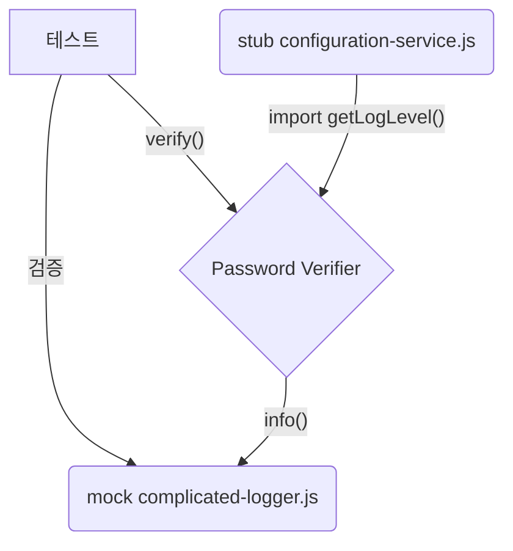
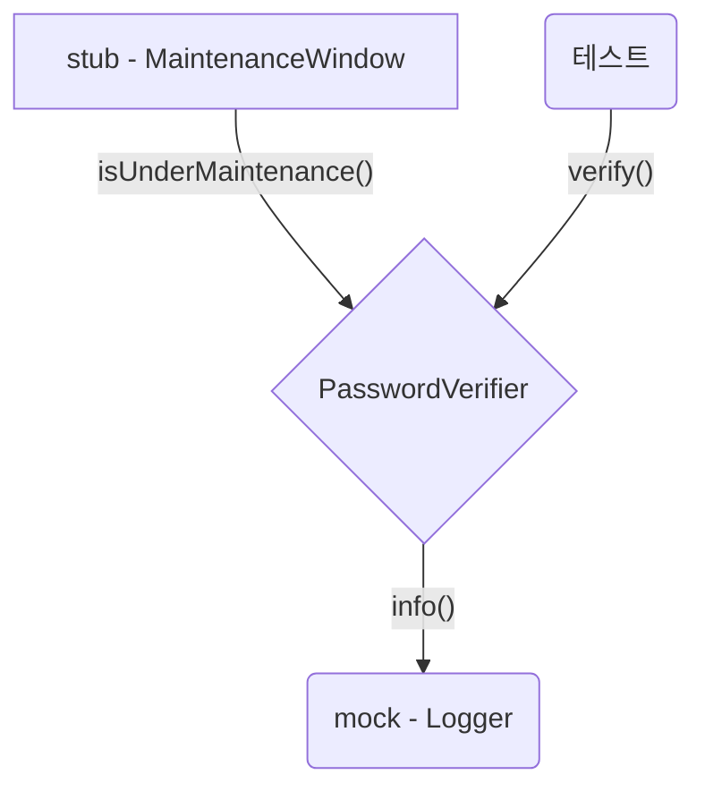

<!-- 단순한 책 내용만 정리하는 스터디에서 벗어나 자신의 생각을 정리하고, 그걸 바탕으로 실무에 적용할 수 있는 내용을 찾는 스터디가 되었으면 좋겠습니다. -->
<!-- 참고한 글 - https://tech.kakaopay.com/post/frontend-study-journey/ -->

> [!NOTE]   
> ch05 격리 프레임워크 (p186 ~ p208)

## Summary
<!-- 한 줄 요약을 통해 발표자는 본인이 주제를 정확하게 이해했는지 점검하고, 스터디원들은 한 눈에 주제를 파악할 수 있습니다. -->
- 격리 프레임워크는 객체나 함수 형태로 목이나 스텁을 동적으로 생성하거나 구성 및 검증할 수 있게 해준다.
- 격리 프레임워크에는 느슨한 타입(jest, 사이넌) 과 정적 타입(substitute.js) 등 두가지 유형이 있다.
- 내부 구현 세부 사항에 의존하지 않도록 가능한 상호 작용 테스트 보다는 반환 값, 상태 기반 테스트를 사용한다.

## Concept
<!-- 책을 바탕으로 발표 주제의 이론적 개념 및 필요한 배경 지식을 설명합니다. -->
### 격리 프레임워크
- 런타임에 가짜 객체를 생성하고 설정할 수 있는 재사용 가능한 라이브러리
- 이러한 가짜 객체는 동적 스텁 (dynamic stubs) 과 동적 목(dynamic mocks) 이라 한다.
- 객체의 상호 작용을 검증하거나 테스트 하려고 반복적으로 코드를 작성하는 일을 줄여주고, 테스트 지속성을 높인다.

#### 격리 프레임워크 유형
1. **느슨한 타입**의 자바스크립트 격리 프레임워크
    - 순수 자바스크립트 친화적인 느슨한 타입 
    - 제스트 or 사이넌
    - 일반적으로 설정과 보일러 플레이트 코드가 더 적게 필요해 함수형 스타일 코드에 적합
2. **정적 타입**의 자바스크립트 격리 프레임워크 
   - 객체 지향적이고 타입스크립트 친화적
   - 전체 클래스와 인터페이스를 다룰 때 유용

| 의존성 종류 | 어울리는 프레임워크 | 
| -------- | -------------- |
| 모듈 의존성 (import, require) | jest 같은 느슨한 타입 |
| 함수형 의존성 (단일 함수, 고차 함수, 간단한 매개변수와 값) | jest 같은 느슨한 타입 |
| 객체 전체, 객체 계층 구조, 인터페이스 | substitute.js 같은 객체 지향적 프레임워크 |

### 동적으로 가짜 모듈 만들기
```js
const { info, debug } = require('./complicated-logger');
const { getLogLevel } = require('./configuration-service');

const log = (text) => {
    if (getLogLevel() === 'info') {
        info(text);
    }

    if (getLogLevel() === 'debug') {
        debug(text);
    }
}.

const verifyPassword = (input, rules) => {
    const failed = rules
        .map(rule => rule(input))
        .filter(result => result === false);

    if (failed.length === 0) {
        log('PASSED');
        return true;
    }
    log('FAIL');
    return false;

}
```

위와 같은 로거 모듈에 강하게 의존하는 비밀번호 검증키 코드가 있다.
이때 테스트를 위해서는 두 가지 작업을 수행해야한다.

1. `getLogLevel()` 함수에서 반환하는 값을 스텁을 사용해 가짜로 만들어야한다.
2. Logger 모듈의 `info()` 함수가 호출되었는지 모의 함수를 사용하여 검증해야 한다.



#### jest 에서 목을 만드는 방법
- jest에서는 `jest.mock([모듈 이름])` 과 같은 식으로 목을 만들 대상을 지정해 만들 수 있다.
- 테스트에서는 가짜 모듈을 불러와 원하는 방식으로 재구성할 수 있다.
- 아래 처럼 jest를 사용함으로써 타이핑을 많이 줄일 수 있고, 가독성도 유지할 수 있다.

```js
jest.mock('./complicated-logger');
jest.mock('./configuration-service');

const { stringMatching } = expect;
const { verifyPassword } = require('./password-verifier');
const mockLoggerModule = require('./complicated-logger');
const stubConfigModule = require('./configuration-service');

describe('password verifier', () => {
    afterEach(jest.resetAllMocks); // 각 테스트 종료 시 jest 로 만든 모든 가짜 객체 초기화

    test('with info log level and no rules, it calls the logger with PASSED', () => {
        stubConfigModule.getLogLevel.mockReturnValue('info'); // 가짜 모듈의 getLogLevel() 함수가 info 를 반환하도록 설정

        verifyPassword('anything', []);

        // 가짜 모듈 함수의 모의 함수가 호출 되었는지 검증
        expect(mockLoggerModule.info).toHaveBeenCalledWith(stringMatching(/PASS/)); 
    });

    test('with debug log level and no rules, it calls the logger with PASSED', () => {
        stubConfigModule.getLogLevel.mockReturnValue('debug'); // getLogLevel() 반환 값이 debug 가 되도록 설정

        verifyPassword('anything', []);

        expect(mockLoggerModule.debug).toHaveBeenCalledWith(stringMatching(/PASS/));
    });
});
```
> [!TIP]   
> - jest는 스텁을 만들 때나, 목을 만들 때 거의 모든 곳에서 `mock` 이란 단어를 사용하기 때문에 헷갈릴 수 있다.   
> - JS의 호이스팅 특성 때문에 모듈을 가짜로 만드는 `jest.mock` 코드는 파일 가장 위쪽에 위치해야 한다.

### 함수형 스타일의 동적 목과 스텁
#### `jest.fn()` 으로 모의 함수 간단하게 만들기
```js
test('given logger and passing scenario', () => {
    // before - 직접 함수를 만들었음
    // const mockLog = { info: (text) => (logged = text) };
     
    // after -  jest.fn() 으로 mocking
    const mockLog = { info: jest.fn() };
    const verify = makeVerifier([], mockLog);

    verify('any input');

    // stringMatching => matcher 함수, 매개변수 값을 검증하는 유틸리티 함수
    expect(mockLog.info).toHaveBeenCalledWith(expect.stringMatching(/PASS/)); 
});
```

### 객체 지향 스타일의 동적 목과 스텁
위에서 알아본 `jest.fn()` 은 단일 함수를 모의 함수로 만드는 예시다.   
함수형 프로그래밍이 아닌 여러 함수를 포함하는 전체 API 인터페이스나 클래스에 사용하기엔 어렵다.   

#### 느슨한 타입의 프레임워크 사용
이전 장에서 사용한 복잡한 인터페이스 예시인 `IComplicatedLogger` 예시로 살펴보자.
```ts
export interface IComplicatedLogger {
    info(text: string, method: string)
    debug(text: string, method: string)
    warn(text: string, method: string)
    error(text: string, method: string)
}
```
위와 같은 복잡한 인터페이스를 테스트할 때 수동으로 `FakeLogger` 를 만드는 건 시간도 오래 걸리고 작성하기도 번거롭다.   
먼저 `jest.fn()` 을 사용해보자.
```js
describe('password verifier', () => {
    test('verify, w logger & passing, calls logger with PASS', () => {
        const mockLog: IComplicatedLogger = {
            info: jest.fn(),
            warn: jest.fn(),
            debug: jest.fn(),
            error: jest.fn(),
        }; // 모의 함수를 각 인터페이스의 메서드로 선언한다.

        const verifier = new PasswordVerifier([], mockLog);
        verifier.verify('anything');

        expect(mockLog.info).toHaveBeenCalledWith(
            expect.stringMatching(/PASS/), 
            expect.stringMatching(/verify/)
        );
    });
});
```
이렇게 인터페이스의 각 함수에 `jest.fn()` 으로 만든 모의 함수를 할당하면 타이핑을 많이 줄일 수 있다.   
다만, **인터페이스가 변경되어 함수가 추가되면 이 모의 객체 정의 코드도 수정해야한다.**

#### 타입스크립트에 적합한 프레임워크로 전환
이번에는 정적 타입의 격리 프레임워크에 해당하는 `substitute.js`를 사용해보자.
```ts
import { Substitute, Arg } from '@fluffy-spoon/substitute';

describe('working with long interfaces', () => {
    describe('password verifier', () => {
        test('verify, w logger & passing, calls logger w PASS', () => {
            const mockLog = Substitute.for<IComplicatedLogger>(); // 모의 객체 생성

            const verifier = new PasswordVerifier2([], mockLog);
            verifier.verify('anything');

            mockLog.received().info( // 모의 객체의 호출 여부 검증
                Arg.is(x => x.includes('PASSED')), 
                'verify'
            );
        });
    });
});
```
- 복잡한 인터페이스의 모의 객체를 생성
- `mockLog.received()` 로 모의 객체의 `info` 함수가 호출되었는지 확인
- `Arg.is()` 매처 함수를 사용해 호출 argument 확인
- **복잡한 인터페이스에 새로운 함수가 추가되더라도 테스트를 변경할 필요가 없다!**

### 동적 스텁 설정
jest는 모듈과 함수 의존성의 반환 값을 조작하는 함수로 `mockReturnValue()`, `mockReturnValueOnce()` 를 제공한다.

```js
test('fake same return values', () => {
    const stubFunc = jest.fn().mockReturnValue('abc');

    // 3번 모두 값이 동일하다.
    expect(stubFunc()).toBe('abc');
    expect(stubFunc()).toBe('abc');
    expect(stubFunc()).toBe('abc'); 
});

test('fake multiple return values', () => {
    const stubFunc = jest.fn()
        .mockReturnValueOnce('a')
        .mockReturnValueOnce('b')
        .mockReturnValueOnce('c');

    // 값이 동일하게 유지된다.
    expect(stubFunc()).toBe('a');
    expect(stubFunc()).toBe('b');
    expect(stubFunc()).toBe('c');
    expect(stubFunc()).toBe(undefined);
});
```
- `mockReturnValue()` 
   - 언제나 동일한 값을 반환한다.
- `mockReturnValueOnce()`
   - 함수가 실행 되었을 때 최초 한 번만 정해진 값을 반환한다.
   - 정해진 순서 이후로는 항상 `undefined` 를 반환한다.

테스트 가독성이나 유지 보수성 측면에서 `mockReturnValue()` 를 선호하는 편이라고 한다.

만약 오류를 테스트 하거나 더 복잡한 작업이 필요한 경우 `mockImplementation()` 이나 `mockImplementationOnce()` 를 사용할 수 있다.
```js
yourStub.mockImplementation(() => {
    throw new Error();
});
```


#### 목과 스텁을 사용한 객체 지향 예제
- 소프트웨어가 업데이트 되는 유지 보수 기간 동안 비밀번호 검증기가 비활성화 된다고 가정해보자.   
- 유지 보수 기간 중에는 검증기의 `verify()`를 호출하면 `logger.info()`에 `Under Maintenance` 메시지를 전달한다.
- 유지 보수 기간이 아닐 때는 `logger.info()`에 `PASSED` or `FAILED` 결과를 전달한다.


```ts
export class PasswordVerifier3 {
    private _rules: any[];
    private _logger: IComplicatedLogger;
    private _maintenanceWindow: MaintenanceWindow;

    constructor(
        rules: any[],
        logger: IComplicatedLogger,
        maintenanceWindow: MaintenanceWindow
    ) {
        this._rules = rules;
        this._logger = logger;
        this._maintenanceWindow = maintenanceWindow;
    }

    verify(input: string): boolean {
        if (this._maintenanceWindow.isUnderMaintenance()) {
            this._logger.info('Under Maintenance', 'verify');
            return false;
        }

        const failed = this._rules
            .map(rule => rule(input))
            .filter(result => result === false);
        
        if (failed.length === 0) {
            this._logger.info('PASSED', 'verify');
            return true;
        }
        this._logger.info('FAILED', 'verify');
        return false;
    }
}
```
#### `substitute.js`를 사용한 스텁과 목
`substitute.js`를 사용해 `MaintenanceWindow` 인터페이스의 스텁과 `IComplicatedLogger` 인터페이스의 목을 생성해보자.



`substitute.js`에서는 `Substitute.for()` 로 스텁과 목을 생성하는 방법을 알아보자.
```ts
const stubMaintWindow = Substitute.for<MaintenanceWindow>();
// isUnderMaintenance() 함수의 반환 값을 스텁으로 대체
stubMaintWindow.isUnderMaintenance().returns(true);

const mockLog = Substitute.for<IComplicatedLogger>();
// 검증 단계 예시
mockLog.received().info('Under Maintenance', 'verify');
```

이제 `substitute.js`를 사용해 테스트 코드를 구성해보면, 아래와 같다.

```ts
import { Substitute } from '@fluffy-spoon/substitute';

const makeVerifierWithNoRules = (log, maint) => {
    new PasswordVerifier3([], log, maint);
}

describe('working with substitute part 2', () => {
    test('verify, during maintenance, calls logger', () => {
        const stubMaintWindow = Substitute.for<MaintenanceWindow>();
        stubMaintWindow.isUnderMaintenanace().returns(true);
        const mockLog = Substitute.for<IComplicatedLogger>();
        const verifier = makeVerifierWithNoRules(mockLog, stubMaintWindow);

        verifier.verify('anything');

        mockLog.received().info('Under Maintenance', 'verify');
    });

    test('verify, outside maintenance, calls logger', () => {
        const stubMaintWindow = Substitute.for<MaintenanaceWindow>();
        stubMaintWindow.isUnderMaintenance().returns(false);
        const mockLog = Substitute.for<IComplicatedLogger>();
        const verifier = makeVerifierWithNoRules(mockLog, stubMaintWindow);

        verifier.verify('anything');

        mockLog.received().info('PASSED', 'verify');
    });
});
```
복잡한 인터페이스를 가진 객체 지향 코드를 간단하게 스텁과 목을 구성해 테스트 할 수 있지만, 점점 가독성이 떨어지는게 보인다.   
함수형을 사용하면 테스트 코드가 이보다 훨씬 간결해진다.

### 격리 프레임워크의 장점과 함정
#### 장점
- 손쉬운 가짜 모듈 생성
  - 보일러 플레이트 코드를 제거하여 모듈 의존성을 쉽게 처리할 수 있게 도와준다.
- 값이나 오류를 만들어 내기가 더 쉬워짐
  - 복잡한 인터페이스의 모의 객체를 수작업으로 작성하는 것이 훨씬 쉬워진다.
- 가짜 객체 생성이 더 쉬워짐
  - 목이나 스텁을 더 쉽게 생성할 수 있다.

#### 함정
- 서드 파티 구현에 강하게 결합되도록 만들 수 있다.
- 대부분의 경우 모의 객체가 필요하지 않다.
   - 스텁이 필요하지 않다는 말은 아니지만, 모의 객체는 대부분의 단위 테스트에서 기본적으로 사용해서는 안된다.
   - 작업 단위에는 반환 값, 상태 변화, 서드 파티 의존성 호출 이렇게 3가지 종류의 종료점이 있을 수 있다는 점을 항상 기억하자.
   - 이 중에 **서드 파티 의존성 호출 한 경우에서만 모의 객체에 이점**이 있는 것이다.
- 읽기 어려운 테스트 코드
   - 하나의 테스트에 많은 목을 만들거나 검증 단계를 너무 많이 추가하면 테스트 가독성이 덜어진다.
   - 테스트 가독성이 떨어진다고 느낀다면 목이나 검증 단계를 줄여보자.
- 잘못된 대상 검증
   - 함수 호출 여부만 확인할 수 있다는 이유로 검증을 수행하지만 **실제로 의미 있는 검증이 아닐 수 있다.**
   - ex. 내부 함수가 다른 내부 함수를 호출했는지 검증 (종료점이 아닌 경우)
   - ex. 스텁이 호출되었는지 검증 (들어오는 의존성은 검증할 필요 없음)
   - ex. 단순히 누군가가 테스트를 작성하라 해서 호출 여부 검증
- 테스트 당 하나 이상의 목을 사용
   - 하나의 테스트에 목을 두 개 이상 사용하는 건 동일한 작업 단위의 여러 종료점을 한꺼번에 테스트하는 것과 같다.
   - 각 종료점마다 별도의 테스트를 작성하는 것이 좋다.
- 테스트의 과도한 명세화
   - 테스트의 검증 항목이 너무 많으면 아주 작은 프로덕션 코드 변경에도 깨질 수 있다.
   - **목 대신 스텁 사용하기**
   - **가능한 스텁을 목으로 사용하지 않기**
## Advantages
<!-- (선택) 발표 주제를 적용했을 때 얻을 수 있는 이점이나 해결할 수 있는 문제 상황들에 대해 설명합니다. -->
- 격리 프레임워크에서 제공하는 동적 목, 스텁 생성 기능을 통해 코드 가독성을 높이고, 수작업을 줄일 수 있다.

## Disadvantages 
<!-- (선택) 발표 주제를 적용했을 때 발생할 수 있는 side effect나 trade-off에 대해 설명합니다. -->
- 격리 프레임워크에서 제공하는 의존성 대체에 너무 의존할 경우 코드가 서드 파티에 강하게 결합될 수 있다.
- 스텁과 목을 구분하지 않을 경우 하나의 테스트에 목을 두 개 이상 쓰거나, 스텁을 검증하는 등 잘못된 테스트 코드를 작성할 수 있다.
## Example Case
<!-- 발표 주제가 적용되어 있는 라이브러리, 실제 업무에 적용되어 있는 코드, 직접 만든 예시 코드, 자신의 느낀점 등을 첨부하여 이해를 돕습니다. -->
- 사실 격리 프레임워크는 jest 말고는 잘 몰라서 `substitute.js` 는 처음 보게됐는데 함수형이냐, 객체 지향형이냐에 따라 어울리는 프레임워크가 따로 있다는게 신기했다.
- jest가 제공하는 함수들이 mock 이라서 그동안 mock / stub 개념이 헷갈렸는데 이번 5장을 읽고 좀 개념이 잡힌 것 같다.
- 기존에는 스텁으로 사용하는 것도 모의 객체 이름을 `mockGetInfo()` 등으로 지었는데!!    앞으로는 변수명에 stub을 활용해 mock과 stub 을 명시적으로 분리하는 연습을 해봐야겠다.

저번에 유틸 함수 중에 DB batch operation을 처리하는 간단한 함수 하나를 만들고 테스트 코드를 구현했었는데 아래와 같다.    
쭉 보면서 고칠 수 있는 점, mock/stub을 헷갈리게 쓰던 부분을 주석으로 남겨보았다. 
```js
describe('models/utils/function', () => {
	describe('processBatchOperationByCutoffDate', () => {
		const mockBatchSize = 3;

		let mockGetBatchDataFunc;  // 이거 stubGetBatchData 등으로 stub이라고 명시해서 쓰는게 좋을 듯
		let mockBatchOperationFunc; // 얘는 DB 업데이트 등의 함수라 mock이 맞다고 생각
		let testParams;

		const makeBatchData = (size) => {  // 가짜 데이터 반환하는 stub function, jest mocking 하지 말고 그냥 이 함수 자체를 stubGetBatchData 이라 해도 될듯
			return Array.from({ length: size }, () => ({
				id: 'mockId',
			}));
		};

		beforeEach(() => {
			jest.clearAllMocks();

            // 뭔가 지금 보니 이 친구를 굳이 jest로 만들지 않고 위에 만든 makeBatchData stub을 바로 써도 될 것 같다.
			mockGetBatchDataFunc = jest.fn(); 
			mockBatchOperationFunc = jest.fn();

			testParams = {
				size: mockBatchSize,
				getBatchDataFunc: mockGetBatchDataFunc, 
				batchOperationFunc: mockBatchOperationFunc,
			};
		});

		test('batchData가 0개 일 때 batch operation 수행하지 않고 종료', async () => {
            /**
             * stub이니까 stubGetBatchDataFunc.mockResolvedValue([])
             * 이렇게 명시해주는게 더 좋을 것 같다.
            */
			mockGetBatchDataFunc.mockResolvedValue([]); 

            /**
             *  아니면 굳이 resolvedValue쓰지 않고 만들어둔 stub function 사용해서
             *  testParams = { ...testParams, getBatchDataFunc: () => stubGetBathData(0) } 
             *  이렇게 보낼 수 있을듯
            */
			const ret = await utilFunction.processBatchOperation(testParams); 

			expect(ret).toBe(0);
			expect(mockBatchOperationFunc).not.toHaveBeenCalled();
		});
	});
});
```

뭔가 지금까지 읽고 나서 보니 이 테스트 코드에 고칠 점이 많이 보이네요.

```js
describe('models/utils/function', () => {
	describe('processBatchOperationByCutoffDate', () => {
         afterEach(jest.resetAllMocks); 

		const mockBatchSize = 3;

		let mockBatchOperationFunc;
		let testParams;

		const stubGetBatchData = (size) => {
			return Array.from({ length: size }, () => ({
				id: 'mockId',
			}));
		};

		beforeEach(() => {
			mockBatchOperationFunc = jest.fn();

			testParams = {
				size: mockBatchSize,
				batchOperationFunc: mockBatchOperationFunc,
			};
		});

		test('batchData가 0개 일 때 batch operation 수행하지 않고 종료', async () => {
            const getBatchDataFunc = () => stubGetBatchData(0);

			const ret = await utilFunction.processBatchOperation({ ...testParams, getBatchDataFunc });

			expect(ret).toBe(0);
			expect(mockBatchOperationFunc).not.toHaveBeenCalled(); 
            // 갑자기 궁금한데 이거는 반환 값 테스트 + 호출 테스트 이면 종료점 2개를 같이 테스트한 거 일까요?
		});
	});
});

```

위에서 혼자 골라본 고칠 점들을 찾아서 한번 수정해보았다.
1. stub 인데 mock 이라고 명시한 것  
2. stub func을 만들었는데 `jest.fn()` 으로 모의 객체를 또 생성한 것 

오 제가 보기엔 뭔가 테스트가 좀 더 간결해진 것 같은데 어떤가요? 

앞으로도 테스트 코드 작성시 **stub/mock 구분을 꼭 생각**해서 해보고 불필요한 모의 객체를 만들진 않았나 한번 더 고민해보겠습니다. 

## Wrap-up
<!-- 발표를 마무리하며 발표 주제를 다시 요약하고 정리합니다. -->
- 격리 프레임워크는 목, 스텁을 동적으로 생성하고 검증할 수 있게 한다.
- 격리 프레임워크에는 함수형에 어울리는 느슨한 타입과 객체 지향에 어울리는 정적 타입 유형이 존재한다.
- 격리 프레임워크가 의존성을 완전 대체할 수 있지만 직접적인 의존성은 추상화하고 그 추상화를 가짜로 만드는 것이 좋다.
- 목은 다른 방법을 테스트 할 수 없을 때만 사용한다.