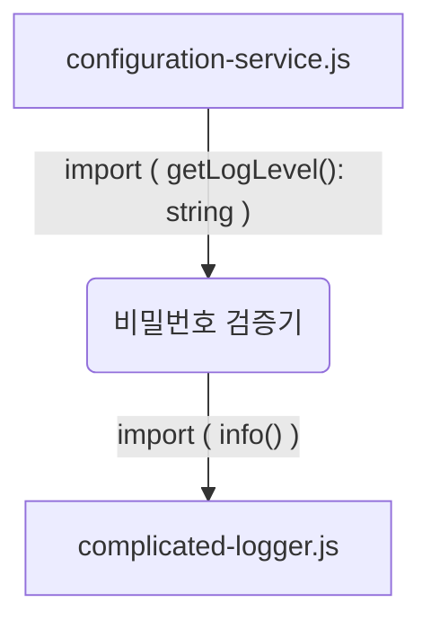
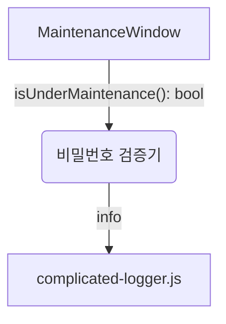

<!-- 단순한 책 내용만 정리하는 스터디에서 벗어나 자신의 생각을 정리하고, 그걸 바탕으로 실무에 적용할 수 있는 내용을 찾는 스터디가 되었으면 좋겠습니다. -->
<!-- 참고한 글 - https://tech.kakaopay.com/post/frontend-study-journey/ -->

> [!Note]
> 5장. 격리 프레임워크

## Summary
<!-- 한 줄 요약을 통해 발표자는 본인이 주제를 정확하게 이해했는지 점검하고, 스터디원들은 한 눈에 주제를 파악할 수 있습니다. -->

격리 프레임워크를 사용하면 목이나 스텁을 더 간단하고 빠르게 만들 수 있다.


## Concept
<!-- 책을 바탕으로 발표 주제의 이론적 개념 및 필요한 배경 지식을 설명합니다. -->


### 격리 프레임워크 정의
- 격리 프레임워크는 객체나 **함수 형태의 목이나 스텁을 동적으로 생성, 구성, 검증할 수 있게 해주는 프로그래밍 가능한 API**이다.
- 테스트를 하기 위해 반복적으로 코드를 작성하는 일을 줄여준다.
- 테스트 지속성을 높여 프로덕션 코드가 변경되어도 테스트를 수정하지 않게 해준다.

### 격리 프레임워크 유형
다양한 프로그래밍 패러다임을 지원하는 자스 덕분에 격리 프레임워크를 크게 두 가지 유형으로 나눌 수 있다.
#### 느스한 타입의 자바스크립트 격리 프레임워크
- 제스트, 사이넌등이 있다.
- 작업을 수행할 때 설정과 보일러 플레이트 코드가 더 적게 필요하기 때문에 함수형 스타일 코드에 적합하다.

#### 정적 타입의 자바스크립트 격리 프레임워크
- substitue.js가 있다.
- 객체 지향적이고 타스에 친화적이기 때문에 전체 클래스와 인터페이스를 다룰 때 유용하다.

#### 어떤 유형을 써야하는가?
위 두 가지 유형은 어떤 유형을 써야할지는 몇 가지 요소에 따라 달라질 수 있지만, 가장 중요한 점은 `어떤 종류의 의존성을 가짜로 만들어야 하는가에 관한 것`이다.
- `모듈 의존성`은 제스트 같은 느슨한 타입의 프레임워크가 적합하다.
- `함수형 의존성`은 제스트 같은 느슨한 타입의 프레임워크가 적합하다.
- `객체 전체, 객체 계층 구조, 인터페이스`는 substitue와 같은 객체 지향적인 프레임워크가 적합하다.


### 격리 프레임워크를 사용한 모듈 의존성을 가짜로 만들기

다음의 예제는 의존성을 두 개 가진 비밀번호 검증기이다.
- 로깅 레벨을 결정
- 비밀번호 검증할 때마다 종료점으로 호출하는 로깅



```js
const { info , debug } = require('./complicated-logger.js');
const { getLogLevel } = require('./configuration-service.js');


const log = (text) => {
    // 1. getLogLevel에서 반환하는 값을 스텁을 사용하여 가짜로 생성
    if(getLogLevel() === 'info') {

        // 2. info함수가 호출되었는지 모의 함수를 사용하여 검증
        info(text);
    }

    if(getLogLevel() === 'debug') {
        debug(text);
    }
}

const verifyPassword = (input, rules) => {
    const failed = rules
        .map(rule => rule(input))
        .filter(result => result === false);

    if(failed.length === 0) {
        log('PASSED');
        return true;
    }

    log('FAILED');
    return false;
}
```

여기서는 제스트를 격리 프레임워크를 사용하며 목을 만들고 검증하는 여러가지 방법 중에서 하나로
테스트 가장 위쪽에 `jest.mock([모듈이름])`과 같은 식으로 목을 만들 대상을 지정한다.
그런 다음 테스트에서 가짜 모듈을 불러 원하는 방식으로 재구성한다.

제스트를 사용한다면,

```js
// 가장 상단에 모듈을 가짜로 생성
// 호이스팅 특성 때문에 파일 가장 위쪽에 위치해야 함.
jest.mock('./configuration-service.js');
jest.mock('./complicated-logger.js');

const { stringMatching } = expect;
const { verifyPassword } = require('./password-verifier');
// jest.mock() 함수로 만든 가짜 모듈 인스턴스를 불러온다.
const mockLoggerModule = require('./complicated-logger.js');
const stubConfigModule = require('./configuration-service.js');


describe('password verifier', () => {
   afterEach(jest.resetAllMocks);

   test('with info level and no rules, it calls the logger with PASSED', () => {

    // 가짜 모듈의 getLogLevel 함수의 반환 값이 info를 반환하도록 (스텁)
    stubConfigModule.getLogLevel.mockReturnValue('info');

    verifyPassword('password', []);

    // 가짜 모듈의 모의 함수가 호출되었는지 검증(목)
    expect(mockLoggerModule.info).toHaveBeenCalledWith(stringMatching(/PASSED/));

   })

   test('with debug level and no rules, it calls the logger with PASSED', () => {
    stubConfigModule.getLogLevel.mockReturnValue('debug');

    verifyPassword('password', []);
    
    expect(mockLoggerModule.debug).toHaveBeenCalledWith(stringMatching(/PASSED/));
   })   
})
```

3, 4장과 비교해봤을 때 제스트를 사용함으로서 타이핑을 많이 줄일 수 있고 테스트 가독성은 그대로 유지할 수 있다.


### 격리 프레임워크를 사용한 함수형 의존성을 가짜로 만들기

지금까지 수동으로 작성했던 방식
```js
test('given logger and passing scenario', () => {
    it('calls the logger with PASS', () => {
        let logged = '';
        const mockLog = { info: (text) => (logged = text) };
        const passVerify = makeVerifier([], mockLog);

        passVerify('any input');

        // logger함수가 호출되었는지 확인하기 위해 반복 코드가 많았음.
        expect(logged).toMatch(/PASSED/);
    });
}); 
```

제스트를 사용한 방식
```js
test('given logger and passing scenario', () => {
    it('calls the logger with PASS', () => {
        let logged = '';

        // jest.fn을 사용하여 모의함수를 만듬.
        const mockLog = { info: jest.fn() };
        const verify = makeVerifier([], mockLog);

        verify('any input');

        // 제스트에서 모의함수를 만들어두면 자동으로 추적하고 toHaveBeenCalledWith를 사용하면 
        // 모의 함수가 호출되었는지 검증이 가능
        expect(mockLog.info).toHaveBeenCalledWith(expect.stringContaining(/PASSED/));
    });
}); 
```

- 결론적으로 시간을 많이 절약할 수 있다.
- jest.fn()은 단일 함수 기반의 목과 스텁에 잘 맞음.

### 격리 프레임워크를 사용한 객체형 의존성을 가짜로 만들기

위 두 케이스는 함수형 프로그래밍에서는 잘 작동하지만 여러 함수를 포함하는 전체 API 인터페이스나 클래스에 사용하려면 문제가 생긴다.


먼저 느슨한 타입의 프레임워크를 사용하여 복잡한 인터페이스 예시 IComplicatedLogger를 다뤄본다.

```js
export interface IComplicatedLogger {
    info(text: string, method: string)
    debug(text: string, method: string)
    warn(text: string, method: string)
    error(text: string, method: string)
}
```
먼저 이  인터페이스를 직접 작성하려면 시간이 많이 필요하고 메서드마다 매개변수를 기억해야함.

```js
describe('working with long interfaces', () => {
    describe('password verifier', () => {
        class FakeLogger implements IComplicatedLogger {
            // 필드 지정
            debugText = '';
            debugMethod = '';
            infoText = '';
            infoMethod = '';
            warnText = '';
            warnMethod = '';
            errorText = '';
            errorMethod = '';

            // 인터페이스의 각 함수에 대해 직접 정의 해줘야하기에 번거롭다.
            debug(text: string, method: string) {
                this.debugText = text;
                this.debugMethod = method;
            }

            error(text: string, method: string) {
                this.errorText = text;
                this.errorMethod = method;
            }

            ...
        }

         test('verify, with logger, calls logger with PASS', () => {
            const mockLog = new FakeLogger();
            const verifier = new PasswordVerifier([], mockLog);

            verifier.verify('anything');

            expect(mockLog.written).toMatch(/PASSED/);
        });
    })
})
```

제스트 같은 격리 프레임워크를 사용하면 훨씬 간단하고 가독성이 좋은 형태로 작성이 가능하다.
```js
describe('working with long interfaces', () => {
    describe('password verifier', () => {
        test('verify, with logger, calls logger with PASS', () => {

            // 인터페이스의 각 함수에 jest.fn()으로 만든 모의 함수를 할당
            // 문제는 인터페이스 변경되었을 떄 이다.
            const mockLog: IComplicatedLogger = {
                debug: jest.fn(),
                info: jest.fn(),
                warn: jest.fn(),
                error: jest.fn(),
            }
            const verifier = new PasswordVerifier([], mockLog);

            verifier.verify('anything');

            expect(mockLog.info).toHaveBeenCalledWith(
                expect.stringMatching(/PASSED/), 
                expect.stringMatching(/verify/)
            );
        });
    })
})
```
그래서 정적 타입의 프레임워크를 사용하여 복잡한 인터페이스 예시 IComplicatedLogger를 다뤄보는 예시

```js
import { Substitute, Arg } from '@fluffy-spoon/substitute';

describe('working with long interfaces', () => {
    describe('password verifier', () => {
        test('verify, with logger, calls logger with PASS', () => {
            // 중요한 포인트는 객체의 시그니처가 변경되더라도 신경 쓸 필요가 없다.
            const mockLog = Substitute.for<IComplicatedLogger>(); // 모의 객체를 생성한다.
            const verifier = new PasswordVerifier([], mockLog);

            verifier.verify('anything');
            // 모의 객체의 호츌 여부를 검증
            mockLog.received().info(
                Arg.is((x) => x.includes('PASS')),
                'verify'
            );
        });
    })
})
```

### 격리프레임 워크를 사용한 스텁 설정
제스트는 모듈과 함수 의존성의 반환 값을 조작하는 함수로 mockReturnValue()와 mockReturnValueOnce()를 제공.

```js
test('test same return values', () => {
    const stubFunc = jest.fn()
        .mockReturnValue('abc');

    // 언제나 동일한 값을 반환
    expect(stubFunc()).toBe('abc');
    expect(stubFunc()).toBe('abc');
    expect(stubFunc()).toBe('abc');

    const stubFunc2 = jest.fn()
        .mockReturnValueOnce('a')
        .mockReturnValueOnce('b')
        .mockReturnValueOnce('c');

    // 최초 한번만 정해진 값을 반환
    expect(stubFunc2()).toBe('a');
    expect(stubFunc2()).toBe('b');
    expect(stubFunc2()).toBe('c');
    expect(stubFunc2()).toBe(undefined);
})

// 오류를 테스트해야 하거나 더 복잡한 작업을 하는 경우에는 
// mockImplementation()이나 mockImplementationOnce() 함수를 사용할 수 있다.
yourStub.mockImplementation(() => {
    throw new Error('error');
})
```

비밀번호 검증기에 또 다른 요소를 첨가한 예시
- 소프트웨어가 업데이트되는 유지 보수 기간 동안 비밀번호 검증기가 `비활성화`된다고 가정
- 유지 보수 기간 중에는 비밀번호 검증기의 verify()를 호출하면 logger.info()에 Under maintenance라는 메시지를 전달
- 아닐 때는 logger.info()에 PASSED 또는 FAILED 결과를 전달



```js
subtitue를 사용하여 MaintenanceWindow 인터페이스의 스텁과 IcomplicatedLogger 인터페이스의 목을 생성

import { Substitute } from '@fluffy-spoon/substitute';


const makeVerifierWithNoRules = () => new PasswordVerifier3([], log, maint);

describe('working with substitue part 2', () => {
    test('verify, during maintenance, calls logger', () => {
        const stubMaintenanceWindow = Substitute.for<MaintenanceWindow>();

        // isUnderMaintenance() 반환값을 스텁으로 대체
        stubMaintenanceWindow.isUnderMaintenance().returns(true);

        const mockLog = Substitute.for<IComplicatedLogger>();
        const verifier = makeVerifierWithNoRules(mockLog, stubMaintenanceWindow);

        verifier.verify('anything');

        // 검증
        mockLog.received().info('Under maintenance', 'verify');
    })
 

    test('verify, outside maintenance, calls logger', () => {
        const stubMaintenanceWindow = Substitute.for<MaintenanceWindow>();
        stubMaintenanceWindow.isUnderMaintenance().returns(false);

        const mockLog = Substitute.for<IComplicatedLogger>();
        const verifier = makeVerifierWithNoRules(mockLog, stubMaintenanceWindow);

        verifier.verify('anything');
        mockLog.received().info('PASSED', 'verify');
    })
})
```


### 격리 프레임워크의 잠재적 위험 요소
- 대부분의 경우 모의 객체가 필요하지 않지만 쉽게 가짜로 만들 수 있기 때문에 이 부분을 쉽게 생각하게 할 수 있다.
- 올바른 대상을 테스트하고 있는 경우가 아닐 수도 있다.
  - 의미 있는 동작을 검증해본다.
- 하나의 테스트에 많은 목을 만들거나 검증 단계가 많아질 수 있다.
  - 더 작은 하위 테스크로 쪼개거나 줄여본다.
  - 목을 줄인다.


## Advantages
<!-- (선택) 발표 주제를 적용했을 때 얻을 수 있는 이점이나 해결할 수 있는 문제 상황들에 대해 설명합니다. -->
- 제어할 수 없는 의존성에 대해서 비교적 쉽고 빠르게 생성하고 구성 및 검증할 수 있다.
- 여러 의존성 유형에 대해 jest, substitute 등 적합한 격리 프레임워크를 선택할 수 있다.

## Disadvantages 
<!-- (선택) 발표 주제를 적용했을 때 발생할 수 있는 side effect나 trade-off에 대해 설명합니다. -->

## Example Case
<!-- 발표 주제가 적용되어 있는 라이브러리, 실제 업무에 적용되어 있는 코드, 직접 만든 예시 코드, 자신의 느낀점 등을 첨부하여 이해를 돕습니다. -->


리액트 프로젝트를 예시로 든다면
유저 정보를 외부로 부터 통신하여 가져온 다음 브라우저에 유저이름을 노출하는 컴포넌트를 테스트한다고 가정해보자.
조금 더 객체스러운 부분을 첨가하여 substitude를 써보는 예시이다.

먼저 user 정보를 가져오는 부분을 객체 형태로 작성
```js
export interface IUserService {
  fetchUser(): Promise<{ name: string }>;
  updateUser(name: string): Promise<void>;
}

export class UserService implements IUserService {
  async fetchUser(): Promise<{ name: string }> {
    const res = await fetch('/api/user');
    return res.json();
  }

  async updateUser(name: string): Promise<void> {
    await fetch('/api/user', {
      method: 'PUT',
      body: JSON.stringify({ name })
    });
  }
} 
```

그 다음 유저정보를 가져오는 컴포넌트에 prop으로 주입하여
상황에 따라 텍스트를 렌더링
```js
interface UserInfoProps {
  userService: IUserService;
}

export const UserInfo = ({ userService }: UserInfoProps) => {
  const [user, setUser] = useState<{ name: string } | null>(null);

  useEffect(() => {
    userService.fetchUser()
      .then(setUser);
  }, [userService]);

  if (!user) return <div>Loading...</div>;
  return <div>{user.name}</div>;
}; 
```

이를 위에서 배운 substitute라는 프레임워크를 사용하여 테스트를 작성해본다고 했을 때 
아래 처럼 작성이 가능.
```js
import { render, screen, waitFor } from '@testing-library/react';
import { Substitute } from '@fluffy-spoon/substitute';
import { IUserService } from '../api/user';
import { UserInfo } from './UserInfo';

describe('UserInfo', () => {
  let userService: IUserService;

  beforeEach(() => {
    // 모의 객체 생성
    userService = Substitute.for<IUserService>();
  });

  test('사용자 정보를 성공적으로 불러올 때 이름을 표시', async () => {
    // 메서드의 반환값을 쉽게 설정 스텁????
    // userService의 인터페이스가 변경되어도 따로 추가적으로 유지보수해야할 부분이 없다.
    userService.fetchUser().returns(Promise.resolve({ name: 'Alice' }));

    render(<UserInfo userService={userService} />);
    
    await waitFor(() => {
        // 검증
        expect(screen.getByText('Alice')).toBeInTheDocument();
    });
  });
}); 
```


## Wrap-up
<!-- 발표를 마무리하며 발표 주제를 다시 요약하고 정리합니다. -->

- 격리 프레임워크는 객체나 함수 형태로 목이나 스텁을 동적으로 생성하거나 구성 및 검증할 수 있게 해주며 많은 시간을 절약해준다.
- 격리 프리엠워크에는 느슨한 타입과 정적 타입 두 가지 유형이 있으며 어떤 유형의 의존성을 가짜로 만들어야하는가에 따라 알맞은 유형을 선택해야 한다.
- 격리 프레임워크를 사용하다보면 여러 개의 목을 사용하는 경우가 생기는데 최대한 목은 다른 방법으로는 테스트할 수 없을 때만 사용해야 한다.