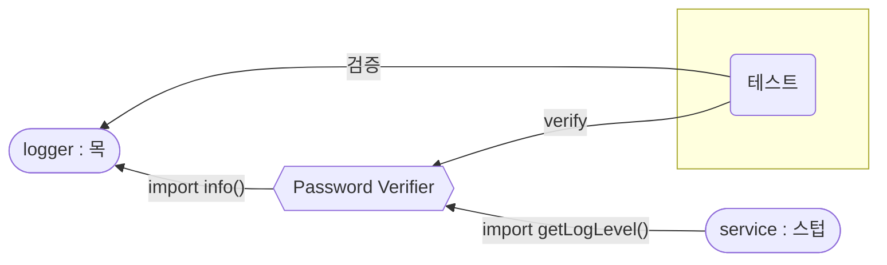

<!-- 단순한 책 내용만 정리하는 스터디에서 벗어나 자신의 생각을 정리하고, 그걸 바탕으로 실무에 적용할 수 있는 내용을 찾는 스터디가 되었으면 좋겠습니다. -->
<!-- 참고한 글 - https://tech.kakaopay.com/post/frontend-study-journey/ -->

> [!Note]
> 정리한 챕터나 페이지 등을 자유롭게 기록

## Summary

<!-- 한 줄 요약을 통해 발표자는 본인이 주제를 정확하게 이해했는지 점검하고, 스터디원들은 한 눈에 주제를 파악할 수 있습니다. -->

격리 프레임워크를 사용하여 수작업으로 작성했던 코드량을 줄이고, 더 간단하고 빠르게 테스트를 작성할 수 있다.

## Concept

<!-- 책을 바탕으로 발표 주제의 이론적 개념 및 필요한 배경 지식을 설명합니다. -->

### 격리 프레임워크

- 런타임에 가짜 객체를 생성하고 설정할 수 있는 재사용 가능한 라이브러리를 의미한다.
- 이러한 객체를 동적 스텁(dynamic stub), 동적 목(dynamic mock)이라고 부른다.

- 장점

  - 객체 간 상호작용을 검증하거나 테스트할 때 반복적인 코드를 줄여준다.
  - 테스트의 지속성을 높여 프로덕션 코드가 변경될 때마다 테스트를 자주 수정하지 않아도 된다.

- 단점

  - 가독성 저하
  - 신뢰할 수 없는 테스트
  - 의미 없는 테스트 작성

### 동적으로 가짜 모듈 만들기

#### `password-verifier.js`

로깅 레벨을 결정하는 `내부로 들어오는 의존성`(configuration-service)과 로그 항목을 생성하는 `외부로 나가는 의존성`(complicated-logger)을 가지고 있음

```js
const { info, debug } = require("./complicated-logger");
const { getLogLevel } = require("./configuration-service");

const log = (text) => {
  if (getLogLevel() === "info") {
    info(text);
  }
  if (getLogLevel() === "debug") {
    debug(text);
  }
};

const verifyPassword = (input, rules) => {
  const failed = rules
    .map((rule) => rule(input))
    .filter((result) => result === false);

  if (failed.length === 0) {
    log("PASSED");
    return true;
  }
  log("FAIL");
  return false;
};

module.exports = {
  verifyPassword,
};
```

- 구성 서비스의 getLogLevel() 함수에서 반환하는 값을 `스텁`을 사용하여 가짜로 만들어야 함.
- Logger 모듈의 info()함수가 호출되었는지 모의 함수를 사용하여 검증해야 함.



```js
jest.mock("./complicated-logger"); // 모듈 가짜로 만들기
jest.mock("./configuration-service");

const { stringMatching } = expect;
const { verifyPassword } = require("./password-verifier");
const mockLoggerModule = require("./complicated-logger"); // 가짜 모듈 인스턴스 불러오기
const stubConfigModule = require("./configuration-service");

describe("password verifier", () => {
  afterEach(jest.resetAllMocks);

  test(`with info log level and no rules, 
          it calls the logger with PASSED`, () => {
    stubConfigModule.getLogLevel.mockReturnValue("info"); // 가짜 모듈의 getLogLevel() -> 'info' return

    verifyPassword("anything", []);

    expect(mockLoggerModule.info).toHaveBeenCalledWith(stringMatching(/PASS/));
  });

  test(`with debug log level and no rules, 
          it calls the logger with PASSED`, () => {
    stubConfigModule.getLogLevel.mockReturnValue("debug");

    verifyPassword("anything", []);

    expect(mockLoggerModule.debug).toHaveBeenCalledWith(stringMatching(/PASS/)); //  가짜 모듈의 모의 함수 호출여부 검증
  });
});
```

### 의존성 종류에 따른 프레임워크 선택

> 느슨한 타입: 설정, 보일러플레이트 코드가 적게 필요 -> 함수형에 적합 (jest )</br>
> 정적 타입: 객체 지향적, 타입 스크립트 친화적 -> 클래스 및 인터페이스를 다루는데 적함 (substitute.js)

- **모듈 의존성(import, require)**: Jest 같은 느슨한 타입 프레임워크 추천
- **함수형 의존성**: 모듈 의존성과 동일하게 Jest가 적합
- **객체 지향/인터페이스 의존성**: substitute.js 같은 객체 지향 프레임워크 추천

### Jest 주요 격리 함수

- `mockReturnValue()` : 항상 동일한 스텁 결과값을 반환
- `mockReturnValueOnce()` : 호출될 때마다 다른 결과값 반환 (없으면 undefined)
- 복잡하거나 오류를 테스트해야 하는 경우 : `mockImplementation()`, `mockImplementationOnce()`

### 격리 프레임워크의 장점과 함정

#### 장점

- 가짜 모듈 / 객체 생성이 쉬워진다.
- 값이나 오류를 만들어내기가 간편하다.

#### 함정

1. **단위 테스트에서 모의 객체를 사용하지 않는 것이 바람직**

   모의 객체나 스텁을 사용하면 외부 의존성으로 인해 테스트가 복잡해질 수 있다.</br>
   제어할 수 없는 서드파티 의존성에 대해 반환값이나 호출 여부만 확인할 때 사용을 권장.

2. **지나치게 많은 목(mock)과 검증 단계는 테스트의 가독성을 떨어뜨림**

   목 객체가 많거나 검증이 복잡하면 테스트 코드가 읽기 어려워진다.

   - solution:
     - 목 객체와 검증 단계를 최소화한다.
     - 테스트를 더 작은 단위로 나누어 가독성을 향상시킨다.

3. **잘못된 대상 검증**

   모의 객체로 메서드 호출 여부를 검증할 수 있지만, 실제 동작 대신 호출만을 검증하는 과잉 명세로 이어질 수 있다.

4. **하나의 테스트에 여러 개의 목 객체 사용**

   하나의 테스트에서 여러 종료점을 한 번에 테스트하면, 유지보수 비용이 증가하고 가독성이 떨어진다.

   - solution: 각 종료점마다 별도의 테스트를 작성하여 분리한다.

5. **테스트의 과도한 세부 명세화**

   검증 항목이 많으면 프로덕션 코드 변경 시 테스트가 쉽게 깨질 수 있다.<br/>
   상호작용 테스트는 너무 많거나 너무 적으면 문제가 발생할 수 있다.

   - solution:
     - 목 객체 대신 스텁을 사용
     - 스텁을 목 객체로 사용 x

## Advantages

<!-- (선택) 발표 주제를 적용했을 때 얻을 수 있는 이점이나 해결할 수 있는 문제 상황들에 대해 설명합니다. -->

## Disadvantages

<!-- (선택) 발표 주제를 적용했을 때 발생할 수 있는 side effect나 trade-off에 대해 설명합니다. -->

## Example Case

<!-- 발표 주제가 적용되어 있는 라이브러리, 실제 업무에 적용되어 있는 코드, 직접 만든 예시 코드, 자신의 느낀점 등을 첨부하여 이해를 돕습니다. -->

### 자주 쓰이는 Jest Mock 함수

#### 1. `mockReturnValue(value)`

- 호출할 때마다 항상 같은 값 반환
- 고정된 응답(mock 데이터)을 리턴할 때 사용

```javascript
const mockFn = jest.fn();
mockFn.mockReturnValue(42);
console.log(mockFn()); // 항상 42
```

---

#### 2. `mockReturnValueOnce(value)`

- 딱 한 번만 지정한 값을 반환
- 호출마다 결과가 다를 때 (ex: 첫 호출 성공, 두 번째 실패) 사용

```javascript
const mockFn = jest.fn();
mockFn.mockReturnValueOnce("first").mockReturnValueOnce("second");
console.log(mockFn()); // 'first'
console.log(mockFn()); // 'second'
```

---

#### 3. `mockImplementation(fn)`

- 매 호출마다 함수를 실행해 결과를 반환
- 복잡한 로직, 입력에 따라 반환 결과를 다르게 하고 싶을 때 사용

```javascript
const mockFn = jest.fn();
mockFn.mockImplementation((x) => x * 2);
console.log(mockFn(3)); // 6
```

---

#### 4. `mockResolvedValue(value)`, `mockRejectedValue(error)`

- `Promise.resolve(value)` / `Promise.reject(error)` 를 반환
- 비동기 함수가 정상적으로 성공 / 실패 하는 경우 mock할 때 사용

```javascript
const mockFn = jest.fn();
mockFn.mockResolvedValue("success");
const result = await mockFn();
console.log(result); // 'success'
```

```javascript
const mockFn = jest.fn();
mockFn.mockRejectedValue(new Error("fail"));
await expect(mockFn()).rejects.toThrow("fail");
```

---

#### 5. `mockClear()`

- 호출 기록만을 초기화하고, 설정은 유지:
  - 함수의 호출 횟수(mock.calls), 호출된 인자(mock.calls 배열), 호출 결과(mock.results)
  - mockReturnValue 등의 모킹은 유지
- 테스트 케이스마다 호출 여부를 새로 체크하고 싶을 때(수동으로) 사용

```javascript
const mockFn = jest.fn();
mockFn();
mockFn.mockClear();
console.log(mockFn.mock.calls.length); // 0
```

#### etc. `mockReset()`, `mockRestore()`, ...

https://jestjs.io/docs/mock-function-api

## Wrap-up

<!-- 발표를 마무리하며 발표 주제를 다시 요약하고 정리합니다. -->

- 확실히 3,4 장에서 직접 가짜 객체를 생성할때보다, jest 내장 함수를 사용하는 것이 간단함.
- jest 는 스텁을 만들 때나 목을 만들 때 'mock' 이라는 단어를 동일하게 사용하기 때문에, 헷갈릴 수 있음.
- `jest.mock` 은 제어권이 있는 코드까지 모두 가짜로 만들어 버리기 때문에, 제어할 수 없는 상황에서만 적절히 사용하자.
