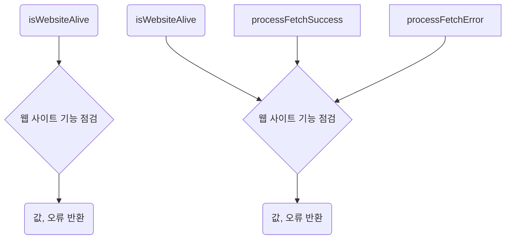
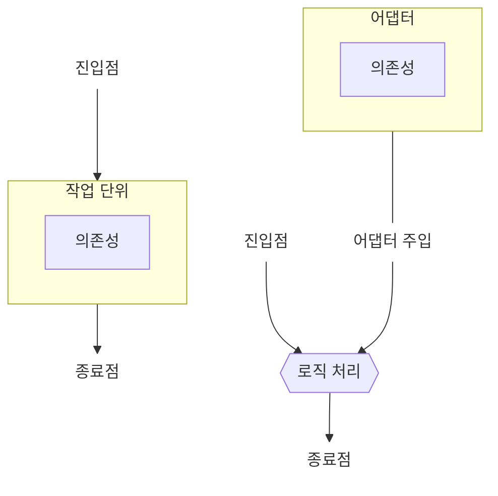
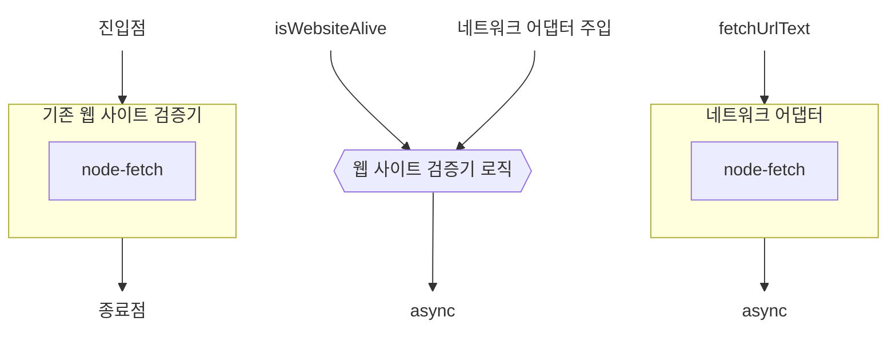

<!-- 단순한 책 내용만 정리하는 스터디에서 벗어나 자신의 생각을 정리하고, 그걸 바탕으로 실무에 적용할 수 있는 내용을 찾는 스터디가 되었으면 좋겠습니다. -->
<!-- 참고한 글 - https://tech.kakaopay.com/post/frontend-study-journey/ -->

> [!NOTE]   
> ch06 비동기 코드 단위 테스트 (p210 ~ p242)

## Summary
<!-- 한 줄 요약을 통해 발표자는 본인이 주제를 정확하게 이해했는지 점검하고, 스터디원들은 한 눈에 주제를 파악할 수 있습니다. -->
- 비동기 로직을 테스트 하기 쉽게 하려면 진입점 분리 패턴, 어댑터 분리 패턴을 사용할 수 있다.
- 순수 로직을 비동기 함수와 별도의 함수로 분리하여 테스트 진입점으로 사용하는 것이 단위 테스트를 작성하기 좋다.
- 어댑터 분리는 비동기적인 의존성을 분리해 동기적인 것으로 대체할 수 있도록 추상화하는 것이다. 

## Concept
<!-- 책을 바탕으로 발표 주제의 이론적 개념 및 필요한 배경 지식을 설명합니다. -->
### 비동기 데이터 가져오기
```js
const isWebsiteAliveWithAsyncAwait = async () => {
    try {
        const resp = await fetch('http://example.com');
        if (!resp.ok) {
            throw resp.statusText;
        } 
        const text = await resp.text();
        const included = text.includes("illustrative");
        if (included) {
            return { success: true, status: "ok" };
        }

        throw "text missing";
    } catch (err) {
        return { success: false, status: err };
    }
}
```
example.com 이라는 웹사이트가 정상적으로 작동하는지 확인하는 모듈이다.   
`isWebsiteAliveWithAsyncAwait()` 을 진입점으로 하고 안에서 url 콘첸츠를 가져와 그에 따른 처리를 하여 값을 반환하고 있다.   
이런 비동기 처리 함수는 어떻게 테스트할 수 있을까?   
처음에는 통합 테스트를 작성해볼 수 있다.   

```js
test("NETWORK REQUIRED (await): correct content, true", (done) => {
    samples.isWebsiteAliveWithAsyncAwait().then(result => {
        expect(result.success).toBe(true);
        expect(result.status).toBe('ok');
        done();
    });
});
```
jest에서는 비동기 코드가 완료되었음을 명시적으로 알릴 수 있는 `done()` 콜백을 제공한다.   
`done()` 이 호출될 때까지 jest는 테스트가 완료되지 않았다 간주하고 기다린다.   
`done`이 호출되지 않으면 기본 타임아웃 5초 후에 테스트가 실패한다.   

위 테스트 코드는 콜백을 사용해 비동기 통합 테스트를 진행했다.   
이 방식 외에도 async/await 을 사용해 통합테스트를 작성할 수 있다.

```js
test("NETWORK REQUIRED (await): correct content, true", async (done) => {
    const result = await samples.isWebsiteAliveWithAsyncAwait();

    expect(result.success).toBe(true);
    expect(result.status).toBe('ok');
});
```
이렇게 테스트 코드 내에서 async/await 을 사용할 시 거의 일반적인 값 기반 테스트 처럼 간단해진다.

### 통합 테스트의 어려움
앞서 나온 예제와 같은 통합 테스트는 아래의 한계점이 존재한다.   
1. 긴 실행 시간
    - 단위 테스트에 비해 훨씬 속도가 느리다.
2. 불안정성
    - 환경에 따라 실행 시간이 달라지거나 실패와 성공이 일관되지 않을 수 있다.
3. 테스트와 관계없는 코드나 환경 검증
    - 테스트와 직접 관련이 없거나 개발자가 신경 쓰지 않는 환경까지도 테스트 한다. (ex. 네트워크 상태, fetch 라이브러리, 외부 웹 사이트 기능 등)
4. 파악하는 데 더 많은 시간이 걸림
    - 실패 원인으로 의심되는 것이 다양해 디버깅하기 어렵다.
5. 상황을 재현하기 어려움
    - 잘못된 웹 사이트 콘텐츠, 웹 사이트 다운, 네트워크 다운 등 부정적인 상황을 재현하기 어렵다. 
6. 결과를 신뢰하기 어려움
    - 통합 테스트 실패가 외부 문제라고 생각할 수 있지만 실제론 내부 코드 문제일 수도 있다.

### 코드를 단위 테스트에 적합하게 만들기
통합 테스트로 해야했던 비동기 로직을 단위 테스트에 적합하게 만들 수 있는 2가지 패턴이 있다.
1. 진입점 분리 패턴
    - 프로덕션 코드에서 순수 로직 부분을 별도의 함수로 분리해 그 함수를 테스트의 시작점으로 사용하는 패턴
2. 어댑터 분리 패턴
    - 본질적으로 비동기적 요소를 분리하고 이를 추상화하여 동기적인 요소로 대체할 수 있게 하는 패턴

#### 진입점 분리 패턴
이 패턴에서는 특정 비동기 작업을 두 부분으로 나눈다.
- 비동기 부분 (그대로 둔다)
- 비동기 작업이 끝났을 때 호출되는 콜백 
   - 이 콜백을 새로운 함수로 분리해 순수 논리 작업 단위의 진입점으로 사용

위에서 나온 `isWebsiteAliveWithAsyncAwait()` 함수를 진입점 분리 패턴으로 리팩터링 해보자.

왼쪽은 기존처럼 비동기 작업과 그 이후 작업이 같이 있는 경우의 흐름이고,   
오른쪽은 진입점 분리 패턴을 사용해 비동기 작업 이후의 작업을 분리하여 새로운 진입점으로 만든 것이다. 
이를 코드로 보면 아래와 같다.

```js
// 진입점
const isWebsiteAlive = async () => {
    try {
        const resp = await fetch("http://example.com");
        throwIfResponseNotOK(resp);

        const text = await resp.text();
        return processFetchSuccess(text);
    } catch (err) {
        processFetchError(err);
    }
}

const throwIfResponseNotOK = (resp) => {
    if (!resp.ok) {
        throw resp.statusText;
    }
}

// 진입점
const processFetchSuccess = (text) => {
    const included = text.includes("illustrative");
    if (included) {
        return { success: true, status: "ok" };
    }
    return { success: false, status: "missing text" }; // 콜백함수를 호출하는 대신 값을 반환
}

// 진입점
const processFetchError = (err) => {
    throw err; // 값을 반환하는 대신 오류를 발생
}
```

비동기 로직 이후에 처리하는 작업을 `processFetchSuccess`, `processFetchError` 의 각 함수로 분리해 진입점으로 사용한다.   

테스트 코드도 각 진입점 별로 작성할 수 있다.
```js
describe("website up check", () => {
    test("on fetch success with good content, returns true", () => {
        const result = samples.processFetchSuccess("illustrative");
        expect(result.success).toBe(true);
        expect(result.status).toBe("ok");
    });

    test("on fetch success with bad content, return false", () => {
        const result = samples.processFetchSuccess("text not on site");
        expect(result.success).toBe(false);
        expect(result.status).toBe("missing text");
    });

    test("on fetch fail, throws", () => {
        expect(() => samples.processFetchError("error text"))
            .toThrowError("error text");
    });
});
```
새로운 진입점이 생기면서 이를 직접 호출하는 식으로 코드가 변경되었다.   
이렇게 바꾸면 다양한 조건을 쉽게 테스트할 수 있게 되었다.

#### 어댑터 분리 패턴
어댑터 분리 패턴은 이전 패턴과 달리 비동기 코드를 의존성처럼 여기는 전략이다.   
테스트에서 더 쉽게 제어하고, 시나리오를 다양하게 만들기 위해 대체하고 싶은 대상으로 본다.

기존 코드에서 의존성으로 있던 비동기 코드를 분리하여 어댑터로 감싸고, 이를 다른 의존성처럼 주입할 수 있게 한다.



위 오른쪽 다이어그램처럼 의존성을 분리하고 어댑터로 감싸면 테스트에서 해당 의존성을 더 간단하게 만들고 가짜로 대체할 수 있다.    
어댑터를 사용하는 쪽은 단순화 된 특별한 인터페이스를 만드는 것도 일반적이다.   
이를 인터페이스 분리 원칙(ISP) 라고 한다.

위에서 만든 웹 사이트 검증기의 비동기 로직을 네트워크 어댑터 모듈로 감싸 의존성을 분리해보자.


```js
// network-adapter.js
const fetch = require('node-fetch');

const fetchUrlText = async (url) => {
    const resp = await fetch(url);
    if (resp.ok) {
        const text = await resp.text();
        return { ok: true, text };
    }
    return { ok: false, text: resp.statusText };
}
```
네트워크 어댑터 모듈은 프로젝트에서 `node-fetch` 를 가져오는 유일한 모듈이다.   
즉, 나중에 의존성이 변경되더라도 이 파일만 수정하면 된다는 뜻이다.   

```js
// 네트워크 어댑터 모듈을 사용하는 isWebsiteAlive 함수
const network = require('./network-adapter');

const isWebsiteAlive = async () => {
    try {
        const result = await network.fetchUrlText("http://example.com");
        if (!result.ok) {
            throw result.text;
        }
        const text = result.text;
        return processFetchSuccess(text);
    } catch (err) {
        throw processFetchFail(err);
    }
}
```
이렇게 네트워크 어댑터 모듈을 불러와 사용하면 해당 모듈을 `jest.mock()` 함수로 가짜로 만들 수 있다. 

```js
jest.mock('./network-adapter');
const stubSyncNetwork = require('./network-adapter');
const webverifier = require('./website-verifier');

describe('unit test website verifier', () => {
    beforeEach(jest.resetAllMocks); // 다른 테스트에 영향을 주지 않기 위해 모든 스텁 리셋

    test('with good content, returns true', async () => {
        // 스텁에서 반환 값을 흉내
        stubSyncNetwork.fetchUrlText.mockReturnValue({
            ok: true,
            text: 'illustrative',
        });
        const result = await webverifier.isWebsiteAlive();
        expect(result.success).toBe(true);
        expect(result.status).toBe('ok');
    });

    test('with bad content, returns false', async () => {
        stubSyncNetwork.fetchUrlText.mockReturnValue({
            ok: true,
            text: "<span>hello world</span>",
        });

        const result = await webverifier.isWebsiteAlive();
        expect(result.success).toBe(false);
        expect(result.status).toBe("missing text");
    });
});
```

#### 함수형 어댑터
함수형 디자인 패턴에서는 네트워크 어댑터 모듈을 website verifier 에 주입하는 방식이 달라진다.
```js
const isWebsiteAlive = async (network) => {
    const result = await netwrok.fetchUrlText("http://example.com");
    if (result.ok) {
        const text = result.text;
        return processFetchSuccess(text);
    }
    return processFetchFail(result.text);
}
```

함수형에서는 네트워크 어댑터 모듈이 함수의 매개변수로 주입된 것을 볼 수 있다.   
함수형 디자인 패턴에서는 **고차 함수와 커링을 사용해 네트워크 의존성이 미리 주입된 형태의 함수**를 설정할 수 있다.    
테스트에서는 이 매개변수를 간단히 가짜 네트워크 어댑터로 바꿔 전달하면 된다. 

```js
const makeStubNetworkWithResult = (fakeResult) => {
    return {
        fetchUrlText: () => {
            return fakeResult;
        },
    };
}

describe('unit test website verifier', () => {
    test('with good content, returns true', async () => {
        const stubSyncNetwork = makeStubNetworkWithResult({
            ok: true,
            text: 'illustrative',
        });
        const result = await webverifier.isWebsiteAlive(stubSyncNetwork);
        expect(result.success).toBe(true);
        expect(result.status).toBe('ok');
    });

    test('with bad content, return false', async () => {
        const stubSyncNetwork = makeStubNetworkWithResult({
            ok: true,
            text: 'unexpected content',
        });
        const result = await webverifier.isWebsiteAlive(stubSyncNetwork);
        expect(result.success).toBe(false);
        expect(result.status).toBe('missing text');
    })
})
```

#### 객체 지향, 인터페이스 기반 어댑터 
객체 지향 디자인에서는 매개변수 주입을 생성자 주입 패턴으로 확장할 수 있다. 

```ts
export interface INetworkAdapter {
    fetchUrlText(url: string): Promise<NetworkAdapterFetchResults>;
}

export interface NetworkAdapterFetchResults {
    ok: boolean;
    text: string;
}

export class NetworkAdapter implements INetworkAdapter {
    async fetchUrlText(url: string): Promise<NetworkAdapterFetchResults> {
        const resp = await fetch(url);
        if (resp.ok) {
            const text = await resp.text();
            return Promise.resolve({ ok: true, text });
        }
        return Promise.rejects({ ok: false, text: resp.statusText });
    }
}
```

이제 `INetworkAdapter` 매개변수를 받는 생성자가 있는 `WebsiteVerifier` 클래스를 만들어보자.

```ts
export interface WebsiteAliveResult {
    success: boolean;
    status: string;
}

export class WebsiteVerifier {
    constructor(private network: INetworkAdapter) {}

    isWebsiteAlive = async (): Promise<WebsiteAliveResult> => {
        let netResult: NetworkAdapterFetchResults;
        try {
            netResult = await this.network.fetchUrlText("http://example.com");
            if (!netResult.ok) {
                throw netResult.text;
            }
            const text = netResult.text;
            return this.processNetSuccess(text);
        } catch (err) {
            throw this.processNetFail(err);
        }
    }

    processNetSuccess = (text): WebsiteAliveResult => {
        const included = text.includes('illustrative');
        if (included) {
            return { success: true, status: 'ok' };
        }
        return { success: false, status: 'missing text' };
    }

    processNetFail = (err): WebsiteAliveResult => {
        return { success: false, status: err };
    }
}
```
이 클래스의 단위 테스트에서는 가짜 네트워크 어댑터를 생성하고 생성자를 사용해 주입하게 된다.     
`substitute.js` 를 사용해 인터페이스에 맞는 가짜 객체를 만들어 보자. 

```ts
const makeStubNetworkWithResult = (
    fakeResult: NetworkAdapterFetchResults
): INetworkAdapter => {
    const stubNetwork = Substitute.for<INetworkAdapter>();
    stubNetwork.fetchUrlText(Arg.any())
        .returns(Promise.resolve(fakeResult));

    return stubNetwork;
}

describe('unit test website verifier', () => {
    test('with good content, returns true', async () => {
        const stubSyncNetwork = makeStubNetworkWithResult({
            ok: true,
            text: 'illustrative',
        });
        const webVerifier = new WebsiteVerifier(stubSyncNetwork);

        const result = await webVerifier.isWebsiteAlive();
        expect(result.success).toBe(true);
        expect(result.status).toBe('ok');
    });

    test('with bad content, returns false', async () => {
        const stubSyncNetwork = makeStubNetworkWithResult({ 
            ok: true,
            text: 'unexpected content',
        });
        const webVerifier = new WebsiteVerifier(stubSyncNetwork);

        const result = await webVerifier.isWebsiteAlive();
        expect(result.success).toBe(false);
        expect(result.status).toBe('missing text');
    });
});
```
객체 지향 패턴에서 IoC, DI 를 사용해 코드를 작성하면 의존성과 로직을 분리하여 유지 관리가 쉬운 코드를 작성할 수 있다. 

### 타이머 다루기
자바 스크립트에서는 `setTimeout` 같은 타이머를 흔하게 사용한다.   
타이머를 다룰 때는 어댑터와 진입점을 분리하는 대신 타이머 기능을 비활성화 하고 우회하는 것이 더 유용할 때도 있다.   

타이머를 다루는 패턴은 아래 2가지가 있다.
- 함수를 직접 몽키 패칭하는 방법
- 제스트 및 다른 프레임워크를 사용하여 타이머를 비활성화하고 제어하는 방법

#### 몽키 패칭으로 타이머를 스텁으로 만들기
몽키 패칭은 프로그램이 실행 중인 동안 시스템 소프트웨어를 로컬에서 확장하거나 수정하는 방법이다. 

```js
const calculate1 = (x, y, resultCallback) => {
    setTimeout(() => { resultCallback(x + y); }, 5000);
}
```
이 코드를 테스트할 때 전역 객체의 `setTimeout` 함수를 임시로 동기 함수로 변경하는 방식으로 몽키 패칭 할 수 있다.

```js
describe('monkey patching', () => {
    let originalTimeout;
    
    beforeEach(() => (originalTimeout = setTimeout)); // 전역 객체에 담겨있던 원래 타이머 함수를 따로 보관
    afterEach(() => (setTimeout = originalTimeout)); // 각 테스트가 끝날 때마다 몽키 패칭 된 타이머 함수를 원래 것으로 복원

    test('calculate1', () => {
        setTimeout = (callback, ms) => callback(); // 타이머 함수를 몽키 패칭

        calculate1(1, 2, (result => {
            expect(result).toBe(3)
        }));
    });
});
```
이렇게 타이머 함수를 몽키 패칭하면 모든 라인이 동기 식으로 진행되므로 콜백 호출을 기다리기 위해 `done()` 을 사용할 필요가 없다.   
각 테스트가 끝날 때마다 몽키 패칭된 타이머 함수를 원래 타이머 함수로 돌려줘야 하는 것을 잊지 말아야 한다.

#### jest로 setTimeout 대체
jest에서는 자바 스크립트 타이머 함수를 처리하기 위해 3가지 기능을 제공한다.
1. `jest.useFakeTimers`
    - `setTimeout` 같은 타이머 함수를 스텁으로 대체한다. 
2. `jest.resetAllTimers`
    - 모든 가짜 타이머를 실제 타이머로 재설정
3. `jest.advanceTimersToNextTimer`
    - 가짜 타이머를 작동시켜 콜백을 실행한다. 실행하면 다음에 예정된 타이머가 실행된다.

앞에 나온 `calculate1()` 함수를 jest를 사용해 테스트 해보자.

```js
describe('calcuate1 - with jest', () => {
    beforeEach(() => {
        jest.useFakeTimers();
    });

    beforeEach(() => {
        jest.clearAllTimers();  
    });

    test('fake timers with callback', () => {
        calculate1(1, 2, (result) => {
            expect(result).toBe(3);
        });
        jest.advanceTimersToNextTimer(); // 다음 예정된 타이머를 실행한다. 
    });
});
```
이렇게 jest 를 사용해 타이머를 대체해도 모든 로직이 동기적으로 작동해 `done()` 함수를 호출할 필요가 없다.   
`advanceTimersToNextTimers`를 사용하지 않으면 가짜로 만든 `setTimeout`이 영원히 실행되지 않으니 주의해야한다. 

특히 `advanceTimersToNextTimers` 를 사용하면 지정된 단계 수만큼 모든 타이머를 앞으로 진행 시켜 다음 타이머 콜백이 실행되도록 할 수도 있다. -> `setInterval`을 사용하는 경우 유용하다. 

```js
const calculate2 = (getInputFn, resultFn) => {
    setInterval(() => {
        const { x, y } = getInputFn();
        resultFn(x + y);
    }, 1000);
}
```

이 함수는 계산할 입력 값을 반환하는 함수 1개와 계산 결과를 콜백으로 받는 함수 1개의 매개변수를 가진다.    
`setInterval` 을 사용해 계속해 입력 값을 받아 그 결과를 계산한다.

```js
describe('calculate with intervals', () => {
    beforeEach(() => jest.clearAllTimers());   // 근데 이거 afterEach 아닌가
    beforeEach(() => jest.useFakeTimers()); 

    test('calculate, incr input/output, calculates correctly', () => {
        let xInput = 1;
        let yInput = 2;

        const inputFn = () => ({ x: xInput++, y: yInput++ }); // 콜백 검증을 위해 변수 값 증가시킨다.

        const results = [];
        calculate2(inputFn, (result) => results.push(result));

        jest.advanceTimersToNextTimer();
        jest.advanceTimersToNextTimer(); // setInterval 을 2번 호출

        expect(results[0]).toBe(3);
        expect(results[1]).toBe(5);
    });
});
```
`advanceTimersToNextTimer` 함수를 사용해 `setInterval`을 원하는 만큼 호출하여 테스트를 진행했다. 

## Advantages
<!-- (선택) 발표 주제를 적용했을 때 얻을 수 있는 이점이나 해결할 수 있는 문제 상황들에 대해 설명합니다. -->

## Disadvantages 
<!-- (선택) 발표 주제를 적용했을 때 발생할 수 있는 side effect나 trade-off에 대해 설명합니다. -->

## Example Case
<!-- 발표 주제가 적용되어 있는 라이브러리, 실제 업무에 적용되어 있는 코드, 직접 만든 예시 코드, 자신의 느낀점 등을 첨부하여 이해를 돕습니다. -->
평소에는 외부 api 사용 등의 비동기 로직은 별도 파일로 분리하고,   
각 API별 필요한 함수를 만들어 두고, 이를 호출하는 곳에서 받은 데이터를 가공해서 다음 로직을 처리하는데 이를 진입점 분리라고 보는 걸지 궁금해졌다.

---

`setTimeout`, `setInterval` 같은 비동기 타이머 로직은 아니지만 최근에 템플릿 관련 코드를 작성하다 jest timer를 다룬적이 있어서 하나 소개 하고 간다.

#### new Date() 테스트 하기
```js
exports.getTodayIsoDateFormat = () => {
    const today = new Date();

    return today.toISOString();
}
```
이렇게 오늘 날짜의 ISO string 포맷을 반환하는 함수가 있다고 할 때, 아무런 대체 없이 테스트를 작성하면 어떻게 될까? 

```js
describe('date object test', () => {
    test('get today iso date format', () => {
        const today = getTodayIsoDateFormat();

        expect(today).toBe('2025-05-18T16:46:33.724Z')
    })
});
```
당연히 today는 매초마다 변경될테니 테스트에 통과할 수 없다. 
이런 상황을 위해 jest에서는 [setSystemTime](https://jestjs.io/docs/jest-object#jestsetsystemtimenow-number--date) 함수를 제공한다.   
시스템 시간 자체를 가짜로 대체할 수 있어 `new Date()` 등의 Date 객체를 조작할 수 있다.

```js
describe('date object test with fake time', () => {
    beforeEach(() => {
        const fakeDate = new Date('2025-05-18T16:46:33.724Z');
        jest.useFakeTimers().setSystemTime(fakeDate);
    });

    afterEach(() => jest.useRealTimers());

    test('get today iso date format', () => {
        const today = getTodayIsoDateFormat();
        
        expect(today).toBe("2025-05-18T16:46:33.724Z");
    });
});
```
사용법은 위 테스트 예제처럼 간단하다.
매 테스트 전 `useFakeTimers() 를 통해 가짜 타이머를 사용함을 명시하고, 이어 `setSystemTime` 을 통해 미리 준비한 `fakeTime`으로 대체해준다. 

이제 테스트를 수행하면 모든 시간이 설정한 `fakeTime`으로 반환된다.
책에서 나온 것처럼 테스트가 끝날 때마다 반드시 `jest.useRealTimers()` 를 사용해 원래의 타이머를 사용하겠다고 돌려줘야 문제가 없다. 

재밌는 사실은 jest 26버전 부터 새로운 fake timer 체계가 시작되었다는데 현재 타이머 기능 이전의 legacy에서는 아래처럼 spy 를 사용해 직접 타이머를 대체했다고 한다.

```js
describe('date object test with spy', () => {
    beforeEach(() => {
        jest.useFakeTimers('legacy'); // 임의로 레거시 타이머 사용

        const fakeTime = new Date('2025-05-18T16:46:33.724Z');
        jest.spyOn(global, 'Date').mockImplementation(() => fakeTime); // 직접 Date객체 모킹
    })

    afterAll(() => jest.restoreAllMocks())

    test("get today iso date format", () => {
      const today = getTodayIsoDateFormat();

      expect(today).toBe("2025-05-18T16:46:33.724Z");
    });
});
```

그럼 책에서 나온 몽키 패칭 방식으로는 어떻게 구현해볼 수 있을까?
```js
describe('date object test with monkey patching', () => {
    let OriginalDate;
    beforeEach(() => { 
        OriginalDate = global.Date; 
        
        class MockDate extends OriginalDate {
          constructor(...args) {
            if (args.length === 0) {
              return new OriginalDate("2025-05-18T16:46:33.724Z");
            }
            return new OriginalDate(...args);
          }
        }

        global.Date = MockDate;
    });
    afterEach(() => (global.Date = OriginalDate));

    test('get today iso date format', () => {
        const today = getTodayIsoDateFormat(); // MockDate로 몽키 패칭된 Date를 사용하게됨

        expect(today).toBe("2025-05-18T16:46:33.724Z");
    });
});
```
Date는 constructor가 필요해서 임의의 가짜 클래스를 직접 구현하고 `global.Date`에 넣어주었다.
각 테스트가 끝나면 원래의 `OriginalDate` 를 다시 `global.Date`에 넣어주어 몽키패칭된 클래스를 다시 원래대로 돌려주었다.

---

흠. 이렇게 공부하고 최근에 작성했다는 Date 타이머 관련 테스트 코드를 다시 봤는데 
너무 짬뽕으로 작성되어 있단 걸 알게 되었네요 
site template test 코드 어딘가에 있는데 시간 날 때 고쳐놓을게요 ..
```js
beforeAll(() => {
			const mockDate = new Date('2025-04-05T06:20:45.612+00:00');

			jest.useFakeTimers().setSystemTime(mockDate);
		});

		afterAll(() => {
			jest.restoreAllMocks();
		});

		beforeEach(() => {
			mockUpdateTemplate
				.makeSpy({ module: modTemplate, funcName: 'updateTemplate' })
				.mockResolvedValue({ id: mockTemplateId });

			const mockDate = new Date('2025-04-05T06:20:45.612+00:00');
			jest.spyOn(global, 'Date').mockImplementation(() => mockDate); // -> 이건 왜 또 한거지
		});

```

아무래도 급하게 구글링 or AI와 대화를 여기저기 하다가 이상한거 보고 가져 온 것 같은데
역시 뭐든 제대로 알아보고 쓰는게 중요한 것 같아요.

## Wrap-up
<!-- 발표를 마무리하며 발표 주제를 다시 요약하고 정리합니다. -->
- 비동기 로직을 직접 테스트하기엔 불안정하고 어렵기 때문에 진입점 분리, 어댑터 분리 패턴을 사용해 테스트하기 쉽게 만들 수 있다.
