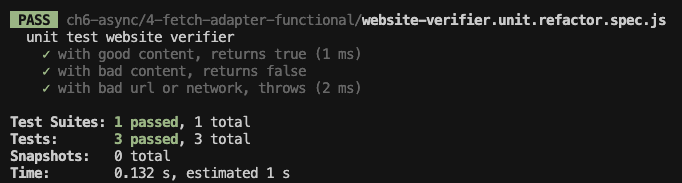

<!-- 단순한 책 내용만 정리하는 스터디에서 벗어나 자신의 생각을 정리하고, 그걸 바탕으로 실무에 적용할 수 있는 내용을 찾는 스터디가 되었으면 좋겠습니다. -->
<!-- 참고한 글 - https://tech.kakaopay.com/post/frontend-study-journey/ -->

> [!Note]
> 정리한 챕터나 페이지 등을 자유롭게 기록

## Summary

<!-- 한 줄 요약을 통해 발표자는 본인이 주제를 정확하게 이해했는지 점검하고, 스터디원들은 한 눈에 주제를 파악할 수 있습니다. -->

테스트하기 까다로운 비동기 코드를 단위 테스트에 적합한 코드로 분리할 수 있다.

## Concept

<!-- 책을 바탕으로 발표 주제의 이론적 개념 및 필요한 배경 지식을 설명합니다. -->

### 통합 테스트를 통한 비동기코드 테스트하기

ex) node-fetch 모듈을 통해 웹 사이트에서 콘텐츠를 가져오는 비동기 fetch 함수

#### case1) callback

```js
const fetch = require("node-fetch");
const isWebsiteAliveWithCallback = (callback) => {
  const website = "http://example.com";
  fetch(website)
    .then((response) => {
      if (!response.ok) {
        throw Error(response.statusText);
      }
      return response;
    })
    .then((response) => response.text())
    .then((text) => {
      if (text.includes("illustrative")) {
        callback({ success: true, status: "ok" }); // 종료점(콜백)
      } else {
        callback({ success: false, status: "text missing" });
      }
    })
    .catch((err) => {
      callback({ success: false, status: err });
    });
};
```

=> 콜백 함수가 종료점인 함수를 테스트하기 위해선 직접 작성한 콜백 함수를 전달해야함, jest 는 `done()` 함수를 제공

#### 통합 테스트

```js
test("NETWORK REQUIRED (callback): correct content, true", (done) => {
  samples.isWebsiteAliveWithCallback((result) => {
    expect(result.success).toBe(true);
    expect(result.status).toBe("ok");
    done();
  });
});
```

=> 테스트 함수 내에서 매개변수로 전달 받을 수 있는 `done()` 콜백을 사용하여 테스트가 done() 을 명시적으로 호출할 때까지 기다려야 한다고 신호를 보낼 수 있다.

> [!Note] done 콜백 사용 예제

```js
test("async task test (using done)", (done) => {
  // 3초 후에 콜백을 호출하는 비동기 작업
  setTimeout(() => {
    expect(true).toBe(true);
    done(); // 비동기 작업이 완료되었음을 테스트에 알림
  }, 3000);
});
```

#### case2) async/await

```js
const isWebsiteAliveWithAsyncAwait = async () => {
  try {
    const resp = await fetch("http://example.com");
    if (!resp.ok) {
      throw resp.statusText;
    }
    const text = await resp.text();
    const included = text.includes("illustrative");
    if (included) {
      return { success: true, status: "ok" }; // 종료점(값이나 오류를 반환)
    }

    throw "text missing";
  } catch (err) {
    return { success: false, status: err };
  }
};
```

#### 통합 테스트

```js
test("NETWORK REQUIRED2 (await): correct content, true", async () => {
  const result = await samples.isWebsiteAliveWithAsyncAwait();
  expect(result.success).toBe(true);
  expect(result.status).toBe("ok");
});
```

=> 테스트 코드 내에서는 await 문법이 사용 가능하다.

### 통합테스트의 단점

- 실행 시간이 김: 단위 테스트보다 훨씬 느려 몇 초~몇 분 소요될 수 있음.
- 결과가 불안정함: 환경에 따라 실행 시간과 결과가 달라질 수 있음.
- 불필요한 환경까지 검증: 테스트와 직접 관계 없는 외부 요소(예: 네트워크, 외부 API 등)까지 테스트됨.
- 디버깅이 어려움: 실패 원인이 다양해 원인 파악에 시간이 오래 걸림.
- 재현이 어려움: 외부 환경 문제는 테스트 상황 재현이 어려움.
- 신뢰 어려움: 실패가 외부 요인처럼 보여도 실제로는 내부 코드 버그일 수 있음.

=> 위와 같은 문제를 이유로 통합 테스트를 단위 테스트, API 테스트, 컴포넌트 테스트 같은 **하위 수준의 테스트로 분리하자.**

### 코드를 단위 테스트에 적합하게 만들기

- 진입점 분리 패턴: 프로덕션 코드에서 순수 로직 부분을 별도의 함수로 분리하여 그 함수를 테스트의 시작점으로 사용하는 패턴
- 어댑터 분리 패턴: 본질적으로 비동기적인 요소를 분리하고 이를 추상화하여 동기적인 요소를 대체할 수 있게 하는 패턴

### 진입점 분리 패턴

특정 비동기 작업을 두 부분으로 나눈다.

1. 비동기 부분
2. 비동기 작업이 끝났을 때 호출되는 콜백: **새로운 함수로 분리**하여 순누 논리 **작업 단위의 진입점**으로 사용

#### 콜백을 사용하여 진입점 분리

```js
// 진입점(비동기 부분)
const isWebsiteAlive = (callback) => {
  fetch("http://example.com")
    .then(throwOnInvalidResponse)
    .then((resp) => resp.text())
    .then((text) => {
      processFetchSuccess(text, callback);
    })
    .catch((err) => {
      processFetchError(err, callback);
    });
};

const throwOnInvalidResponse = (resp) => {
  if (!resp.ok) {
    throw Error(resp.statusText);
  }
  return resp;
};

// 진입점(비동기 작업이 끝났을 때 호출되는 콜백)
const processFetchSuccess = (text, callback) => {
  if (text.includes("illustrative")) {
    callback({ success: true, status: "ok" });
  } else {
    callback({ success: false, status: "missing text" });
  }
};

// 진입점(비동기 작업이 끝났을 때 호출되는 콜백)
const processFetchError = (err, callback) => {
  callback({ success: false, status: err });
};
```

=> 단일 진입점 대신 3개의 진입점으로 분리

#### 단위 테스트

```js
describe("Website alive checking", () => {
  test("content matches, returns true", (done) => {
    samples.processFetchSuccess("illustrative", (result) => {
      expect(result.success).toBe(true);
      expect(result.status).toBe("ok");
      done();
    });
  });

  test("website content does not match, returns false", (done) => {
    samples.processFetchSuccess("bad content", (result) => {
      expect(result.status).toBe("missing text");
      done();
    });
  });

  test("When fetch fails, returns false", (done) => {
    samples.processFetchError("error text", (result) => {
      expect(result.status).toBe("error text");
      done();
    });
  });
});
```

#### async/await 를 사용하여 진입점 분리

```js
// 진입점(비동기 부분)
const isWebsiteAlive = async () => {
  try {
    const resp = await fetch("http://example.com");
    throwIfResponseNotOK(resp);
    const text = await resp.text();
    return processFetchContent(text);
  } catch (err) {
    processFetchError(err);
  }
};

const throwIfResponseNotOK = (resp) => {
  if (!resp.ok) {
    throw resp.statusText;
  }
};

// 진입점(비동기 작업이 끝났을 때 호출되는 콜백)
const processFetchContent = (text) => {
  const included = text.includes("illustrative");
  if (included) {
    return { success: true, status: "ok" };
  }
  return { success: false, status: "missing text" };
};

// 진입점(비동기 작업이 끝났을 때 호출되는 콜백)
const processFetchError = (err) => {
  throw err;
};
```

=> 단일 진입점 대신 3개의 진입점으로 분리,</br>
=> 콜백 예제와 달리 성공이나 실패를 나타내기 위해 return, throw 사용</br>
=> isWebsiteAlive() 함수는 필요한 값만 반환하고 / 오류를 던지기 때문에 거의 동기적 코드로 보여지게 된다.

#### 단위 테스트

```js
describe("website up check", () => {
  test("on fetch success with good content, returns true", () => {
    const result = samples.processFetchContent("illustrative");
    expect(result.success).toBe(true);
    expect(result.status).toBe("ok");
  });

  test("on fetch success with bad content, returns false", () => {
    const result = samples.processFetchContent("text not on site");
    expect(result.success).toBe(false);
    expect(result.status).toBe("missing text");
  });

  test("on fetch fail, throws", () => {
    expect(() => samples.processFetchError("error text")).toThrowError(
      "error text"
    );
  });
});
```

=> async/await 와 관련된 키워드를 추가하거나 코드 실행을 기다리기 위해 신경 쓸 필요가 없다.

### 어댑터 분리 패턴

- 비동기 코드를 이전 장에서 다룬 의존성(mock, stub)처럼 여기는 전략.
- 테스트에서 더 쉽게 제어하고 테스트 시나리오를 다양하게 만들기 위해 대체하고 싶은 대상으로 본다.
- 논리 코드를 별도의 진입점으로 분리하는 대신 기존 코드에서는 의존성으로 있던 비동기 코드를 분이하여 어댑더로 감싸고,
- 이를 다른 의존성 처럼 주입 할 수 있게 한다.

#### 네트워크 어댑터 모듈(모듈 방식)

```js
const fetch = require("node-fetch");

const fetchUrlText = async (url) => {
  const resp = await fetch(url);
  if (resp.ok) {
    const text = await resp.text();
    return { ok: true, text: text };
  }
  return { ok: false, text: resp.statusText };
};
```

=> 네트워크 어댑터 모듈은 프로젝트에서 node-fetch를 가져오는 유일한 모듈</br>
=> 즉, 의존성이 변경되더라도 해당 파일만 수정하면 된다.

#### 단위 테스트(모듈 방식)

```js
jest.mock("./network-adapter"); // 모듈을 모의 객체로 대체
const stubSyncNetwork = require("./network-adapter");
const webverifier = require("./website-verifier");

describe("unit test website verifier", () => {
  beforeEach(jest.resetAllMocks); // 스텁 초기화

  test("with good content, returns true", async () => {
    // 테스트가 동기적으로 작동함을 명확히 알리기 위해 네이밍을 stubNetwork로 설정
    stubSyncNetwork.fetchUrlText.mockReturnValue({
      ok: true,
      text: "illustrative",
    });
    const result = await webverifier.isWebsiteAlive(); // await 사용
    expect(result.success).toBe(true);
    expect(result.status).toBe("ok");
  });

  test("with bad content, returns false", async () => {
    // 테스트가 동기적으로 작동함을 명확히 알리기 위해 네이밍을 stubNetwork로 설정
    stubSyncNetwork.fetchUrlText.mockReturnValue({
      ok: true,
      text: "<span>hello world</span>",
    });
    const result = await webverifier.isWebsiteAlive(); // await 사용
    expect(result.success).toBe(false);
    expect(result.status).toBe("missing text");
  });
});
```

=> async/await 를 사용한다고 해서, 테스트가 비동기적으로 실행되는 것은 아님.

#### 네트워크 어댑터 모듈(함수형 방식)

```js
const isWebsiteAlive = async (network) => {
  const result = await network.fetchUrlText("http://example.com");
  if (result.ok) {
    const text = result.text;
    return onFetchSuccess(text);
  }
  return onFetchError(result.text);
};
```

=> 네트워크 어댑터 모듈이 함수의 매개변수로 주입되도록 변경

#### 단위 테스트(함수형 방식)

```js
const webverifier = require("./website-verifier");

const makeStubNetworkWithResult = (fakeResult) => {
  return {
    fetchUrlText: () => {
      return fakeResult;
    },
  };
};

describe("unit test website verifier", () => {
  test("with good content, returns true", async () => {
    const stubSyncNetwork = makeStubNetworkWithResult({
      ok: true,
      text: "illustrative",
    });
    const result = await webverifier.isWebsiteAlive(stubSyncNetwork);
    expect(result.success).toBe(true);
    expect(result.status).toBe("ok");
  });

  test("with bad content, returns false", async () => {
    const stubSyncNetwork = makeStubNetworkWithResult({
      ok: true,
      text: "unexpected content",
    });
    const result = await webverifier.isWebsiteAlive(stubSyncNetwork);
    expect(result.success).toBe(false);
    expect(result.status).toBe("missing text");
  });

  test("with bad url or network, throws", async () => {
    const stubSyncNetwork = makeStubNetworkWithResult({
      ok: false,
      text: "some error",
    });
    try {
      await webverifier.isWebsiteAlive(stubSyncNetwork);
    } catch (err) {
      expect(err.success).toBe(false);
      expect(err.status).toBe("some error");
    }
  });
});
```

=> `webverifier.isWebsiteAlive()` 함수의 매개변수로 가짜 네트워크를 주입한다.

#### 네트워크 어댑터 모듈(객체지향형 방식)

```js
import { INetworkAdapter, NetworkAdapterFetchResults } from "./INetworkAdapter";

export class NetworkAdapter implements INetworkAdapter {
  async fetchUrlText(url: string): Promise<NetworkAdapterFetchResults> {
    const resp = await fetch(url);
    if (resp.ok) {
      const text = await resp.text();
      return Promise.resolve({ ok: true, text: text });
    }
    return Promise.reject({ ok: false, text: resp.statusText });
  }
}
```

```js
import { INetworkAdapter, NetworkAdapterFetchResults } from './INetworkAdapter';

export interface WebsiteAliveResult {
  success: boolean;
  status: string;
}

export class WebsiteVerifier {
  constructor(private network: INetworkAdapter) {}

  isWebsiteAlive = async (): Promise<WebsiteAliveResult> => {
    let netResult: NetworkAdapterFetchResults;
    try {
      netResult = await this.network.fetchUrlText('http://example.com');
      if (!netResult.ok) {
        throw netResult.text;
      }
      const text = netResult.text;
      return this.processNetSuccess(text);
    } catch (err) {
      throw this.processNetFail(err);
    }
  };

  processNetSuccess = (text): WebsiteAliveResult => {
    const included = text.includes('illustrative');
    if (included) {
      return { success: true, status: 'ok' };
    }
    return { success: false, status: 'missing text' };
  };

  processNetFail = (err): WebsiteAliveResult => {
    return { success: false, status: err };
  };
}

```

=> 매개변수 주입을 생성자 주입 패턴으로 확장

#### 단위 테스트(객체지향형 방식)

```js
import Substitute, { Arg } from '@fluffy-spoon/substitute';
import { INetworkAdapter, NetworkAdapterFetchResults } from './INetworkAdapter';
import { WebsiteVerifier } from './website-verifier';

const makeStubNetworkWithResult = (
  fakeResult: NetworkAdapterFetchResults
): INetworkAdapter => {
  const stubNetwork = Substitute.for<INetworkAdapter>();
  stubNetwork.fetchUrlText(Arg.any()).returns(Promise.resolve(fakeResult));
  return stubNetwork;
};

describe('unit test website verifier', () => {
  test('with good content, returns true', async () => {
    const stubSyncNetwork = makeStubNetworkWithResult({
      ok: true,
      text: 'illustrative',
    });
    const webVerifier = new WebsiteVerifier(stubSyncNetwork);

    const result = await webVerifier.isWebsiteAlive();
    expect(result.success).toBe(true);
    expect(result.status).toBe('ok');
  });

  test('with bad content, returns false', async () => {
    const stubSyncNetwork = makeStubNetworkWithResult({
      ok: true,
      text: 'unexpected content',
    });
    const webVerifier = new WebsiteVerifier(stubSyncNetwork);

    const result = await webVerifier.isWebsiteAlive();
    expect(result.success).toBe(false);
    expect(result.status).toBe('missing text');
  });
});

```

### 타이머 다루기

- 함수를 직접 몽키 패칭
- 제스트 및 다른 프레임워크를 사용하여 타이머를 비활성하고 제어

#### 몽키 패칭으로 타이머를 스텁으로 만들기

> [!Note]
> 몽키 패치(monkey patch)는 런타임 시 코드 조각의 동작을 동적으로 업데이트하는 데 사용되는 기술이다.</br>
> 몽키 패치라는 용어는 런타임에 코드를 은밀하게 변경하는 것을 의미하는 게릴라 패치(다른 패치와 호환되지 않을 수도 있음)에서 유래한 것으로 보인다.</br>
> 고릴라와 거의 동음이의어인 게릴라라는 단어는 패치(patch)가 덜 위협적으로 들리도록 하기 위해 원숭이, 즉 몽키(monkey)가 되었다.(어원 유래가 재밌네요.)

```js
const calculate1 = (x, y, resultCallback) => {
  setTimeout(() => {
    resultCallback(x + y);
  }, 5000);
};
```

```js
describe("monkey patching", () => {
  let originalTimeOut;
  beforeEach(() => (originalTimeOut = setTimeout));
  afterEach(() => (setTimeout = originalTimeOut));

  test("calculate1", () => {
    setTimeout = (callback, ms) => callback();
    Samples.calculate1(1, 2, (result) => {
      expect(result).toBe(3);
    });
  });
});
```

=> 모든 라인이 동기식으로 진행되기 때문에 done() 을 사용하지 않아도 된다.</br>
=> but, 많은 보일러 플레이트 코드가 필요하고,</br>
=> 테스트가 끝날때 마다 몽키 패칭된 함수를 원래대로 되돌려야 하므로,</br>
=> 오류가 발생하기 쉽다.

#### 제스트를 통해 setTimeout 대체

제스트는 자바스크립트의 타이머를 대부분 처리하기 위해 다음 세 가지 주요 기능을 제공한다.

- `jest.useFakeTimers`: setTimeout 같은 다양한 타이머 함수를 스텁으로 대체
- `jest.resetAllTimers` : 모든 가짜 타이머를 실제 타이머로 재설정
- `jest.advanceTimersToNextTimer`: 가짜 타이머를 작동시켜 콜백을 실행 -> 실행하면 다음에 예정된 타이머가 실행됨

```js
describe("calculate1 - with jest", () => {
  beforeEach(() => {
    jest.useFakeTimers();
  });

  beforeEach(() => {
    jest.clearAllTimers();
  });

  test("fake timeout with callback", () => {
    Samples.calculate1(1, 2, (result) => {
      expect(result).toBe(3);
    });
    jest.advanceTimersToNextTimer();
  });
});
```

=> 마찬가지로 done() 함수 호출할 필요 없음.
=> setTimeout() 을 재귀적으로 호출하여 반복적으로 타이머 작업 수행 가능.

## Advantages

<!-- (선택) 발표 주제를 적용했을 때 얻을 수 있는 이점이나 해결할 수 있는 문제 상황들에 대해 설명합니다. -->

## Disadvantages

<!-- (선택) 발표 주제를 적용했을 때 발생할 수 있는 side effect나 trade-off에 대해 설명합니다. -->

## Example Case

<!-- 발표 주제가 적용되어 있는 라이브러리, 실제 업무에 적용되어 있는 코드, 직접 만든 예시 코드, 자신의 느낀점 등을 첨부하여 이해를 돕습니다. -->

이전 장에서 `mockResolvedValue(value)`, `mockRejectedValue(error)` jest mock 함수를 통해 비동기 코드를 테스트 할 수 있다고 배웠는데, 차이점에 대해서 궁금해졌다.

일단 예제 비동기 코드중 하나를 골라보자.

```js
const fetch = require("node-fetch");

const fetchUrlText = async (url) => {
  const resp = await fetch(url);
  if (resp.ok) {
    const text = await resp.text();
    return { ok: true, text: text };
  }
  return { ok: false, text: resp.statusText };
};
```

### [기존 방식] Jest 모듈 모킹

```js
const webverifier = require("./website-verifier");

const makeStubNetworkWithResult = (fakeResult) => {
  return {
    fetchUrlText: () => {
      return fakeResult;
    },
  };
};
describe("unit test website verifier", () => {
  test("with good content, returns true", async () => {
    const stubSyncNetwork = makeStubNetworkWithResult({
      ok: true,
      text: "illustrative",
    });
    const result = await webverifier.isWebsiteAlive(stubSyncNetwork);
    expect(result.success).toBe(true);
    expect(result.status).toBe("ok");
  });

  test("with bad content, returns false", async () => {
    const stubSyncNetwork = makeStubNetworkWithResult({
      ok: true,
      text: "unexpected content",
    });
    const result = await webverifier.isWebsiteAlive(stubSyncNetwork);
    expect(result.success).toBe(false);
    expect(result.status).toBe("missing text");
  });

  test("with bad url or network, throws", async () => {
    const stubSyncNetwork = makeStubNetworkWithResult({
      ok: false,
      text: "some error",
    });
    try {
      await webverifier.isWebsiteAlive(stubSyncNetwork);
    } catch (err) {
      expect(err.success).toBe(false);
      expect(err.status).toBe("some error");
    }
  });
});
```

=> `mockResolvedValue(value)`, `mockRejectedValue(error)`를 사용해서 리팩토링을 해보자

### [리팩토링] 직접 Mock 객체 주입

```js
const webverifier = require("./website-verifier");

describe("unit test website verifier", () => {
  test("with good content, returns true", async () => {
    // fetchUrlText가 Promise를 성공(resolve)하며 기대하는 텍스트를 반환하도록 모킹한 stub 객체 생성
    const stubNetwork = {
      fetchUrlText: jest.fn().mockResolvedValue({
        ok: true,
        text: "illustrative",
      }),
    };

    const result = await webverifier.isWebsiteAlive(stubNetwork);
    expect(result.success).toBe(true);
    expect(result.status).toBe("ok");
    expect(stubNetwork.fetchUrlText).toHaveBeenCalled();
  });

  test("with bad content, returns false", async () => {
    const stubNetwork = {
      fetchUrlText: jest.fn().mockResolvedValue({
        ok: true,
        text: "unexpected content",
      }),
    };

    const result = await webverifier.isWebsiteAlive(stubNetwork);
    expect(result.success).toBe(false);
    expect(result.status).toBe("missing text");
    expect(stubNetwork.fetchUrlText).toHaveBeenCalled();
  });

  test("with bad url or network, throws", async () => {
    // fetchUrlText가 네트워크 에러로 Promise를 reject 하도록 모킹
    const stubNetwork = {
      fetchUrlText: jest.fn().mockRejectedValue(new Error("some error")),
    };

    await expect(webverifier.isWebsiteAlive(stubNetwork)).rejects.toThrow(
      "some error"
    );
    expect(stubNetwork.fetchUrlText).toHaveBeenCalled();
  });
});
```

### 테스트 결과



=> 동일하게 성공한다. 그러면 무슨 차이가 있을까? GPT 한테 물어봤다.

| 상황                                 | Jest 모듈 모킹                                    | 직접 Mock 객체 주입               |
| ------------------------------------ | ------------------------------------------------- | --------------------------------- |
| 함수가 의존성을 인자로 받는 경우     | 적합하지 않음. 의존성을 주입하지 않으면 사용 불가 | 매우 적합. 테스트가 쉽고 유연함   |
| 기존 코드 리팩터링이 어렵거나 불가능 | 적합. 모듈 모킹만으로 테스트 가능                 | 사용 어려움                       |
| 테스트 격리 및 독립성 중시           | 단점. 모듈 모킹 범위 내에서만 격리 가능           | 장점. 의존성을 자유롭게 교체 가능 |
| 테스트 코드 간결성 중시              | 장점. mock 자동 적용으로 간결한 테스트 가능       | 다소 코드 중복 발생 가능          |
| 내부 모듈 변경이 잦은 경우           | 단점. 모듈 모킹 코드도 함께 수정해야 함           | 내부 구조 변경에 영향 적음        |

### 결론

직접 Mock 객체를 주입하는 방식은 함수가 의존성을 인자로 받도록 설계되어 있을 때 좋고,

Jest의 모듈 모킹 방식은 기존 코드 리팩터링이 어렵거나 내부 모듈을 직접 모킹하고 싶을 때 편리하다.

## Wrap-up

<!-- 발표를 마무리하며 발표 주제를 다시 요약하고 정리합니다. -->

- 테스트 코드 내에서 비동기 코드를 테스트하면(통합 테스트) 시간이 오래 걸리고 불안정한 테스트가 된다.
- 그러므로 이를 단위 테스트에 적합한 코드로 분리하는 것이 좋다.
- 코드 복잡성을 낮추려면 콜백 방식 보단 반환 값을 사용하는 것이 좋다.
- 몽키 패칭이나 제스트 내부 기능을 통해 타이머 함수를 테스트 할 수 있다.
