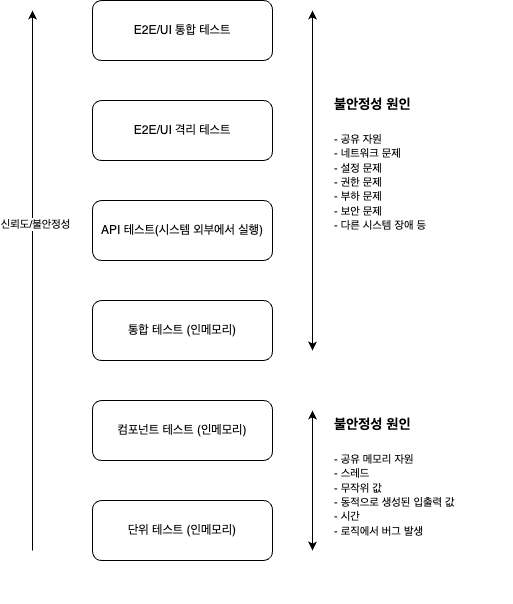

<!-- 단순한 책 내용만 정리하는 스터디에서 벗어나 자신의 생각을 정리하고, 그걸 바탕으로 실무에 적용할 수 있는 내용을 찾는 스터디가 되었으면 좋겠습니다. -->
<!-- 참고한 글 - https://tech.kakaopay.com/post/frontend-study-journey/ -->

> [!NOTE]   
> ch07 신뢰할 수 있는 테스트 (p246 ~ p268)

## Summary
<!-- 한 줄 요약을 통해 발표자는 본인이 주제를 정확하게 이해했는지 점검하고, 스터디원들은 한 눈에 주제를 파악할 수 있습니다. -->
- 프로덕션 코드의 버그로 테스트가 실패하는 것이 아닌 다른 경우의 실패는 신뢰할 수 없는 테스트를 의미한다. 
- 테스트 검증 부분이 없거나, 이해할 수 없거나, 불안정한 테스트와 함께 실행되거나, 여러 종료점을 검증하거나, 자주 변경된다면 신뢰할 수 없는 테스트이다. 
- 불안정한 테스트는 안정한 테스트와 구분하고 리팩터링, 저수준 테스트로 수정하거나 과감히 삭제하는 것이 좋다.

## Concept
<!-- 책을 바탕으로 발표 주제의 이론적 개념 및 필요한 배경 지식을 설명합니다. -->
### 좋은 테스트의 특징
1. 신뢰성
    - 버그가 없고 올바른 대상을 테스트 하는 것을 의미
2. 유지 보수성
    - 자주 바뀌어야하는 테스트, 코드를 조금만 수정해도 테스트를 수정해야 한다면 유지보수성이 떨어진다.
3. 가독성
    - 테스트가 잘못된 경우 문제를 파악할 수 있는 능력을 의미 
    - 이해하기 쉬운 테스트 

세 가지 요소를 모두 갖추어야 테스트가 제대로 작동하고 유지될 수 있다.   
하나라도 부족하면 테스트의 신뢰성과 효율성이 떨어질 수 있다. 

### 테스트를 신뢰할 수 있는지 판단하는 방법
#### 테스트를 신뢰하지 않는 상황
- 테스트는 실패했지만 신경 쓰지 않는 경우, 거짓 양성이라 상객함
- 테스트가 가끔 통과하거나 현재 작업과 관련없다고 생각함, 테스트에 버그가 있다고 느낄 때 테스트 결과를 무시해도 괜찮다고 여긴다.
- 테스트가 통과했지만 의심스러운 경우, 거짓 음성이라 생각한다.
- 만약에 대비하여 직접 디버깅하거나 프로그램을 테스트할 필요를 느끼는 경우

#### 테스트를 신뢰하는 상황
- 테스트가 실패했을 때, 코드가 잘못되었음을 걱정하는 경우
- 테스트가 통과한 경우로, 따로 수동으로 테스트하거나 디버깅할 필요가 없다고 여긴다. 

### 테스트가 실패하는 이유 
모든 종류의 테스트 실패는 **합당한 이유**가 있어야 납득 할 수 있다.    
합당한 이유란 실제 버그가 프로덕션 코드에서 발견된 경우를 의미한다.

테스트가 실패하는 이유
- 프로덕션 코드에서 실제 버그가 발견된 경우
- 테스트가 거짓 실패를 일으키는 경우
- 기능 변경으로 테스트가 최신 상태가 아닌 경우
- 테스트가 다른 테스트와 충돌하는 경우
- 테스트가 불안정한 경우

#### 1. 프로덕션 코드에서 실제 버그가 발견된 경우
운이 좋은 경우, 이 버그 때문에 테스트를 작성해야하는 것임

#### 2. 테스트가 거짓 실패를 일으키는 경우 
프로덕션 코드에는 문제가 없지만 테스트가 실패하는 상황   
종료점의 예상 결과를 잘못 설정했거나 테스트 대상 시스템(SUT)를 잘못 사용한 것이 원인일 수 있다.

##### 테스트에 버그가 있는지 찾아내는 방법
테스트에 실패했는데 프로덕션 코드를 디버깅 해도 버그를 찾을 수 없을 때 -> **테스트 자체를 의심**   
아래의 경우 테스트가 거짓 실패를 일으킨다.   
- 잘못된 항목이나 잘못된 종료점을 검증하는 경우
- 잘못된 값을 진입점에 전달하는 경우
- 진입점을 잘못 호출하는 경우

##### 테스트 버그를 발견했을 때 해야 할 일
버그를 수정하고 테스트를 다시 실행해 통과하는지 확인하면 된다.   
또한, 통과했다고 넘어가는 것이 아니라 프로덕션 코드에 일부러 버그를 넣어 테스트 해본다.   
> ex. boolean 값을 항상 true/false로 설정하고 테스트 실행      

이상한 값을 넣고 테스트했는데 테스트가 실패하지 않고 통과한다면 여전히 테스트에 문제가 있을 수 있다는 의미   
프로덕션 코드 때문에 테스트가 실패한다면 방금 전 임의의 값을 다시 원래대로 돌리고 테스트를 진행한다.   
테스트가 정상 동작하면 문제가 해결된 것이다. 

##### 향후 잘못된 테스트를 방지하는 방법
- TDD 방식으로 코드를 작성한다.
    - 코드의 어디가 잘못 되었는지 쉽게 찾을 수 있어 버그를 미리 막을 수 있다.    
- 테스트 내부의 복잡한 로직을 제거하는 것

#### 3. 기능 변경으로 테스트가 최신 상태가 아닌 경우
기능이 변경되면 테스트가 현재 기능과 맞지 않아 실패할 수 있다.    
이때는 두 가지 선택지가 있다.
1. 테스트를 새로운 기능에 맞게 수정한다.
2. 새로운 기능을 대상으로 새 테스트를 만들고 기존 테스트는 삭제한다. 

##### 향후 이 문제를 피하거나 예방하는 방법
어느 시점에서든 테스트가 구식이 되는 것을 완전히 막을 수 없다.

#### 4. 테스트가 다른 테스트와 충돌하는 경우
서로 다른 두 테스트가 실행할 때마다 하나는 실패하고 다른 하나는 성공하는 경우  

예를 들어 어떤 테스트는 새로운 기능과 호환되지 않아 실패할 수 있다.    
반면에 또 다른 테스트는 새로운 기능이 있어야하는데 그 기능이 적용되지 않아 실패할 수 있다. 

##### 무엇을 할 수 있을까?
근본적인 원인은 두 테스트 중 하나가 더 이상 쓸모 없어졌다는 것이다.   
어떤 테스트를 없애야 할까? => **제품의 기능과 요구 사항을 결정하는 사람**, 프로덕트 오너에게 물어보아야 한다. 

##### 향후 이 문제를 피하거나 예방하는 방법
테스트와 기능이 발전하는 과정에서 자연스러운 현상이므로 굳이 피하려 하지 않아도 괜찮다. 

#### 5. 테스트가 불안정한 경우 
테스트가 불규칙하게 실패할 때가 있다.   
프로덕션 코드가 변경되지 않아도 테스트가 갑자기 실패하거나 다시 통과하는 경우도 있다.    
이런 테스트를 불안정한 테스트라 한다. -> 뒤에서 자세히

### 단위 테스트에서 불필요한 로직 제거
**테스트에 로직이 많을수록 테스트에 버그가 생길 확률이 증가한다.**   
테스트가 동적인 로직을 갖거나, 난수를 생성하거나, 스레드를 만들거나 파일을 쓰는 등 행위를 하면서 복잡해지는 경우이다. 

테스트 코드 내부에 반복문이나 난수 생성등을 더 넣으면 실제로 더 많은 버그를 찾을 수 있지만,   
그만큼 테스트 자체에 버그가 생길 확률이 높아지므로 지양하는 것이 좋다.

다음 내용이 단위 테스트에 포함되어 있다면 이는 불필요한 로직이므로 줄이거나 없애는 편이 좋다. 
1. switch, if, else 문
2. foreach, for, while loop
3. 문자열 연결 + 기호 등
4. try/catch 블록


#### Assert 문에서 로직: 동적 기댓값 생성
문자열 연결 예제를 살펴보자 
```js
// 테스트 대상 코드 
const makeGreeting = (name) => {
    return "hello" + name; // 아래 테스트 코드와 똑같은 로직 포함
}

describe('makeGreeting', () => {
    it('returns correct greeting for name', () => {
        const name = "abc";
        const result = trust.makeGreeting(name);
        expect(result).toBe("hello" + name); // 검증 부분에 로직이 포함됨 
    });
});
```
이렇게 테스트 대상이 포함한 로직과 동일한 로직을 포함한 테스트를 작성할 경우,    
테스트 대상에 문제가 있다면 **테스트 코드에서도 동일한 버그**가 발생한다. 

결국 테스트는 버그를 잡아내지 못하고 오히려 잘못된 결과를 기대하게 된다. 

예를 들어, `makeGreeting()` 함수가 'hello abc' 대신 'helloabc' 처럼 공백 없이 잘못된 결과를 반환한다고 가정해보자.    
이 상황에서도 테스트 코드는 동일한 방식으로 문자열을 결합하고 있다면 잘못된 결과를 정상으로 인식하는 문제가 발생한다. 

=> 테스트 신뢰성을 떨어뜨린다.

테스트는 항상 **실제 코드와는 다른 방식으로 기댓값을 상정**해야 버그를 제대로 잡아낼 수 있다.

> [!TIP]   
> assert(검증) 단계에서 기댓값을 동적으로 생성하지 말고 가능하면 하드코딩된 값을 사용해야한다.

위 테스트 코드를 아래처럼 간단하게 리팩터링 할 수 있다. 
```js
it('returns correct greeting for name', () => {
    const result = trust.makeGreeting('abc');
    expect(result).toBe('hello abc'); // 하드코딩 된 값을 사용
});
```
테스트의 입력값이 매우 단순해 하드코딩된 기댓값을 만들기 쉽다.   
다만, 더 높은 수준의 테스트에서는 직접 기댓값을 만드는 것이 어려울 수 있다.   
그래도 이는 가능한 피하는 것이 좋다. 

#### 다른 형태의 로직
이번엔 반복문을 사용해 입력 값을 동적으로 생성하는 경우를 보자. 
```js
const isName = (input) => {
    return input.split(" ").length === 2;
}

describe('isName', () => {
    const namesToTest = ['firstOnly', 'first second', '']; // 여러 입력 값 정의

    it('correctly finds out if it is a name', () => {
        namesToTest.forEach(name => {
            const result = isName(name);
            if (name.includes(' ')) {  // 프로덕션 코드의 로직이 테스트에 포함됨 
                expect(result).toBe(true);
            } else {
                expect(result).toBe(false); 
            }
        });
    });
});
```
이 테스트의 문제점은 아래와 같다.    
1. 테스트에 여러 입력 값을 반복해서 사용해 복잡하게 한다. 
   - 반복문에도 버그가 있을 수 있다는 점을 항상 기억한다.
2. 값에 따라 공백이 있는 경우, 없는 경우를 처리하는 데 if/else 문을 사용한다. 
   - if/else 문에도 버그가 생길 수 있다.
3. 프로덕션 코드에서 이미 사용한 로직을 테스트 코드에도 반복하고 있다.
   - 테스트가 버그를 잡아내기 힘들다.
4. 테스트 이름이 너무 모호하다.
   - 여러 테스트 시나리오와 기댓값을 모두 포함하다보니 '잘 작동한다' 정도로 지어 가독성을 떨어뜨린다. 


이 테스트는 두세 개 분리해 각 테스트 별로 다른 이름을 부여해 의미를 살리는 것이 낫다.      
이렇게 하면 입력 값과 기댓값을 직접 만들어 사용하고, 코드에서 반복문과 조건문을 지울 수 있다.

테스트가 더 복잡해지면 다음 문제가 생길 수 있다.
- 테스트를 읽고 이해하기 어렵다.
- 테스트를 재현하기 어렵다.
- 테스트에 버그가 있을 가능성이 높아지거나 잘못된 것을 검증할 수 있다.
- 테스트가 여러가지 일을 하므로 이름 짓기가 어려워진다. 

복잡한 테스트일 수록 프로덕션 코드에서 버그를 찾기가 더 어려워진다.   
따라서 꼭 만들어야 한다면, 기존 간단한 테스트를 대체하지 말고 새로운 테스트로 추가해야한다.    
또한, 이러한 복잡한 테스트는 별도의 폴더로 관리하는 것이 좋다. 

#### 로직이 더 많이 포함된 경우
테스트에 필요한 헬퍼 함수, 직접 작성한 가짜 객체, 테스트 유틸리티 클래스 등에서도 볼 수 있다.   
이러한 곳에 로직을 추가할수록 코드 가독성이 떨어지고 버그가 생길 가능성도 높다.   

테스트에 복잡한 로직이 필요하다면 최소한 유틸리티 함수의 로직을 검증하는 몇 가지 테스트를 추가하는 것이 좋다. 

### 테스트가 통과하더라도 끝이 아니다.
실패한 테스트가 아닌 아무 문제 없이 통과하는 테스트는 신뢰할 수 있을까?    
테스트를 검토하고 잘못된 신뢰를 찾아내는 것이 매우 중요하다.   

> [!NOTE]  
> 잘못된 신뢰(false trust)란 신뢰하지 말아야 할 테스트를 신뢰하지만, 그 사실을 아직 모르는 상태를 의미한다.

테스트가 통과하더라도 그 테스트를 믿지 못하는 몇 가지 이유
- 검증 부분이 없는 경우
- 테스트를 이해할 수 없는 경우
- 단위 테스트가 불안정한 통합 테스트와 섞여 있는 경우 
- 테스트가 여러 가지를 한꺼번에 검증하는 경우
- 테스트가 자주 변경되는 경우 

#### 1. 검증 부분이 없는 경우
테스트에 검증(assert) 부분이 없으면 함수 호출 내 검증 로직이 숨어있을 수 있다.    
이 경우 함수 이름에 어떤 설명도 포함하지 않으면 가독성이 떨어질 수 밖에 없다.    

예를 들어 어떠한 테스트는 코드 실행에 예외가 발생하지 않는지 확인하는 테스트를 작성하기도 한다.   
이러한 테스트는 테스트 이름에 '예외 없음' 같은 용어를 포함해 이를 명확히 해야한다.   
혹은 테스트 프레임워크에서 제공하는 기능을 사용하는 것도 있다. 
```js
expect(() => someFunction()).not.toThrow(error);
```
단, 이러한 테스트는 그 수를 늘리지 않는 것이 좋고 특수한 상황에만 사용하는 것이 좋다. 

#### 2. 테스트를 이해할 수 없는 경우
이는 9장에서 더 자세히 다루기 때문에 어떤 문제들이 있는지만 살펴본다.
- 이름이 적절하지 않은 테스트
- 코드가 너무 길거나 복잡한 테스트
- 변수 이름이 헷갈리게 되어 있는 테스트
- 숨어 있는 로직이나 이해하기 어려운 가정을 포함한 테스트
- 결과가 불분명한 테스트 (실패도 아니고 통과도 아닌 경우)
- 충분한 정보를 제공하지 않는 테스트 메시지 

#### 3. 단위 테스트가 불안정한 통합 테스트와 섞여 있는 경우
통합 테스트는 단위 테스트보다 의존성이 많아 불안정할 가능성이 더 높다.    
이러한 테스트를 같은 폴더에 놓거나 하나의 테스트 명령어로 함께 실행한다면 이 경우를 의심해야한다. 

이 문제를 방지하려면, 통합 테스트와 단위 테스트를 분리해 두 테스트가 섞이지 않도록 **안정적인 테스트 영역**(safe green zone)을 만드는 것이 중요하다.

안정적인 테스트 영역에는 빠르고 신뢰할 수 있는 테스트만 포함되어야한다.    
개발자는 모든 폴더의 모든 테스트를 실행할 수 있어야하며, 프로덕션 코드에 변경이 없는 한 모든 테스트과 통과할 것이란 믿음을 가질 수 있어야한다.

#### 4. 테스트가 여러가지를 한꺼번에 검증하는 경우 
```js
const trigger = (x, y, callback) => {
    callback("I'm triggered");
    return x + y;
}
```
위 코드에는 두 개의 종료점이 있다.   
이 함수는 값을 반환하면서 동시에 매개변수로 전달된 콜백 함수를 실행한다. 

이 두 종료점을 동시에 확인하는 테스트는 아래처럼 작성한다.
```js
describe('trigger', () => {
    it('works', () => {
        const callback = jest.fn();
        const result = trigger(1, 2, callback);
        expect(result).toBe(3);
        expect(callback).toHaveBeenCalledWith("I'm triggered");
    });
});
```
테스트에서 여러 가지를 테스트하면 문제가 되는 이유 
1. 테스트 이름이 모호해진다.
    - 여러 가지를 동시에 테스트 할 때는 무엇을 테스트 하는지 명확하게 나타내기 어렵다.
    - 일반적인 이름을 짓게 되어 테스트를 읽는 사람이 코드까지 읽게 만든다.
    - 하나의 관심사만 테스트할 때는 이름 짓기가 쉽다.
2. 하나의 검증이 실패하면 다음을 테스트하지 않음
    - 대부분의 단위 테스트 프레임워크에서는 검증이 실패하면 특별한 예외를 던지고, 그 예외를 잡아내면 테스트는 실패한 것으로 처리된다. 
    - 즉, 위 테스트 코드에서 `expect(result).toBe(3)` 이 실패하면 그 다음 검증을 진행하지 않고 코드 실행이 중단된다. 
    - 하나의 검증이 실패하면 그 다음 검증은 실행되지 않으므로 문제를 해결하는데 필요한 다른 단서를 놓칠 수 있다. 
    - `expect` 같은 각각의 검증은 서로 다른 작업 단위 요구 사항으로 볼 수 있으며, 이를 따로 구현하고 순차적으로 실행하는 것이 좋다. 

이제 테스트를 두 개로 나누어보자
```js
describe('trigger', () => {
    it('triggers a given callback', () => {
        const callback = jest.fn();
        trigger(1, 2, callback);
        expect(callback).toHaveBeenCalledWith("I'm triggered"); // 검증 1
    });

    it('sums up given values', () => {
        const result = trigger(1, 2, jest.fn());
        expect(result).toBe(3); // 검증 2 
    });
});
```

조건부로 한 테스트에서 여러 가지를 검증해도 괜찮은 경우가 있다.   
여러 관심사를 한 번에 다루지 않는 경우에 한해서 가능하다. 

```js
const makePerson = (x, y) => {
    return {
        name: x,
        age: y,
        type: 'person',
    };
}

describe('makePerson', () => {
    it('creates person given passed in values', () => {
        const result = makePerson('name', 1);
        expect(result.name).toBe('name');
        expect(result.age).toBe(1);
    });
});
```
`name`, `age` 는 `person` 객체의 일부로 같은 관심사에 해당한다.   
따라서 함께 검증해도 문제가 없다.
첫 번째 검증이 실패하면 객체를 만드는 과정에서 문제가 발생한 것이므로 두 번째 검증은 중요하지 않게 된다. 

> [!TIP]  
> 첫 번째 검증이 실패했을 때, 다음 검증 결과가 여전히 중요하다면 각 검증을 서로 다른 테스트 두 개로 독립적으로 진행하는 것이 좋다. 

#### 5. 테스트가 자주 변경되는 경우
날짜, 시간을 사용하는 테스트는 매번 실행할 때마다 다른 테스트가 된다.   
난수, 컴퓨터 이름, 외부 환경 변수 값을 가져오는 테스트도 마찬가지다.    

이러한 테스트는 결과가 일관되지 않을 가능성이 커 불안정하다.

동적으로 만든 값을 테스트에 사용하는 것은 문제가 생길 여지가 많다.   
입력 값을 미리 알 수 없기 때문에 기댓값도 함께 계산해야한다.    

### 불안정한 테스트 다루기 
불안정한 테스트란 **코드의 변화가 없는데도 일관성 없는 결과를 반환**하는 테스트를 말한다. 



테스트 수준이 올라갈 수록 스텁과 모의 객체를 덜 사용하고 데이터베이스, 네트워크, 환경 설정 등 실제 의존성을 더 많이 사용한다.   
그 결과 제어할 수 없는 변동 요소가 많아져 실행 경로가 변경되거나, 예상치 못한 값을 반환하거나, 실행 자체가 실패할 수 있음을 의미한다. 

가장 낮은 수준의 테스트는 불안정한 요소가 없어야 하므로 불안정해질 이유가 없다고 생각할 수 있지만,    
낮은 수준의 테스트에서도 시간, 날짜, 컴퓨터 이름, 네트워크, 파일 시스템 등을 사용하면 변동 요소가 생겨 불안정해질 수 있다. 


테스트가 프로덕션 코드를 건드리지 않았는데도 실패하는 경우가 있다. 
- 테스트가 세 번에 한 번씩 실패하는 경우
- 테스트가 불규칙하게 몇 번에 한 번씩 실패하는 경우
- 네트워크나 데이터베이스 가용성, 다른 API가 사용되지 않았을 가능성, 환경 설정 등 다양한 외부 조건이 제대로 작동하지 않을 때 실패하는 경우 

#### 불안정한 테스트를 발견했을 때 할 수 있는 일
1. 문제 정의하기   
-> 불안정이 무엇을 의미하는지 명확히 정의해야 한다.    
-> 결과가 일관되지 않은 테스트를 모두 세어본다. 

불안정하다고 판단된 테스트는 별도의 폴더에 따로 모아 실행할 수 있도록 한다.    
이 테스트를 임시로 별도의 파이프라인으로 분리하는 것이 좋다.   

그 다음에 각 **불안정한 테스트를 검토해 수정, 리팩터링, 삭제 과정**을 밟으면 된다. 

1. 수정   
-> 가능한 경우 의존성을 제어해 테스트 안정성을 높인다.   
-> 예를 들어 데이터베이스에 특정 데이터가 필요하다면 테스트 과정에서 해당 데이터를 삽입하도록 수정한다. 

2. 리팩터링   
-> 의존성을 제거하거나 제어해 테스트를 더 낮은 수준의 테스트로 변환해 불안정성을 제거한다.    
-> 예를 들어 실제 서버 대신 스텁을 사용해 네트워크 요청을 처리할 수 있다. 

3. 삭제   
-> 테스트의 이점이 유지 보수 비용을 감당하고도 남을 만큼 충분한지 검토한다.   
-> 새롭게 만든 테스트가 이미 그 기능을 더 잘 검증하고 있을 수도 있어 없애는게 나을 수도 있다. 

#### 상위 수준의 테스트에서 안전성을 유지하는 방법
고수준 테스트 안정성을 지속적으로 유지하려면 배포 후에 테스트가 반복적으로 실행될 수 있도록 하는게 중요하다. 

- 테스트가 데이터베이스나 네트워크 서비스 같은 외부 시스템을 변경했으면 변경한 내용을 롤백한다.
- 다른 테스트가 외부 시스템의 상태를 변경하지 않도록 한다.
- 외부 시스템과 의존성을 제어할 수 있어야 한다. 

외부 시스템을 타 회사에서 관리하는 경우 의존성을 제어하기가 힘들거나 불가능할 수 있다.   
이런 상황에서는 다음 방법을 고려한다.   
- 저수준 테스트가 이미 특정 기능이나 동작을 검증하고 있다면 일부 고수준 테스트를 삭제한다.
- 일부 고수준 테스트를 저수준 테스트로 바꾼다.
- 새로운 테스트를 작성할 때는 배포 파이프라인에 적용하기 쉬운 테스트 전략과 방법을 고려한다.


## Advantages
<!-- (선택) 발표 주제를 적용했을 때 얻을 수 있는 이점이나 해결할 수 있는 문제 상황들에 대해 설명합니다. -->
- 7장에서 나온 테스트 코드가 실패하는 경우 예시를 보며 실제 테스트 코드에서 신뢰할 수 없는 테스트가 있는지 파악할 수 있을 것 같다. 
- 종료점 여러개를 동시에 테스트하거나, 검증 부분이 없거나, 동적인 기댓값 사용, 테스트 코드내 복잡한 로직 사용 등 신뢰할 수 없는 테스트 코드를 작성하는 습관을 지양하며 테스트를 작성할 수 있다. 

## Disadvantages 
<!-- (선택) 발표 주제를 적용했을 때 발생할 수 있는 side effect나 trade-off에 대해 설명합니다. -->

## Example Case
<!-- 발표 주제가 적용되어 있는 라이브러리, 실제 업무에 적용되어 있는 코드, 직접 만든 예시 코드, 자신의 느낀점 등을 첨부하여 이해를 돕습니다. -->
신뢰할 수 없는 테스트 코드의 예시나 상황을 다양하게 알려줘서 실제 업무에서 작성한 테스트 코드들 중에서 잘못 작성된 테스트 코드들을 찾아보기 쉬울 것 같다.   

특히, 한꺼번에 여러 종료점을 테스트 한다거나, 종료점이 아닌데 검증, 혹은 동적인 기댓값을 지정해 검증하는 패턴 등은 자주 실수하는 부분인 것 같다. 

7장에서 언급한 패턴을 생각하며 잘못 작성된 테스트 코드들을 찾아보았다.

#### 신뢰할 수 없는 테스트 코드 찾아보기
1. 불필요한 반복문으로 테스트 로직 복잡하게 만들기   
=> 반복문에서 버그가 발생할 수 있다

```js
// 테스트 대상 함수
exports.deleteOutdatedTemplateResources = async (ids) => {
	const results = await Promise.all([
		...ids.map((id) =>
			serK8sContainer.deleteTemplate(id, Config.REGION.default),
		),
		modTemplate.deleteTemplatesByIds(ids),
	]);

	return results[results.length - 1];
};
// 테스트 코드
const testTemplateIds = ['id-1', 'id-2', 'id-3'];

test('config에 설정된 REGION.default 값으로 deleteTemplate 호출하는지 확인', async () => {
    const Config = require('#configs/app.config');

    await serTemplate.deleteOutdatedTemplateResources(testTemplateIds);

    testTemplateIds.forEach((templateId) => {
        expect(mockDeleteTemplate.mock).toHaveBeenCalledWith(
            templateId,
            Config.REGION.default,
        );
    });
});
```
- 인자를 여러 케이스로 나눠서 테스트하는 것도 아닌데 불필요하게 테스트 대상의 로직처럼 반복문을 통해 검증하고 있다. 
- 똑같은 인자를 여러번 검증하지 않고 반복문 없이 작성해도 됐을 것 같다.

```js
test('config에 설정된 REGION.default 값으로 deleteTemplate 호출하는지 확인', async () => {
    const Config = require('#configs/app.config');
    const testIds = ['id-1'];

    await serTemplate.deleteOutdatedTemplateResources(testIds);

    expect(mockDeleteTemplate.mock).toHaveBeenCalledWith(
        testIds[0], // 그냥 1번만 검증
        Config.REGION.default,
    );
});
```
---
두 번째는 예전에 작성했던 이벤트 관련 테스트 코드인데, 여러 종료점을 동시에 테스트 하고 있어 가져왔다. 
```js
// 테스트 대상 
exports.updateCompletedEventLogAndReleaseLock = async ({
	userId,
	productId,
}) => {
    // 1. 최근 event log 조회 => stub
    // 2. 조회한 로그의 lock value 가 있다면, 그 값으로 lock 해제 => 종료점 1
    // 3. 최근 event log의 상태를 완료로 업데이트 => 종료점 2
};

// 테스트 (원본이랑 약간 변형 있음 전체적인 플로우만 가져옴)
test('lockValue가 없으면 releaseLock 진행하지 않음', async () => {
    mockGetLatestEventLog.mockImplementation(() => ({}));

    await serEventLog.updateCompletedEventLogAndReleaseLock(
        mockParams,
    );

    expect(redlockHandlerMock.releaseLock).not.toHaveBeenCalled();
    expect(mockUpdateIsCompletedToTrue.mock).toHaveBeenCalled();
});

test('lockValue가 있으면 releaseLock 진행', async () => {
    mockGetLatestEventLog.mockImplementation(() => ({
        lockValue: 'lock-value',
    }));

    await serEventLog.updateCompletedEventLogAndReleaseLock(
        mockParams,
    );

    expect(redlockHandlerMock.releaseLock).toHaveBeenCalledWith({
        resources: [
            `${mockParams.userId},${mockParams.productId}`,
        ],
        value: 'lock-value',
    });
    expect(mockUpdateIsCompletedToTrue.mock).toHaveBeenCalled();
});
```
lock 을 해제하는 종료점과, 상태를 업데이트하는 종료점을 동시에 테스트해   
7장에서 나온 것 처럼 `releaseLock`에서 실패시 중단되어 다음 라인 검증을 하지 않아 신뢰할 수 없게 된다. 

아래처럼 리팩터링 해보았다.

```js
const stubGetLatestEventLog = new Mocker(); 

beforeEach(() => {
    stubGetLatestEventLog
            .makeSpy({
                module: serEventLog,
                funcName: 'getLatestEventLog',
            })
            .mockResolvedValue({});
    
    // 중략
})

test('lockValue가 없으면 releaseLock 진행하지 않는지 확인', async () => {
    stubGetLatestEventLog.mockResolvedValueOnce({});

    await serEventLog.updateCompletedEventLogAndReleaseLock(
        mockParams,
    );

    expect(redlockHandlerMock.releaseLock).not.toHaveBeenCalled();
});

test('lockValue가 있으면 releaseLock 진행하는지 확인', async () => {
    stubGetLatestEventLog.mockResolvedValueOnce({ lockValue: 'lock-value'});

    await serEventLog.updateCompletedEventLogAndReleaseLock(
        mockParams,
    );

    expect(redlockHandlerMock.releaseLock).toHaveBeenCalled();
});

test('userId, productId에 해당하는 이벤트 로그의 상태를 업데이트 하는지 확인', async () => {
    await serEventLog.updateCompletedEventLogAndReleaseLock(
        mockParams,
    );

    expect(mockUpdateIsCompletedToTrue.mock).toHaveBeenCalledWith({
        userId: mockParams.userId,
        productId: mockParams.productId
    });
});
```
1. 스텁임에도 mock이라고 명시한 부분을 수정했다.
2. 동시에 여러 종료점을 테스트 하던 것을 종료점 별로 케이스를 나눠서 테스트 하도록 수정했다.


앞으로도 이런 신뢰할 수 없는 테스트 코드를 생성하는 안티 패턴을 기억하고 지양하려고 노력해야겠다.


## Wrap-up
<!-- 발표를 마무리하며 발표 주제를 다시 요약하고 정리합니다. -->
- 잘못 검증하고 있거나 이해할 수 없는 테스트 등의 신뢰 할 수 없는 테스트를 파악하고, 이를 제대로 신뢰할 수 있는 테스트로 수정하는 것이 중요하다. 
- 불안정한 테스트를 안정한 테스트와 격리하고, 점진적으로 안정한 테스트로 변경하는 것이 중요하다. 