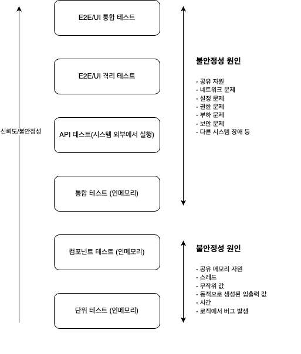
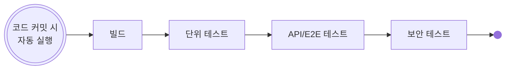
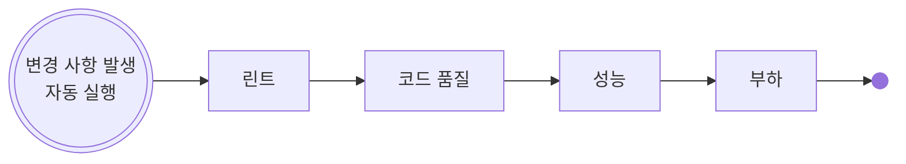
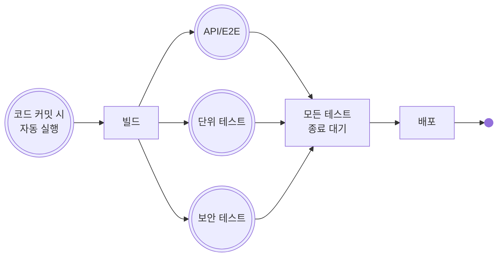
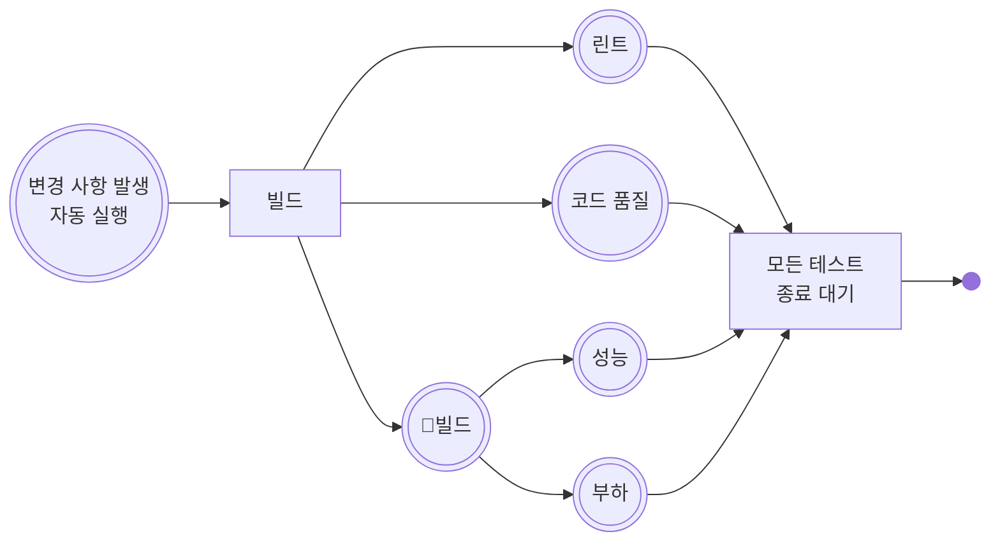

<!-- 단순한 책 내용만 정리하는 스터디에서 벗어나 자신의 생각을 정리하고, 그걸 바탕으로 실무에 적용할 수 있는 내용을 찾는 스터디가 되었으면 좋겠습니다. -->
<!-- 참고한 글 - https://tech.kakaopay.com/post/frontend-study-journey/ -->

> [!NOTE]   
> ch10 더 나은 테스트 전략 수립 (p312 ~ p333)

## Summary
<!-- 한 줄 요약을 통해 발표자는 본인이 주제를 정확하게 이해했는지 점검하고, 스터디원들은 한 눈에 주제를 파악할 수 있습니다. -->
- 테스트는 복잡성, 불안정성, 유지보수성, 신뢰도, 실행 속도 기준으로 평가할 수 있다.
- 한쪽에 치우치지 않고 저수준 테스트와 고수준 테스트를 적절히 분배해 사용해야한다. 
- 테스트 레시피를 사용해 기능 개발 전 어떤 시나리오가 어떤 수준의 테스트에서 동작할지 정리할 수 있다.
## Concept
<!-- 책을 바탕으로 발표 주제의 이론적 개념 및 필요한 배경 지식을 설명합니다. -->
### 일반적인 테스트 유형과 수준
- 테스트 수준이 높아질 수록
   - 실제 의존성을 더 많이 사용해 전체 시스템 정확성에 대한 신뢰도가 높아진다.
   - 테스트는 더 느려지고 불안정해질 수 있다.

### 테스트 평가 기준
일반적으로 사용하는 테스트 평가표

| 기준 | 평가 점수(최소/최대) | 비고 |
| --- | --------------- | ---- |
| 복잡성 | 1/5 | 테스트를 작성하고 읽고 디버깅하는 과정이 얼마나 복잡한지 평가 (낮을 수록 좋음) |
| 불안정성 | 1/5 | 다른 팀의 코드, 네트워크, 데이터베이스, 설정 권한 등 제어할 수 없는 요소 때문에 테스트가 실패할 가능성을 평가 (낮을 수록 좋음) |
| 테스트를 통과할 때 신뢰도 | 1/5 | 테스트가 통과할 때 얼마나 큰 신뢰를 주는지 평가 (높을수록 좋음) |
| 유지 보수성 | 1/5 | 테스트를 얼마나 자주 변경해야 하며, 변경이 얼마나 쉬운지 평가 (높을수록 좋음) |
| 실행 속도 | 1/5 | 테스트가 얼마나 빨리 끝나는지 평가 (높을수록 좋음) |

### 단위 테스트와 컴포넌트 테스트
컴포넌트 테스트는 단위 테스트에 비해 더 많은 함수나 클래스, 컴포넌트를 작업 단위에 포함할 수 있다.   
아래 예시를 보며 둘의 차이점을 알아보자.
- 테스트 A
  - 화면상의 버튼에 대한 단위 테스트
  - 이 버튼을 객체로 생성한 후 클릭해 특정 이벤트가 실행되는지 확인할 수 있다.
- 테스트 B
  - 버튼을 포함하는 부모 요소인 폼을 사용하는 컴포넌트 테스트
  - 폼 컴포넌트 전체 동작을 검증하며, 버튼은 그 안에서 일부 기능을 수행한다.

이 두 테스트는 메모리에서 실행되는 단위 테스트로, 사용하는 모든 요소에 대한 제어권을 갖고 있다.   
테스트 A는 B에 비해 더 낮은 수준의 단위 테스트이다.    
테스트 B는 컴포넌트 테스트로 더 높은 수준의 단위 테스트이다.

#### 단위 테스트나 컴포넌트 테스트 평가표
| 기준 | 평가 점수(최소/최대) | 비고 |
| --- | --------------- | ---- |
| 복잡성 | 1/5 | 테스트 범위가 작고, 테스트 내에서 모든 것을 제어할 수 있어 모든 테스트 유형 중 가장 단순 |
| 불안정성 | 1/5 | 테스트 내 모든 것을 제어할 수 있기 때문에 모든 테스트 유형 중 가장 불안정성이 작다 |
| 테스트를 통과할 때 신뢰도 | 1/5 | 테스트가 통과해도 시스템이 제대로 동작하는지 확신은 없다. 작은 부분이 잘 작동하는 것을 알 수 있다. |
| 유지 보수성 | 5/5 | 모든 테스트 유형 중에서 가장 유지 보수가 쉽다. 코드를 읽었을 때 이해하기가 상대적으로 쉽기 때문이다. |
| 실행 속도 | 5/5 | 파일, 네트워크, 데이터베이스 등 외부 의존성 없이 모든 것이 메모리에서 실행되기 때문에 가장 빠르다 |

### 통합 테스트
일반적인 단위 테스트와 거의 비슷해 보이지만, 일부 의존성은 스텁으로 대체할 수 없다.
예를 들어 실제 환경 설정, 데이터베이스, 파일 시스템을 사용하는 경우다.

#### 통합 테스트 평가표
| 기준 | 평가 점수(최소/최대) | 비고 |
| --- | --------------- | ---- |
| 불안정성 | 2~3/5 | 실제 의존성 수에 따라 불안정성이 달라질 수 있다. |
| 테스트를 통과할 때 신뢰도 | 2~3/5 | 통합테스트가 통과하면 데이터베이스나 설정 파일처럼 우리가 제어할 수 없는 요소를 사용하는 코드가 제대로 동작한다는 것을 확인할 수 있어 더 큰 신뢰감을 준다. |
| 유지 보수성 | 3~4/5 | 외부 의존성을 사용해 단위 테스트보다 더 복잡하다. |
| 실행 속도 | 3~4/5 | 파일 시스템, 네트워크, 데이터베이스, 스레드 등에 대한 의존성 때문에 단위 테스트보다 더 느릴 수 있다. |

### API 테스트
API 테스트 단계에서는 애플리케이션을 일부라도 배포하고 네트워크를 통해 호출해야한다.   
단위 테스트, 컴포넌트 테스트, 통합 테스트와 달리 메모리 내부에서 하는 것이 아닌 작업 프로세스 외부에서 하는 테스트이다.

#### API 테스트 평가표
| 기준 | 평가 점수(최소/최대) | 비고 |
| --- | --------------- | ---- |
| 불안정성 | 3~4/5 | 네트워크를 사용하면서 불안정성이 더 높아진다. |
| 테스트를 통과할 때 신뢰도 | 3~4/5 | 통합 테스트보다 더 큰 신뢰감을 느낄 수 있다. 배포 후에도 만든 API를 믿고 사용할 수 있다고 느낀다. |
| 유지 보수성 | 2~3/5 | 네트워크는 환경 설정을 더 복잡하게 만들며, 테스트를 변경하거나 API를 추가하거나 변경할 때 더 주의를 기울여 작업해야한다. |
| 실행 속도 | 2~3/5 | 네트워크 때문에 테스트 속도가 상당히 느려진다. |

### E2E/UI 격리 테스트
이 수준에 해당하는 E2E와 UI 테스트는 사용자 관점에서 애플리케이션을 테스트한다.   
`격리` 라는 표현은 우리가 테스트하는 애플리케이션이나 서비스만 대상으로 하고, 이 애플리케이션에서 필요할 수 있는 외부 애플리케이션이나 서비스는 배포하지 않고 테스트 한다는 의미를 명시한다.   
이러한 테스트에서는 타사의 인증 절차, 동일 서버에 배포해야 하는 다른 애플리케이션의 API, 테스트 중인 애플리케이션에 속하지 않는 모든 코드를 가짜로 만들어 사용한다.

#### E2E/UI 격리 테스트 평가표
| 기준 | 평가 점수(최소/최대) | 비고 |
| --- | --------------- | ---- |
| 불안정성 | 4/5 | 사용하는 의존성이 많기 때문에 테스트가 느려지거나, 타임아웃이 발생하거나, 제대로 작동하지 않을 가능성이 커진다. |
| 테스트를 통과할 때 신뢰도 | 4/5 | 이 유형의 테스트가 통과하면 큰 안도감을 느낀다. |
| 유지 보수성 | 1~2/5 | 의존성이 더 많이 추가되어 설정이 복잡해지고, 테스트를 변경하거나 작업 흐름을 추가해야 하거나 변경 할 때 더 주의를 기울여야 한다. 테스트가 필연적으로 길어지며, 보통은 여러 단계로 나누어 테스트한다. |
| 실행 속도 | 1~2/5 | 로그인이나 캐싱, 여러 페이지 탐색 등 사용자 인터페이스를 살펴보는 과정에서 속도가 매우 느려질 수 있다. |

### E2E/UI 시스템 테스트
이 단계에서는 **가짜인 것이 없다.**   
실제 운영 환경에 가장 가까운 상태에서 수행한다.

####  E2E/UI 시스템 테스트 평가표
| 기준 | 평가 점수(최소/최대) | 비고 |
| --- | --------------- | ---- |
| 불안정성 | 5/5 | 오만가지 이유로 테스트가 실패할 수 있으며, 원인도 매우 다양 |
| 테스트를 통과할 때 신뢰도 | 5/5 |  이 수준의 테스트는 통과했을 때 관련된 모든 코드가 아무런 조작 없이 전부 제대로 작동한다고 느끼게 됨 |
| 유지 보수성 | 1/5 | 의존성이 많고 테스트 진행을 위한 작업 흐름이 길어 유지 보수가 어렵다. |
| 실행 속도 | 1/5 | UI와 실제 의존성을 사용하기 때문에 테스트 속도가 매우 느리다. 하나의 테스트를 완료하는데 몇 분에서 몇 시간이 걸릴 수 있다. |

### 각 테스트 수준마다 존재하는 안티 패턴
**1. 팀에서 거의 대부분을 E2E 테스트로 운용하거나 E2E만 사용하는 경우**   
이 수준의 테스트는 매우 느리고, 유지 보수하기 어렵고, 디버깅이 힘들며, 불안정성이 높다.   
이러한 비용은 계속 발생하는 반면, 새로운 E2E 테스트를 작성하는 것에서 얻는 가치는 점점 줄어들기 때문이다.

#### E2E 테스트의 가치 하향
E2E를 처음 작성하면 여러 경로에서 불러온 코드를 한 번에 확인하며, 애플리케이션과 다른 시스템 간 연결 부분을 관리하는 코드도 함께 검증하기 때문에 테스트를 통과할 때 더 큰 신뢰감을 얻을 수 있다.   

그러나 두 번째 E2E 테스트는 보통 첫 번째 테스트에서 약간만 수정해서 만들기에 큰 변화는 없다.   
두 번째 E2E 테스트에서 얻는 신뢰도는 첫 번째 테스트에 비해 훨씬 적다.   
하지만 디버깅이나 코드 수정, 코드 읽기, 실행에 드는 비용은 첫 번째 테스트와 큰 차이가 없다. 

=> **첫 번째 테스트에서 얻을 수 있었던 가치 대비 두 번째 테스트에서 얻는 가치가 상대적으로 작다.**

#### 안티 패턴이 생기는 이유
1. 업무 분리
   - 많은 조직이 QA 팀과 개발 팀을 별도로 운영해 서로 다른 파이프라인과 대시보드를 관리하고, 서로 동일한 유형의 테스트를 작성
2. '잘 되고 있으니 굳이 바꾸지 말자'는 사고 방식
   - E2E 테스트를 시작해 결과가 좋으면 새로운 테스트도 계속 같은 방식으로 작성
3. 매몰 비용의 오류
   - 이미 이러한 유형의 테스트를 많이 작성했는데 이제와서 바꾸면 그동안 들인 시간이 아깝다고 여김

#### 그렇다면 E2E 테스트는 하지 말아야 할까?
E2E 테스트는 피할 수 없다.   
E2E 테스트의 장점은 애플리키에션이 제대로 작동한다는 확신과 신뢰감을 준다는 것이다.

**=>E2E 테스트를 완전히 피하지는 말되, E2E 테스트 수를 최소화할 것을 강력 추천**

### 저수준 테스트만 사용하는 안티 패턴
E2E 테스트만 사용하는 안티 패턴의 반대    
유닛 테스트는 빠른 결과를 얻을 수 있지만, 하나의 통합된 시스템으로 제대로 작동하는지에 대한 신뢰도는 얻을 수 없다.

이 안티 패턴은 주로 개발자가 저수준 테스트만 작성하는데 익숙하거나, 고수준 테스트 작성에 자신이 없거나, 고수준 테스트는 QA 팀이 해야 할 일이라고 생각할 때 주로 발생한다.

#### 저수준 테스트와 고수준 테스트의 단절
테스트가 단절되어 있으면 아래 문제가 발생한다.

1. 여러 테스트가 여러 수준에서 반복적으로 생긴다.   
2. 저수준 테스트를 작성하는 사람과 고수준 테스트를 작성하는 사람이 다르다.
   - 서로가 작성한 테스트에 관심이 없다.
   - 서로 다른 파이프라인에서 각기 다른 유형의 테스트가 실행될 가능성이 높다.
3. 상위 수준과 하위 수준 테스트에서 발생할 수 있는 문제점이 모두 드러난다.
   - 상위 수준에서 긴 테스트 시간, 유지 보수의 어려움, 빌드 분석의 필요성, 불안정성 문제가 발생
   - 하위 수준에서는 충분한 테스트 신뢰도를 얻지 못한다.

### 테스트 레시피 전략
조직 내 테스트 유형 간 균형을 맞추려면 **테스트 레시피** 를 추천한다.    

테스트 레시피란 특정 기능을 어떻게 테스트할 지 간단한 계획을 세우는 것이다.   
이 계획에는 주요 시나리오 뿐만 아니라 예외적이 상황이나 극단적인 상황도 모두 포함해야한다.

### 테스트 레시피 작성 방법
최소한 두 사람이 함께 작업하면 좋다.   
한 명은 개발자 관점에서, 다른 한 명은 테스터 관점에서 접근하는 것이 이상적이다.   

테스트 레시피 자체는 투두 리스트의 새 항목으로 추가하거나 작업을 관리하는 트래킹 보드에서 해당 작업의 일부로 저장할 수 있다.

테스트 레시피를 작성하기 가장 좋은 시점은 기능 작업을 시작하기 직전이다.   
이렇게 하면 테스트 레시피가 해당 기능의 '완료' 기준에 포함되며 전체 테스트 레시피가 통과해야 기능이 완성되었다고 볼 수 있다.

테스트 레시피는 기능이 제대로 작동한다는 '신뢰감'을 주는 시나리오 목록을 의미한다.   

일반적으로 저수준 테스트와 고수준 테스트 간에 1:5 또는 1:10 비율을 유지하면 좋다.   
예를 들어 고수준 테스트 1개를 작성하면, 저수준 테스트는 5개정도 작성하는 식이다.

테스트 레시피는 형식적으로 다룰 필요가 없고 간단한 시나리오 5~20줄로 어떤 수준에서 테스트 할 것인지 간략하게 설명한 목록일 뿐이다.

#### ex. 사용자 프로필 기능에 대한 테스트 레시피
- E2E: 로그인, 프로필 화면으로 이동, 이메일 업데이트, 로그아웃, 새 이메일로 다시 로그인, 프로필 화면 업데이트 확인
- API: 더 복잡한 데이터를 사용해 UpdateProfile API 호출
- 단위 테스트: 잘못된 이메일로 프로필 업데이트 로직 확인
- 단위 테스트: 동일한 이메일로 프로필 업데이트 로직 확인
- 단위 테스트: 프로필 데이터 변환 및 데이터 복원

### 언제 테스트 레시피를 사용할까?
기능이나 사용자 스토리를 작업하기 전에 팀 동료와 함께 어떤 시나리오를 테스트할 지 구상해보는 것이 좋다.   
그 다음 그 시나리오를 어느 수준에서 테스트하면 가장 적합할 지 결정한다.

조직 내 자동화나 QA 역할이 있는 경우, 개발자가 저수준 테스트를 작성하고 QA가 고수준 테스트를 작성하는데 이 과정은 기능 개발과 동시에 진행된다.    
둘은 동시에 작업하며 병렬적으로 각자 테스트를 작성한다.

### 테스트 레시피 작성 규칙
- 속도
   - 신뢰도를 얻는 방법이 E2E 밖에 없는게 아니라면 저수준 테스트를 우선시하는게 좋다.
- 신뢰도
- 수정
   - 코딩하면서 테스트를 추가하거나 삭제해도 좋다.
   - 수정 시 레시피를 함께 작성한 사람에게 알려야한다.
- 적절한 타이밍
   - 코딩 시작 직전에 누가 코딩할 지 정해졌을 때 이 레시피를 작성한다.
- 페어 프로그래밍
   - 가급적 다른 사람과 함께 작성한다.
- 기존 기능의 테스트를 중복하지 말 것
   - 현재 시나리오가 이미 다른 테스트에서 테스트 한 적 있다면 같은 수준에서 이 시나리오를 다시 테스트 할 필요가 없다.
- 다른 계층에서 테스트를 중복해서 작성하지 말 것
   - 동일한 시나리오를 여러 테스트 수준에서 반복하지 말아야한다.
   - E2E에서 로그인이 잘 되는 것을 확인했다면 저수준에서는 이 시나리오를 살짝 바꾼 부분만 테스트하면 된다. (ex. 로그인 실패 처리 등)
- 더 많이, 더 빠르게
   - 테스트 수준 간 비율을 최소 1:5로 맞추는 것이다.
- 실용성 중시
   - 모든 기능을 각기 다른 테스트 수준으로 작성해야 한다고 생각할 필요 없다.
   - 중요한 점은 테스트 레시피에 있는 모든 시나리오를 통과했을 때 기능이 제대로 동작한다고 확신할 수 있으면 된다. 

### 배포 파이프라인 관리
배포 파이프라인 내에서 각 테스트는 어느 단계에 포함되어야 할까   
테스트는 두 가지 그룹으로 나눌 수 있다.

- 배포 중단 테스트 
  - 변경 사항에 문제 없는지 배포 전에 판단하는 테스트
  - 단위 테스트, E2E 테스트, 시스템 테스트, 보안 테스트 등이 여기에 속한다.
  - 테스트가 실패하면 코드를 수정한 후 배포할 수 있다.
- 참고용 테스트 
  - 주요 성과 지표를 파악하고 지속적으로 모니터링하는 데 사용
  - 코드를 분석하고 복잡도를 스캔하기도 한다.
  - 테스트 결과가 단순히 '성공', '실패'로 나뉘지 않는다.
  - 실패하더라도 다음 스프린트 작업으로 추가할 수 있다.
  - 배포에는 큰 영향을 주지 않는다.

  
### 배포 파이프라인, 탐색 파이프라인

- 배포 파이프라인
   - 배포를 결정하는 테스트에 사용
   - 이 파이프라인이 통과하면 코드를 프로덕션에 자동으로 배포해도 된다는 확신을 가질 수 있어야 한다.

- 탐색 파이프라인
   - 참고용 테스트에 사용한다. 
   - 배포 파이프라인과 병렬로 실행되지만 지속적으로 작동하며, 배포 기준에는 포함되지 않는다.
   - 결과를 기다릴 필요가 없어 테스트가 오래 걸려도 무방하다.

### 테스트 계층 병렬화
테스트 결과를 신속하게 얻는 것은 매우 중요하기 때문에 아래처럼 파이프라인의 여러 테스트 계층을 병렬로 실행하는 것이 일반적이다. 

## Advantages
<!-- (선택) 발표 주제를 적용했을 때 얻을 수 있는 이점이나 해결할 수 있는 문제 상황들에 대해 설명합니다. -->
- 저수준 테스트와 고수준 테스트를 적절한 비율로 분배해 테스트하면 고수준 테스트의 장점인 신뢰도도 얻고, 저수준 테스트의 이점인 유지 보수성과 실행 속도의 이점도 얻을 수 있다.
- 동료 개발자와 기능 개발 전 테스트 레시피를 작성하면 어느 수준에서 어떤 시나리오가 동작해야하는지 미리 정리해 중복 테스트를 줄이고 효과적인 테스트를 진행할 수 있다.
## Disadvantages 
<!-- (선택) 발표 주제를 적용했을 때 발생할 수 있는 side effect나 trade-off에 대해 설명합니다. -->

## Example Case
<!-- 발표 주제가 적용되어 있는 라이브러리, 실제 업무에 적용되어 있는 코드, 직접 만든 예시 코드, 자신의 느낀점 등을 첨부하여 이해를 돕습니다. -->
- 현재는 저수준 테스트로만 애플리케이션을 테스트하고 있는데 책 내 안티패턴 부분에 QA 개발자가 없거나, 저수준 테스트만 작성해본 개발자라는 이야기가 나와 뜨끔했다.
- arkain에 QA 자동화를 통해 고수준의 E2E 테스트를 넣어보면 좋을 것 같다.

## Wrap-up
<!-- 발표를 마무리하며 발표 주제를 다시 요약하고 정리합니다. -->
