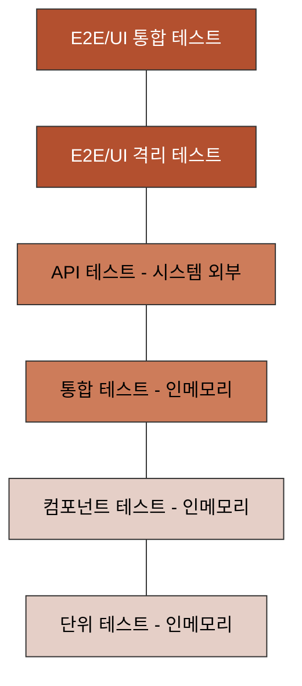
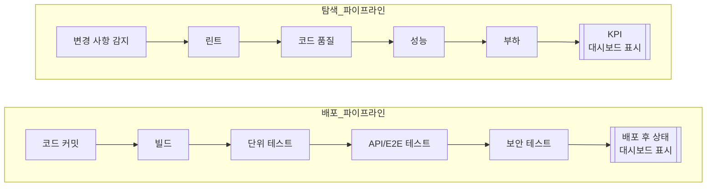

<!-- 단순한 책 내용만 정리하는 스터디에서 벗어나 자신의 생각을 정리하고, 그걸 바탕으로 실무에 적용할 수 있는 내용을 찾는 스터디가 되었으면 좋겠습니다. -->
<!-- 참고한 글 - https://tech.kakaopay.com/post/frontend-study-journey/ -->

> [!Note]
> 정리한 챕터나 페이지 등을 자유롭게 기록

## Summary

## <!-- 한 줄 요약을 통해 발표자는 본인이 주제를 정확하게 이해했는지 점검하고, 스터디원들은 한 눈에 주제를 파악할 수 있습니다. -->

더 나은 테스트 전략을 수립하기위해 다음과 같은 것들을 알아본다.

- 테스트 수준에 따른 장단점과 안티 패턴
- 테스트 레시피 전략
- 배포 파이프라인과 탐색 파이프라인

## Concept

<!-- 책을 바탕으로 발표 주제의 이론적 개념 및 필요한 배경 지식을 설명합니다. -->

### 일반적인 테스트 유형과 수준

테스트 수준이 높을수록 실제 의존성을 더 많이 사용하게 되어 전체 시스템 정확성에 대한 **신뢰도는 높다**. 그러나 테스트는 더 느려지고 **불안정해질 수 있는 단점이 있다.**

의사 결정 프레임워크를 설계할 때 참고하기 좋은 다이어그램
위로 갈수록 높은 신뢰도를 가져 낮은 유지 보수성, 낮은 생산성을 가지고 결과를 얻는데 시간이 많이 걸린다. 반대로 아래로 갈수록 낮은 식뢰도를 가져 높은 유지보수성, 높은 생산성을 가지고 결과를 빠르게 확인 가능하다.

### 테스트 평가 기준

#### 일반적인 테스트

필자가 테스트를 평가할 때 중요하게 여기는 기준

| 기준                      | 평가 점수(최소/최대) | 비고                                                                                                                           |
| ------------------------- | -------------------- | ------------------------------------------------------------------------------------------------------------------------------ |
| 복잡성                    | 1/5                  | 테스트를 작성하고 읽고 디버깅하는 과정이 얼마나 복잡한지 평가, 낮을 수록 좋다.                                                 |
| 불안정성                  | 1/5                  | 다른 팀의 코드, 네트워크, 데이터베이스, 설정 권한 등 제어할 수 없는 요소 때문에 테스트가 실패할 가능성을 평가, 낮을 수록 좋다. |
| 테스트를 통과할 때 신뢰도 | 1/5                  | 테스트가 통과할 때 얼마나 큰 신뢰를 주는지 평가, 높을수록 좋다.                                                                |
| 유지 보수성               | 1/5                  | 테스트를 얼마나 자주 변경해야 하며, 변경이 얼마나 쉬운지 평가, 높을수록 좋다.                                                  |
| 실행 속도                 | 1/5                  | 테스트가 얼마나 빨리 끝나는지 평가, 높을수록 좋다.                                                                             |

#### 단위 테스트, 컴포넌트 테스트

이 책에서 지금까지 다룬 테스트 유형

컴포넌트 테스트는 단위 테스트와 동일한 인메모리 테스트이지만, 단위 테스트에 비해 더 높은 수준을 가진다.

| 기준                      | 평가 점수(최소/최대) | 비고                                                                                               |
| ------------------------- | -------------------- | -------------------------------------------------------------------------------------------------- |
| 복잡성                    | 1/5                  | 테스트 범위가 작고 테스트 내에서 모든 것을 제어할 수 있음, 모든 테스트 유형 중 가장 단순           |
| 불안정성                  | 1/5                  | 테스트 내 모든 것을 제어할 수 있음, 모든 테스트 유형 중 가장 불안정성이 작다                       |
| 테스트를 통과할 때 신뢰도 | 1/5                  | 테스트가 통과해도 시스템이 제대로 동작하는지 확신은 없다. 작은 부분이 잘 작동하는 것을 알 수 있음. |
| 유지 보수성               | 5/5                  | 모든 테스트 유형 중에서 가장 유지 보수가 쉽다. 코드를 읽었을 때 이해하기가 상대적으로 쉽기 때문    |
| 실행 속도                 | 5/5                  | 파일, 네트워크, 데이터베이스 등 외부 의존성 없이 모든 것이 메모리에서 실행, 가장 빠르다            |

#### 통합 테스트

| 기준                      | 평가 점수(최소/최대) | 비고                                                                                                                                                       |
| ------------------------- | -------------------- | ---------------------------------------------------------------------------------------------------------------------------------------------------------- |
| 불안정성                  | 2~3/5                | 실제 의존성 수에 따라 불안정성이 달라질 수 있다.                                                                                                           |
| 테스트를 통과할 때 신뢰도 | 2~3/5                | 통합테스트가 통과하면 데이터베이스나 설정 파일처럼 우리가 제어할 수 없는 요소를 사용하는 코드가 제대로 동작한다는 것을 확인할 수 있어 더 큰 신뢰감을 준다. |
| 유지 보수성               | 3~4/5                | 통합 테스트는 외부 의존성을 사용해 단위 테스트보다 더 복잡하다.                                                                                            |
| 실행 속도                 | 3~4/5                | 파일 시스템, 네트워크, 데이터베이스, 스레드 등에 대한 의존성 때문에 단위 테스트보다 더 느릴 수 있다.                                                       |

#### API 테스트

이전까지의 테스트와는 달리 인메모리가 아닌, 시스템 외부에서 실행된다.

| 기준                      | 평가 점수(최소/최대) | 비고                                                                                                                     |
| ------------------------- | -------------------- | ------------------------------------------------------------------------------------------------------------------------ |
| 불안정성                  | 3~4/5                | 네트워크를 사용하면서 불안정성이 더 높아진다.                                                                            |
| 테스트를 통과할 때 신뢰도 | 3~4/5                | 통합 테스트보다 더 큰 신뢰감을 느낄 수 있다. 배포 후에도 만든 API를 믿고 사용할 수 있다고 느낀다.                        |
| 유지 보수성               | 2~3/5                | 네트워크는 환경 설정을 더 복잡하게 만들며, 테스트를 변경하거나 API를 추가하거나 변경할 때 더 주의를 기울여 작업해야한다. |
| 실행 속도                 | 2~3/5                | 네트워크 때문에 테스트 속도가 상당히 느려진다.                                                                           |

#### E2E/UI 격리 테스트

사용자 관점에서 앱을 테스트

| 기준                      | 평가 점수(최소/최대) | 비고                                                                                                                                                                                                |
| ------------------------- | -------------------- | --------------------------------------------------------------------------------------------------------------------------------------------------------------------------------------------------- |
| 불안정성                  | 4/5                  | 사용하는 의존성이 많기 때문에 테스트가 느려지거나, 타임아웃이 발생하거나, 제대로 작동하지 않을 가능성이 커진다.                                                                                     |
| 테스트를 통과할 때 신뢰도 | 4/5                  | 이 유형의 테스트가 통과하면 큰 안도감을 느낀다.                                                                                                                                                     |
| 유지 보수성               | 1~2/5                | 의존성이 더 많이 추가되어 설정이 복잡해지고, 테스트를 변경하거나 작업 흐름을 추가해야 하거나 변경할 때 더 주의를 기울여야 한다. 테스트가 필연적으로 길어지며, 보통은 여러 단계로 나누어 테스트한다. |
| 실행 속도                 | 1~2/5                | 로그인이나 캐싱, 여러 페이지 탐색 등 사용자 인터페이스를 살펴보는 과정에서 속도가 매우 느려질 수 있다.                                                                                              |

#### E2E/UI 시스템 테스트

실제 운영환경에 가장 가까운 상태

| 기준                      | 평가 점수(최소/최대) | 비고                                                                                                                       |
| ------------------------- | -------------------- | -------------------------------------------------------------------------------------------------------------------------- |
| 불안정성                  | 5/5                  | 오만가지 이유로 테스트가 실패할 수 있으며, 원인도 매우 다양함.                                                             |
| 테스트를 통과할 때 신뢰도 | 5/5                  | 통과했을 때 관련된 모든 코드가 아무런 조작 없이 전부 제대로 작동한다고 느끼게 됨, 가장 높은 신뢰감을 줄 수 있음.           |
| 유지 보수성               | 1/5                  | 의존성이 많고 테스트 진행을 위한 작업 흐름이 길어 유지 보수가 어렵다.                                                      |
| 실행 속도                 | 1/5                  | UI와 실제 의존성을 사용하기 때문에 테스트 속도가 매우 느리다. 하나의 테스트를 완료하는데 몇 분에서 몇 시간이 걸릴 수 있다. |

### 각 테스트 수준마다 존재하는 안티 패턴

테스트 안티 패턴은 기술적 문제보다는 조직 구조, 팀 문화, 역할 분리 등의 조직적인 문제에서 많이 발생한다.

#### 1. E2E 테스트만 사용하는 안티 패턴

일부 팀은 모든 테스트를 E2E로만 작성하거나 시스템 테스트까지 포함해 고수준 테스트만 사용. -> 이로 인해 테스트는 느리고, 유지보수가 어렵고, 불안정성이 높음.

##### E2E 테스트의 가치 하향

- 처음에는 여러 경로를 한번에 확인할 수 있어 신뢰감을 준다
- 하지만 시간이 지나면 신뢰도 대비 비용이 너무 큼

##### 빌드 분석자

- 빌드 실패 원인 분석은 힘들고 스트레스를 유발
- 반복적으로 실패 원인을 추적하는 QA 담당자는 **"고독한 영혼들"**이 된다
- 많은 경우 2년 내 다른 조직으로 이직하게 됨

##### 원인

- 업무 분리: QA와 개발팀이 파이프라인을 따로 관리
- ‘잘 되고 있으면 굳이 바꾸지 말자’는 사고방식
- 매몰 비용 오류: 이미 많은 시간과 자원을 들였기 때문에 바꾸지 않음

#### 저수준 테스트만 사용하는 안티 패턴

- 단위 테스트나 컴포넌트 테스트 등 빠른 저수준 테스트에만 집중
- 빠르게 실행되지만, 통합된 시스템으로서의 신뢰도 확보는 불가능
- 실제 배포 이후 예상치 못한 통합 오류 발생 가능성이 높음

#### 저수준 테스트와 고수준 테스트가 단절된 경우의 안티 패턴

- 여러 테스트가 여러 수준으로 반복적으로 생긴다
- 저수준과 고수준 테스트가 각기 다른 사람, 파이프라인에서 관리됨
- 그러다보니 위에서 언급한 고수준 안티 패턴, 저수준 안티 패턴에 대한 문제점이 모두 발생한다

### 테스트 레시피 전략

테스트 레시피를 작성할 때는 최소 두 사람(개발자 관점/테스터 관점)이 함께 작업하면 좋음.

투두 리스트의 새 항목으로 추가하거나 작업을 관리하는 트래킹 보드에서 해당 작업 일부로 저장할 수 있음.

테스트 레시피를 작성하기에 가장 좋은 시점은 기능 작업을 시작하기 직전이다. 
-> 테스트 레시피가 해당 기능의 '완료' 기준이 된다.

#### 테스트 레시피 작성 규칙

1. 속도

- 기능이 잘 작동하는지 확인할 때, E2E 테스트밖에 없다면 신뢰는 얻을 수 있지만 속도는 느림
- 가능하다면 저수준 테스트(단위, 통합 테스트)를 우선시하는 것이 좋음

2. 신뢰도

- 테스트가 통과했을 때 “기능이 잘 동작한다”고 확신할 수 있어야 함
- 그렇지 않다면 더 명확하게 확인 가능한 테스트 시나리오로 보완할 것

3. 수정 용이성

- 테스트는 삭제하거나 추가해도 부담 없도록 작성

4. 적절한 타이밍

- 코딩을 시작하기 직전, 누가 어떤 기능을 맡을지 정해졌을 때 작성

5. 페어 프로그래밍

- 혼자 작성하지 말고, 다른 사람과 함께 논의하며 작성
- 서로 다른 테스트 방식에 대한 이해와 아이디어 공유가 중요함

6. 기존 기능의 테스트 중복 금지

- 이미 작성된 시나리오가 있다면 같은 수준에서 다시 작성하지 말 것

7. 다른 계층에서 중복 금지

- 같은 시나리오를 여러 테스트 수준에서 반복하지 말기

8. 더 많이, 더 빠르게

- 저수준 테스트가 많고 고수준 테스트는 적은 비율이 이상적

9. 실용성 중시

- 모든 기능을 모든 테스트 수준에서 테스트할 필요는 없음
- 단위 테스트나 E2E만으로 충분한 경우가 많음

> 사용자 프로필 기능에 대한 테스트 레시피
>
> - E2E: 로그인, 프로필 화면으로 이동, 이메일 업데이트, 로그아웃, 새 이메일로 다시 로그인, 프로필 화면 업데이트
> - API: 더 복잡한 데이터를 사용하며 UpdateProfile 호출
> - 단위 테스트: 잘못된 이메일로 프로필 업데이트 로직 확인
> - 단위 테스트: 동일한 이메일로 프로필 업데이트 로직 확인
> - 단위 테스트: 프로필 데이터 변환 및 데이터 복원

#### 결론

저수준 테스트 위주로 빠르게 실행하고, 핵심 기능만 고수준 테스트로 커버한다.

### 배포 파이프라인 관리

여러 조직에서 성능 테스트, 보안테스트, 부하 테스트 같은 작업을 통합 자동화파이프 라인의 일부로 실행한다.

이러한 테스트는 두가지 그룹으로 나륄 수 있다.

- 배포 중단 테스트

  - 변경 사항에 문제가 없는지 배포 전에 판단하는 테스트.
  - 단위 테스트, E2E 테스트, 시스템 테스트, 보안 테스트가 해당된다.

- 참고용 테스트

  - 주요 성과를 파악하고 지속적으로 모니터링하는데 사용.
  - 고부하 성능 테스트, 장기간 실행되는 비기능적 테스트가 해당
  - 결과가 단순히 성공 / 실패로 나뉘어지지 않는다.

#### 배포 파이프라인 대 탐색 파이프라인

참고용 테스트가 배포 과정에서 중요한 결과를 확인하는 데 걸리는 시간을 늘리지 않도록 테스트를 구분하여 두 가지 파이프라인으로 운영해야 한다.

- 배포 파이프라인
  - 코드가 문제없이 통과될 경우 배포를 진행.
- 탐색 파이프라인
  - 리팩터링해야 하는 코드가 어디있는지 찾는데 목적을 가진다.

## Advantages

<!-- (선택) 발표 주제를 적용했을 때 얻을 수 있는 이점이나 해결할 수 있는 문제 상황들에 대해 설명합니다. -->

## Disadvantages

<!-- (선택) 발표 주제를 적용했을 때 발생할 수 있는 side effect나 trade-off에 대해 설명합니다. -->

## Example Case

<!-- 발표 주제가 적용되어 있는 라이브러리, 실제 업무에 적용되어 있는 코드, 직접 만든 예시 코드, 자신의 느낀점 등을 첨부하여 이해를 돕습니다. -->

327p(테스트 레시피)에 나온 예시처럼, 기능 QA 문서를 작성할때 테스트 수준에 따라 구분하여 작성하는 것도 좋을 것 같다는 생각을 했다.

## Wrap-up

- 테스트는 단계(수준)별로 구성되어 있으며, 각 단계의 특성에 따라 평가 기준에서 부여되는 점수가 달라진다.
- 각 테스트 수준마다 존재하는 안티패턴을 통해 문제상황을 대비하는 것이 중요하다.
- 빌드 파이프라인은 배포 파이프라인과 탐색 파이프라인으로 분리하여 관리되어야 한다.
<!-- 발표를 마무리하며 발표 주제를 다시 요약하고 정리합니다. -->
