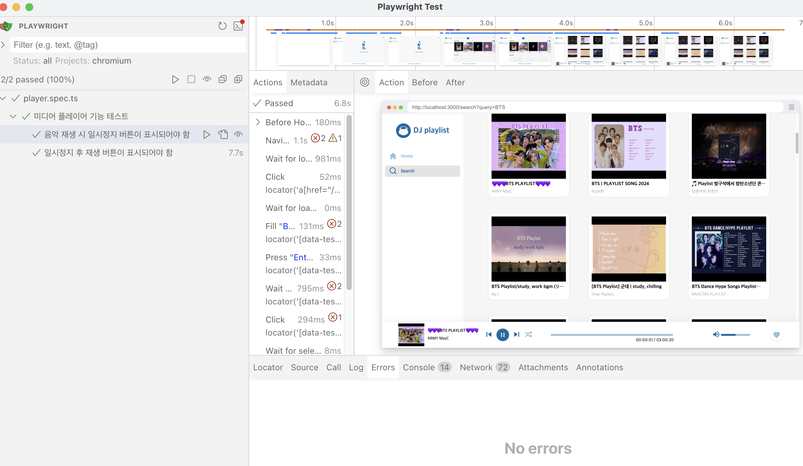

<!-- 단순한 책 내용만 정리하는 스터디에서 벗어나 자신의 생각을 정리하고, 그걸 바탕으로 실무에 적용할 수 있는 내용을 찾는 스터디가 되었으면 좋겠습니다. -->
<!-- 참고한 글 - https://tech.kakaopay.com/post/frontend-study-journey/ -->

> [!Note]
> 정리한 챕터나 페이지 등을 자유롭게 기록

## Summary

<!-- 한 줄 요약을 통해 발표자는 본인이 주제를 정확하게 이해했는지 점검하고, 스터디원들은 한 눈에 주제를 파악할 수 있습니다. -->

레거시 코드에 테스트 코드를 도입할 때 직면하는 어려움에 도움이 될 만한 기법에 대해서 소개한다.

## Concept

<!-- 책을 바탕으로 발표 주제의 이론적 개념 및 필요한 배경 지식을 설명합니다. -->

TDD 기법을 도입하기 어려운 주된 이유들

> - 기존 코드를 대상으로 테스트를 작성하는 것에 어려움이 있음.
> - 기존 코드를 리팩토링하는 것이 거의 불가능하거나 시간적 여유가 없음.
> - 본인이 설계한 코드를 바꾸려고 하지 않음.
> - TDD 를 활용할 수 있는 도구가 부족하거나 도구 자체가 TDD 진행에 방해가 됨.
> - 어디에서부터 시작해야 할지 판단하기 어려움.

레거시 코드의 영향이 가장 컸다고 할 수 있으며 다음 두가지를 고민하며 작업을 해보면 된다.

1. 테스트를 어디에서부터 시작하고 어느 부분에 집중해야 할 지 고민
2. 테스트가 없는 상태에서 기존 기능을 망가뜨리지 않은 채 어떻게 안전하게 코드를 리팩터링 할 지 고민

### 어디에서부터 시작해야하는가?

테스트가 가정 필요하거나 시작하기 좋은 컴포넌트부터 우선순위를 정해야 하는데
각 컴포넌트의 우선순위를 결정할 때 고려해야 할 몇 가지 항목이 있음

- 논리적 복잡도: 컴포넌트 내에 존재하는 논리 구조의 복잡성을 의미
- 의존성 수준: 컴포넌트가 의존하는 외부 요소 수를 의미
- 우선순위: 컴포넌트가 프로젝트 내에서 차지하는 중요도를 의미

어떤 항목을 먼저 테스트할지는 두 가지 방식으로 결정할 수 있음

1. 복잡하지만 비교적 테스트하기 쉬운 항목을 선택

의존성이 적은 컴포넌트부터 시작하면 초기 테스트 작성이 훨씬 빠르고 수월하다는 장점이 있지만
시간이 지날수록 어려운 컴포넌트들만 남아 시간이 점점 많이 소요됨.

팀이 단위 테스트에 익숙하지 않다면 간단한 컴포넌트부터 시작하는 것이 좋다고 함.

2. 복잡하고 테스트하기 어려운 항목을 선택

처음에는 하나당 테스트 작성에 걸리는 시간이 많이 소요되지만 의존성이 리팩터링되면서 시간이 점차 줄어듬

팀원들이 어느 정도 경험이 있는 경우에 어려운 컴포넌트부터 시작하는 것이 좋다고 함.

### 기존 기능을 망가뜨리지 않은 채 어떻게 안전하게 코드를 리팩터링하는 방법

제대로 동작한다는 것을 보장할 수 있도록 리팩터링 전에 통합 테스트를 미리 작성해본다.

진행 과정

1. 원래 시스템이 정상 작동하는지 확인하기 위해 통합 테스트(목이나 스텁 없이)를 추가

2. 시스템에 추가하려는 기능에 대해 실패하는 테스트를 작성하거나 리팩토링 시작

3. 시스템을 작은 단위로 리팩토링하고 통합 테스트를 자주 실행하여 잘못된 부분이 없는지 체크

### 레거시 코드를 다룰 때 도움이 될만한 도서나 도구

1. 마이클 페더스 도서

<레거시 코드 활용 전략> 레거시 코드에서 겪게 될 다양한 문제를 다룬 참고서

2. CodeScene 도구

레거시 코드에서 기술적 부채와 숨겨진 문제를 찾아내는데 유용한 도구

## Advantages

<!-- (선택) 발표 주제를 적용했을 때 얻을 수 있는 이점이나 해결할 수 있는 문제 상황들에 대해 설명합니다. -->

## Disadvantages

<!-- (선택) 발표 주제를 적용했을 때 발생할 수 있는 side effect나 trade-off에 대해 설명합니다. -->

## Example Case

<!-- 발표 주제가 적용되어 있는 라이브러리, 실제 업무에 적용되어 있는 코드, 직접 만든 예시 코드, 자신의 느낀점 등을 첨부하여 이해를 돕습니다. -->

### DJ-playlist 프로젝트에 Playwright E2E 테스트 도입 사례

기존에 테스트 코드가 전혀 없던 DJ-playlist 프로젝트에
Playwright를 도입하여 E2E 테스트를 추가, 레거시 코드에 테스트를 도입

#### 1. 시작점 선택 - 가장 중요한 기능부터

기존 코드에서 **미디어 플레이어의 재생/일시정지 기능**을 우선순위로 선택

- **논리적 복잡도**: 재생 상태 관리, 버튼 UI 변경 등 복잡한 로직 포함
- **우선순위**: 사용자 경험에 직접적인 영향을 미치는 핵심 기능
- **의존성 수준**: 외부 API 호출, DOM 조작 등 여러 의존성 존재

#### 2. 안전한 리팩터링을 위한 통합 테스트 작성

리팩토링은 아직 고려하지 않았지만 책에서도 언급하듯 통합 테스트의 중요성이 높다고 판단하여
점진적으로 중요한 기능에 대한 통합 테스트를 작성

```typescript
// tests/player.spec.ts
test("음악 재생 시 일시정지 버튼이 표시되어야 함", async () => {
  await searchPage.setupWithMusic("BTS");

  await searchPage.loadFirstMusic();

  await searchPage.verifyPauseButtonVisible();
});

test("일시정지 후 재생 버튼이 표시되어야 함", async ({ page }) => {
  await searchPage.setupWithMusic("BTS");
  await searchPage.loadFirstMusic();

  await searchPage.clickPause();
  await page.waitForTimeout(1000);

  await searchPage.verifyPlayButtonVisible();
});
```



## Wrap-up

<!-- 발표를 마무리하며 발표 주제를 다시 요약하고 정리합니다. -->
