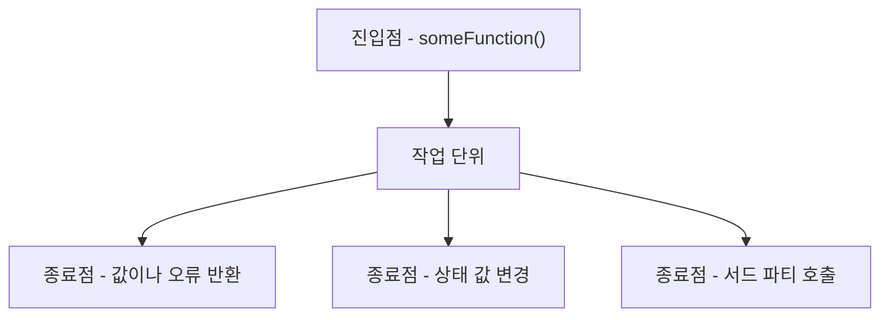
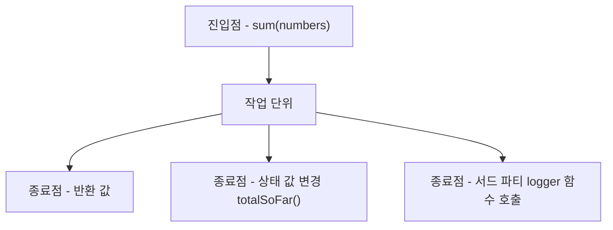

<!-- 단순한 책 내용만 정리하는 스터디에서 벗어나 자신의 생각을 정리하고, 그걸 바탕으로 실무에 적용할 수 있는 내용을 찾는 스터디가 되었으면 좋겠습니다. -->
<!-- 참고한 글 - https://tech.kakaopay.com/post/frontend-study-journey/ -->

> [!NOTE]   
>  ch1 단위 테스트의 기초 (p40 ~ p70) 

## Summary
<!-- 한 줄 요약을 통해 발표자는 본인이 주제를 정확하게 이해했는지 점검하고, 스터디원들은 한 눈에 주제를 파악할 수 있습니다. -->
- 단위 테스트에서 단위가 의미하는 것은 작업 단위로 진입점에서 시작해 하나 이상의 종료점까지 눈에 띄는 결과가 나타날 때까지의 모든 동작을 포함한다.
- 종료점은 단순히 값을 반환하는 것부터 상태를 변경하거나 서드 파티를 호출하는 등 의미있는 동작을 의미한다.
- 작업 단위의 최종 결과로서 특정 종료점을 테스트 검증 목표로 사용해 분리하는 것이 코드 관리 측면에서 유리하다.
- 단위 테스트는 작업 단위를 의존성에서 격리 시켜 항상 일관된 결과를 받을 수 있게 하고, 통합 테스트는 실제 의존성을 사용하는 차이가 있다.
- 테스트에서 중요한 세가지 포인트는 가독성, 유지 보수성, 신뢰성이다.

## Concept
<!-- 책을 바탕으로 발표 주제의 이론적 개념 및 필요한 배경 지식을 설명합니다. -->
### 단위 테스트에서의 단위(unit)
- 테스트를 작성해야할 대상 
  - 테스트 중인 subject(주체), system, suite under test(테스트 대상)
- 단위 = 시스템 내 unit of work(작업 단위) or use case(사용 사례) 
- 작업 단위에는 시작과 끝이 있고 이를 진입점과 종료점이라 함
### 진입점과 종료점
- 함수, 모듈, 컴포넌트 등은 외부 환경에서 실행할 수 있는 진입점(entry point)가 존재
- 진입점 이후로 값을 반환하거나 상태를 변경, 서드 파티 코드를 호출하는 등 의미있는 작업이 일어나고 이런 동작을 종료점이라 함
- 종료점에는 3가지 유형이 있다.

| 종료점 유형 | 설명 |
| ----- | ------ |
| 값 반환 | undefined가 아닌 값을 반환 |
| 상태 값 변경 | 함수 호출 전/후 상태 값이 달라져 내부 상태를 직접 들여다보지 않고 확인 가능함 |
| 서드 파티 함수 호출 | 코드 실행 주도권이 없는 서드 파티 함수를 호출 | 



예를 들어 아래와 같은 코드가 있다고 할 때, 진입점과 종료점을 찾아보면
```js
// number-parser.js
let total = 0;

const totalSoFar = () => {
    return total;
}

const logger = makeLogger();

const sum = (numbers) => {
    const [a,b] = numbers.split(',');
    
    logger.info('this is important log', { 
        firstNumWas: a,
        secondNumWas: b,
    });

    const result = Number.parseInt(a, 10) + Number.parseInt(b, 10);
    total += result;

    return result;
}
```

진입점 sum 함수에 대한 종료점은 3가지 이다. 
1. 숫자의 합을 반환
   - 단순히 값을 반환하는 유형의 종료점
2. 숫자의 합을 total에 추가하는 누적 합계 계산, total은 totalSoFar 함수의 종료점으로 확인
   - total 변수는 하나의 상태
   - 상태 값 변경 유형의 종료점
3. logger 함수
   - logger 함수는 외부에 무언가를 기록한다.
   - 서드 파티 호출 = 의존성 호출 유형의 종료점

다이어그램으로 다시 나타내보면 아래와 같다.


단위 테스트는 작업 단위를 호출하고 최종 결과로서 하나의 특정 종료점을 테스트 검증 목표로 사용해야한다.   
종료점 유형 별로 검증 기법은 아래와 같다.

| 종료점 유형 | 검증 기법 |
| ----- | ------ |
| 값 반환 | 진입점 호출 후 결과 값을 받아 확인 |
| 상태 값 변경 | 어떤 것을 호출 후 다른 것을 호출하거나 이전에 호출한 걸 다시 호출해 의도대로 되었는 지 확인 |
| 서드 파티 함수 호출 | 실행 주도권이 없어 코드 간섭이 어려움 => 모의 객체로만들어 임의로 결과를 조작 | 

> [!TIP]   
> 의존성 - 단위 테스트 중 온전히 제어할 수 없는 것을 의미
> - 파일에 무언가를 기록
> - 네트워크와 통신
> - 다른 팀이 관리하는 코드
> - 데이터베이스 접근 
> - 오래 걸리는 계산 작업

### 좋은 테스트의 특징
- 테스트 작성자의 의도를 이해하기 쉬움
- 읽고 쓰기 쉬움
- 테스트를 자동화할 수 있음
- 같은 조건에서 실행 결과가 항상 같음
- 의미있는 테스트이고 구체적인 결과를 제공해 문제를 쉽게 파악하고 해결할 수 있음
- 누구나 쉽게 실행할 수 있음
- 실패할 경우 무엇이 잘못 되었는지 쉽게 알 수 있음

> [!IMPORTANT]   
> 가독성, 유지 보수성, 신뢰성이 중요한 포인트이다.

### 좋은 '단위' 테스트의 특징
- 빠르게 실행되어야함
- 테스트 환경을 일관되게 유지하고 결과가 항상 예측 가능함
- 다른 테스트와 완전히 독립적으로 실행되어야함
- 시스템 파일, 네트워크, 데이터베이스가 없이도 메모리 내에서 실행되어야함
- 가능한 동기적인 흐름으로 실행되어야함(병렬 스레드를 가능한 사용하지 않아야함)

### 단위 테스트 체크 리스트 
- [ ] 2주, 2개월, 2년 전에 만든 테스트가 여전히 잘 돌아가는 가?
- [ ] 내가 2개월 전에 작성한 테스트를 팀 내 다른 동료가 실행했을 때 문제 없이 결과를 받을 수 있는가?
- [ ] 내가 만든 테스트가 수분 내로 전부 실행되는가?
- [ ] 버튼 하나만 눌러서 내가 작성한 모든 테스트를 실행할 수 있는가?
- [ ] 기본적인 테스트를 몇 분 내로 작성할 수 있는가?
- [ ] 다른 팀 코드에 버그가 있어도 내 테스트는 통과하는가?

### 통합 테스트
- 통합 테스트는 단위 테스트의 조건 중 하나라도 충족하지 못하는 모든 테스트를 의미
- 단위 테스트에서 검증하지 못하는 시스템 전체의 상호작용을 확인
- 실제 의존성을 사용함
- 테스트가 실패했을 때 소프트웨어 구성 요소가 모두 다 같이 실패해 전체 작업의 실패 원인을 파악하기 어려움

### TDD (테스트 주도 개발)
#### 일반적인 단위 테스트 작성 흐름
1. 함수나 클래스 생성
2. 테스트 작성
3. 테스트 동작 확인
4. 버그 수정

#### TDD 흐름
1. 코드 설계 
   - 목표하는 기능 구현을 검증하는 테스트 코드 작성
2. 테스트 실행 
3. 테스트 실패
4. 테스트가 통과하도록 코드 수정
5. 다시 테스트 실행
6. 테스트 통과 시 코드 리팩터링
7. 테스트 실행 -> 테스트 통과
8. 코드가 마음에 들 때까지 6 ~ 7 과정 반복

#### TDD를 잘하는 3가지 핵심 기법
1. 좋은 테스트 코드 작성하기
   - 테스트를 먼저 작성한다고 해서 가독성도 좋고 유지보수가 쉬운 테스트를 만들 수 있는 것이 아니다.
2. 테스트부터 작성하기
   - 테스트가 읽기 쉽고 유지보수가 가능하다해서 테스트부터 시작하는 TDD의 장점을 얻을 수 없다. 
3. 원칙에 따라 설계하기
   - 테스트를 먼저 작성하고 그 테스트가 읽기 쉽고 유지보수가 가능하다해서 좋은 설계를 바탕으로 코드를 만들었단 의미는 아니다.


## Advantages
<!-- (선택) 발표 주제를 적용했을 때 얻을 수 있는 이점이나 해결할 수 있는 문제 상황들에 대해 설명합니다. -->

## Disadvantages 
<!-- (선택) 발표 주제를 적용했을 때 발생할 수 있는 side effect나 trade-off에 대해 설명합니다. -->

## Example Case
<!-- 발표 주제가 적용되어 있는 라이브러리, 실제 업무에 적용되어 있는 코드, 직접 만든 예시 코드, 자신의 느낀점 등을 첨부하여 이해를 돕습니다. -->
진입점과 종료점에 대한 내용이 흥미로웠어서 
옛날에 내가 구현한 사이드 프로젝트 코드에서 진입점과 종료점을 찾아보았다.   
코드의 질은 보지 말아주시길 바랍니다. 
```ts
  // 진입점
  async updateNicknameByUserId(
    userId: number,
    id: number,
    updateNicknameDto: UpdateNicknameDto,
  ): Promise<ResponseNicknameData> {
    if (userId !== id) {
      throw forbidden();  // 종료점 1 - 값 or 에러 반환
    }
    const { nickname } = updateNicknameDto;

    const existedUser = await this.getUserByNickname(nickname); // 종료점 2 - 서드 파티 호출 
    if (existedUser && existedUser.id !== id) { 
      throw conflict();  // 종료점 3 - 값 or 에러 반환
    }

    // 종료점 4 - 서드 파티 호출
    const updatedUser = await this.prisma.user.update({
      where: { id, isDeleted: false },
      data: {
        nickname: updateNicknameDto.nickname,
      },
    });

    // 종료점 5 - 값 반환
    return {
      nickname: updatedUser.nickname,
    };
  }
```
이 함수에 대해 예전에 작성했던 단위 테스트 코드를 보자
```ts
  describe('update nickname by user id', () => {
    const userId: number = 1;
    const updateNicknameDto: UpdateNicknameDto = {
      nickname: 'test',
    };

    // 종료점 1 테스트 
    it('서로 다른 userId 와 id 가 주어지면 forbidden 에러를 던진다.', () => {
      const id: number = 2;

      const result = service.updateNicknameByUserId(
        userId,
        id,
        updateNicknameDto,
      );

      expect(result).rejects.toThrowError(forbidden());
    });

    // 종료점 4 호출 검증, 종료점 5 값 검증
    it('존재하는 userId 와 일치하는 id, 수정할 닉네임이 주어지면, 닉네임을 수정하고, 수정한 닉네임을 반환한다.', async () => {
      const id: number = 1;

      const mockUpdate = prisma.update.mockResolvedValueOnce(
        updateNicknameDto as any,
      );

      const result = await service.updateNicknameByUserId(
        userId,
        id,
        updateNicknameDto,
      );

      expect(mockUpdate).toHaveBeenCalledTimes(1);
      expect(mockUpdate).toHaveBeenCalledWith({
        where: { id, isDeleted: false },
        data: updateNicknameDto,
      });
      expect(result).toEqual(updateNicknameDto);
    });
  });
```

종료점 1에 대한 에러 반환 검증, 종료점 4 서드파티 호출 검증, 종료점 5 값 반환 검증은 하고 있으나    
종료점 2, 3에 대한 검증은 테스트되고 있지 않는 걸 알 수 있다.

작성한 테스트 코드를 보면,    
값 반환에 대한 검증은 진입점을 호출하고 실행 결과 값을 받아 그 값을 확인하는 테스트를 진행하고 있다.   
마찬가지로 서드 파티 호출에 대한 검증은 책에서 언급된대로 모의 객체를 만들어 결과를 임의로 조작후 테스트하고 있는 걸 알 수 있다.

책에서는 작업 단위의 최종 결과인 하나의 특정 종료점을 각각 분리해 테스트 검증 목표로 사용하는 것이 각 테스트끼리 영향을 주지 않고 더 읽기 쉬우며, 디버깅하기 쉽다고 이야기한다. (p48~p49)

이전에는 테스트 코드의 케이스를 작성할 때 별다른 생각 없이 나올 수 있는 케이스를 머릿속으로 생각해서 작성했는데   그러다 보니 놓치는 케이스가 많았다.   
이번 챕터를 통해 종료점 기준으로 나눠 테스트를 작성한다는 부분을 배웠으니 앞으로 함수의 유형별 종료점을 나눠 테스트 케이스를 작성해야겠다는 생각이 들었다.

TDD에 대해서는 아직 익숙하지 않고 책에서 언급한대로 좋은 테스트 코드를 작성하는 것이 우선시 되어야한다 생각해 아직 실천해보지 못했다.    
그럼에도 요새 실천하려고 노력하는 방법은 있다. TDD까진 아니다.   
바로 코드 작성 전 테스트 케이스 (body 제외)를 먼저 구성하는 방식이다.

가령 책에서 나왔던 배열을 받아 덧셈을 하고 반환하는 함수가 있다고 하면, 구현하고자 하는 함수의 목표를 구상한 후 먼저 테스트 케이스의 형태만 잡아두는 방식이다.

```js
describe('sum', () => {
    test('배열 길이가 2보다 크면 타입 에러를 반환', () => {});

    test('배열을 split 하여 두 수를 더한 후 반환', () => {});
});
```

실제 sum 함수를 구현하기 전 이런식으로 테스트 케이스를 먼저 작성하는 방식이다.   
테스트 코드 내부는 함수 구현 이후에 작성한다.
기능 구현 전에 구현 목적에 따라 테스트 케이스를 먼저 작성하면서 구현 기능에 대한 설계를 더 정확하고, 쉽게 할 수 있고, 미리 예외 처리를 생각할 수 있어 좋아하는 방법이다.

## Wrap-up
<!-- 발표를 마무리하며 발표 주제를 다시 요약하고 정리합니다. -->
- 함수의 종료점 별로 테스트 코드를 분리해 작성하면 각 테스트간 영향을 주지 않고 가독성이 좋아진다.
- 종료점의 유형에는 값이나 에러를 반환, 상태를 변경, 서드 파티(의존성) 호출하는 유형 3가지가 있다.
- 좋은 테스트 코드의 중요한 3가지 포인트는 가독성, 신뢰성, 유지보수성이다.
- TDD는 기능 구현 전 먼저 작동하는 테스트 코드를 작성하고 테스트에 실패하면 테스트를 통과할 수 있는 코드를 작성해나가며, 테스트 통과시 이를 마음에 들 때까지 리팩터링해 완성시키는 방식이다.