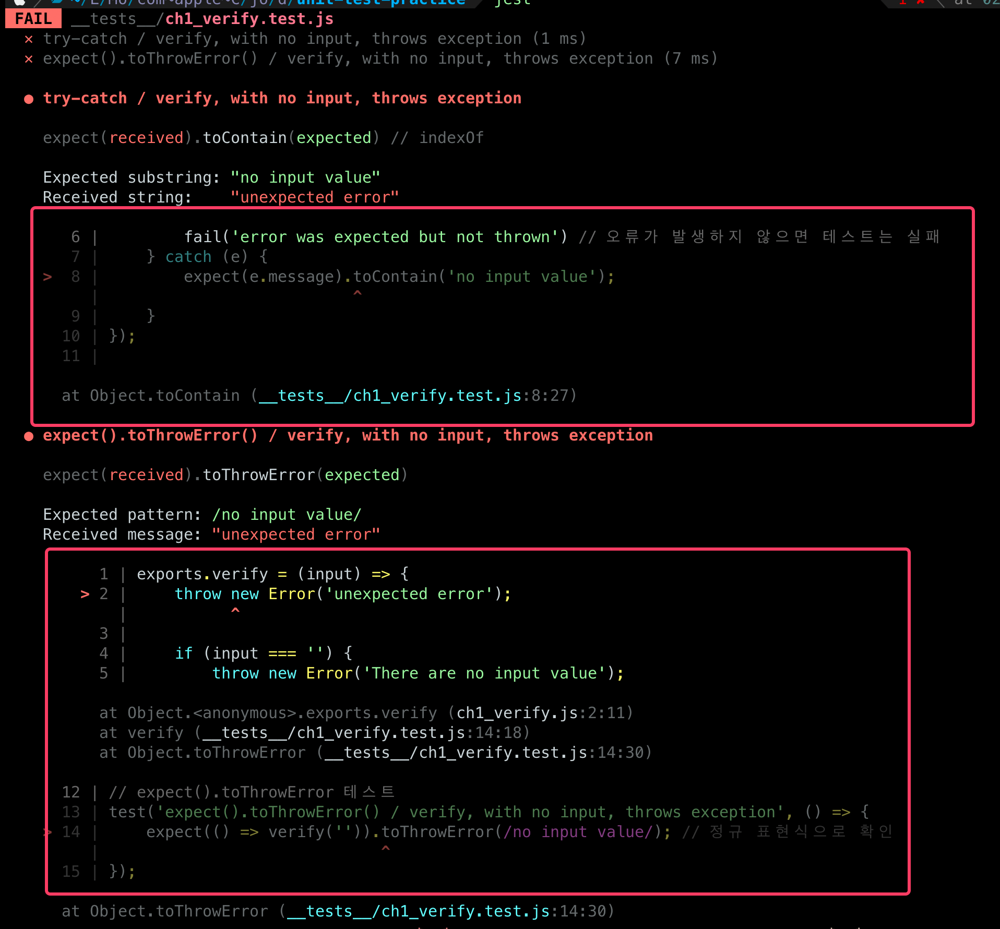

<!-- 단순한 책 내용만 정리하는 스터디에서 벗어나 자신의 생각을 정리하고, 그걸 바탕으로 실무에 적용할 수 있는 내용을 찾는 스터디가 되었으면 좋겠습니다. -->
<!-- 참고한 글 - https://tech.kakaopay.com/post/frontend-study-journey/ -->

> [!NOTE]   
> ch2 첫 번째 단위 테스트 (p72 ~ p116)

## Summary
<!-- 한 줄 요약을 통해 발표자는 본인이 주제를 정확하게 이해했는지 점검하고, 스터디원들은 한 눈에 주제를 파악할 수 있습니다. -->
- 단위 테스트 프레임워크를 사용해 테스트 코드의 일관된 형식을 유지하고, 쉽게 테스트를 반복할 수 있으며 신뢰성과 시간 절약, 공동의 이해를 가져올 수 있다.
- 테스트 코드는 AAA 패턴 - 준비(Arrange), 실행(Act), 검증(Assert)로 작성한다.
- 테스트 코드의 이름은 USE(Unit, Senario, Expectation) 전략을 따라 짓는다.
- jest 프레임워크에서는 describe로 구역을 나누고 test(it) 함수에 테스트 코드를 작성할 수 있다.
- beforeEach 함수를 통해 테스트마다 반복되는 작업을 자동화할 수 있으나 스크롤 피로감을 유발하기에 팩토리 함수를 사용하는 것을 추천한다.

## Concept
<!-- 책을 바탕으로 발표 주제의 이론적 개념 및 필요한 배경 지식을 설명합니다. -->
### 단위 테스트 프레임워크가 제공하는 기능
1. 테스트 코드의 일관된 형식
2. 반복성
3. 신뢰성과 시간 절약
4. 공동의 이해

### AAA 패턴
- 테스트 코드는 준비(Arrange), 실행(Act), 검증(Assert) 순서의 AAA 패턴으로 작성한다.

```js
const verifyPassword = (input, rules) => {
    const errors = [];

    rules.forEach(rule => {
        const result = rule(input);

        if (!result.passed) {
            errors.push(`error ${result.reason}`);
        }
    });

    return errors;
}
```

매개변수로 전달된 rules 함수 배열을 반복하며 입력값 input에 적용하고 결과가 통과하지 않으면 에러 메시지를 반환하는 errors 배열에 추가하는 비밀번호 검증 함수를 AAA 패턴을 적용해 테스트 해보자.

```js
test('badly named test', () => {
    const fakeRule = input => 
        ({ passed: false, reason: 'fake reason' }); // test 준비

    const errors = verifyPassword('any value', [fakeRule]); // 함수 실행

    expect(errors[0]).toMatch('fake reason'); // 검증
})
```

input이 들어오면 무조건 통과하지 못하는 rule을 반환하는 fakeRule 함수는 테스트를 위해 매개변수를 준비하는 단계이다.   
두 번째는 input 값과 위에서 준비한 fakeRule 함수를 매개변수로 보내 함수를 실행하는 과정이고,   
마지막은 함수의 반환 값을 검증하는 단계로 준비-실행-검증의 패턴을 따른다.
### USE 전략
- 테스트 코드에서는 이름을 명확히 짓는 것이 중요하다.
- 이름을 지을 때 고려해야 할 주요 요소는 아래 3가지이다.

1. 테스트 하려는 대상 - `Unit`
2. 입력 값이나 상황에 대한 설명 - `Senario`
3. 기대 값이나 결과에 대한 설명 - `Expectation`

위에서 작성한 테스트 코드를 USE 전략에 맞춰 수정하면 아래와 같다.

```js
// USE 전략에 맞춰 수정
test('verifyPassword, given a failing rule, return errors', () => {
    const fakeRule = input => 
        ({ passed: false, reason: 'fake reason' }); 

    const errors = verifyPassword('any value', [fakeRule]); 

    expect(errors[0]).toContain('fake reason'); 
})
```

> [!TIP]   
> 문자열을 검증할 때는 `toMatch()` 처럼 문자열 전체를 비교하는 함수보다 `toContain()` 같이 일부 문자열이 포함 되었는지를 검증하는 것이 유지 보수에 좋다.

### describe와 it
- jest에서는 `describe()` 를 통해 테스트 코드 구조를 체계적으로 나누어 관리할 수 있다.
```js
describe('verifyPassword', () => {
    // 중첩된 describe도 가능
    describe('with a failing rule', () => {
        test('return errors', () => {

        });
    });
});
```
- `it()` 함수는 `test()` 의 alias로 같은 역할을 한다.
   - 원어민의 입장에서는 describe - test 구조보다 describe - it의 구조가 더 이해하기 쉽다고 한다.
```js
describe('verifyPassword', () => {
    describe('with a failing rule', () => {
        // describe - it
        it('return errors', () => { 

        });
    });
});
```
### stateful 한 코드에서의 테스트 코드
위에서 테스트 한 `verifyPassword` 함수를 상태값을 가진 stateful 한 객체 코드로 만들어보자.
이렇게 하면 애플리케이션에 동일한 객체를 사용해 어느 곳에서는 rule을 추가하거나, 어디선 password를 검증할 수도 있게된다.
```js
class PasswordVerifier1 {
    constructor() {
        this.rules = [];
    }

    addRule(rule) {
        this.rules.push(rule);
    }

    verify(input) {
        const errors = [];
        this.rules.forEach(rule => {
            const result = rule(input);
            if (result.passed === false) {
                errors.push(result.reason);
            }
        });

        return errors;
    } 
}
```
이렇게 클래스 기반 접근 방식으로 변경되었을 때 기존의 테스트 코드는 아래처럼 변경되어야한다.
```js
describe('verifyPassword', () => {
    describe('with a failing rule', () => {
        it('has an error message based on the rule.reason', () => { 
            const verifier = new PasswordVerifier1(); // 추가
            const fakeRule = () => ({
                passed: false,
                reason: 'fake reason',
            });

            verifier.addRule(fakeRule); // 추가
            const errors = verifier.verify('any value');

            expect(errors[0]).toContain('fake reason');
        });
    });
});
```
서로 연관된 addRule, verify 함수가 상태 값을 다루는 코드 특성상 결합되어야만 한다.   
이 때, 종료점이 여러개이거나 동일한 종료점에서 여러 값을 테스트하고자 할 때 문제가 생길 수 있다.

```js
verifier.addRule(fakeRule); 

const errors = verifier.verify('any value');

expect(errors.length).toBe(1); // 새롭게 추가한 검증 코드
expect(errors[0]).toContain('fake reason');
```

새롭게 추가한 검증 라인이 실패하면 두번째 검증 코드는 실행되지 않는다.   
이런 경우는 두 검증을 별도의 테스트로 분리하는 것이 효과적이다.

```js
describe('verifyPassword', () => {
    describe('with a failing rule', () => {
        it('has an error message based on the rule.reason', () => { 
            const verifier = new PasswordVerifier1(); 
            const fakeRule = () => ({
                passed: false,
                reason: 'fake reason',
            });

            verifier.addRule(fakeRule); 
            const errors = verifier.verify('any value');

            expect(errors[0]).toContain('fake reason');
        });

        it('has exactly one error', () => { 
            const verifier = new PasswordVerifier1(); 
            const fakeRule = () => ({
                passed: false,
                reason: 'fake reason',
            });

            verifier.addRule(fakeRule); 
            const errors = verifier.verify('any value');

            expect(errors.length).toBe(1);
        });
    });
});
```
### beforeEach()
위에서 테스트 케이스를 분리했지만, 중복된 코드가 너무 많다.   
이런 경우 중복 코드를 제거하기 위해 `beforeEach()` 를 사용하면 도움이 된다.

```js
describe('verifyPassword', () => {
    let verifier;

    beforeEach(() => {
        verifier = new PasswordVerifier1(); // verifier 변수는 하위 모든 테스트에서 사용 가능
    });

    describe('with a failing rule', () => {
        let fakeRule, errors;

        beforeEach(() => {
            fakeRule = () => ({
                passed: false,
                reason: 'fake reason',
            });
            verifier.addRule(fakeRule)
        });

        it('has an error message based on the rule.reason', () => { 
            errors = verifier.verify('any value');

            expect(errors[0]).toContain('fake reason');
        });

        it('has exactly one error', () => { 
            const errors = verifier.verify('any value');

            expect(errors.length).toBe(1);
        });
    });
});
```
- `beforeEach()` 함수는 각 테스트가 실행되기 전 한 번씩 실행된다.   
- 중복된 코드를 하나로 묶어 재사용할 수 있으며 위 예시 코드처럼 중첩해서 사용 가능하다.

다만 위 예시에서는 아래 2가지의 잠재적 문제가 존재한다.
1. `errors` 배열을 초기화하지 않아 사이드 이펙트가 존재할 수 있음
2. jest는 단위 테스트를 병렬로 실행하기 때문에 `verifier` 변수 같이 공유 되는 상태 값이 각 테스트가 병렬로 수행될 때 A 테스트의 상태를 B 테스트에서 덮어써 변경될 수 있다.

### beforEach() 함수와 스크롤 피로감
위 예시 코드에서는 `beforeEach()` 를 통해 중복 코드를 없앴지만 몇 가지 단점이 보인다.
1. `it` 테스트 부분만 보고 `verifier` 가 어디서 만들어졌는지 알기 어렵다.
2. 어떤 rule이 추가되었는지 이해하는 것이 어렵다. 

위 단점을 공통적으로 해결하기 위해선 스크롤을 올려서 직접 확인해야만 한다.   
이는 테스트가 많아질 수록 피로감을 느끼게 되는 요소이다.

### 팩토리 함수 사용
> [!TIP]
> - 팩토리 함수는 객체나 특정 상태를 쉽게 생성하고, 여러 곳에서 동일한 로직을 재사용할 수 있도록 도와주는 간단한 helper 함수이다.

위에서 단점을 느낀 테스트 코드를 팩토리 함수를 사용해 리팩터링 해보자   
추가적으로 성공 상태도 확인할 수 있도록 passingRule을 추가한 검증 코드를 추가한다.
```js
// beforEach => 팩토리 함수
const makeVerifier = () => new PasswordVerifier1();
const passingRule = () => ({ passed: true, reason: '' });

const makeVerifierWithPassingRule = () => {
    const verifier = makeVerifier();

    verifier.addRule(passingRule);

    return verifier;
}

const makeVerifierWithFailedRule = (reason) => {
    const verifier = makeVerifier();
    const fakeRule = () => ({ passed: false, reason });

    verifier.addRule(fakeRule);

    return verifier;
}

describe('PasswordVerifier', () => {
    describe('with a failing rule', () => {
        it('has an error message based on the rule.reason', () => {
            const verifier = makeVerifierWithFailedRule('fake reason');
            const errors = verifier.verify('any input');

            expect(errors[0]).toContain('fake reason');
        });
        ... 중략
    });

    describe('with a passing rule', () => {
        it('has no errors', () => {
            const verifier = makeVerifierWithPassingRule();
            const errors = verifier.verify('any input');

            expect(errors.length).toBe(0);
        });
    });

    describe('with a failing and a passing rule', () => {
        it('has an error', () => {
            const verifier = makeVerifierWithFailedRule('fake reason');
            verifier.addRule(passingRule);

            const errors = verifier.verify('any input');

            expect(errors.length).toBe(1);
        });
        ... 중략
    });
});
```
코드 길이는 여전히 길어 보이지만 `beforEach()` 사용 코드보다 가독성이 높고 유지 보수도 쉬어졌다.   
테스트를 읽었을 때, 객체가 어떻게 생성되는지는 몰라도 **언제** 생성되고 선언되는지 `it()` 내에서 이해할 수 있다.    
각 팩토리 함수 별로 상태를 캡슐화 하는 부분 역시 이점이다.

### 다양한 입력 값 검증
이번에는 아래처럼 input 값에 따라 결과 값이 달라지는 함수를 테스트 해보자.
```js
const oneUpperCaseRule = (input) => {
    return {
        passed: (input.toLowerCase() !== input),
        reason: 'at least one upper case needed',
    };
}
```

- 다양한 입력 값이 들어오는 상황 별로 검증하고 싶을 때, test 함수를 input 값 별로 나눌 수도 있다.
  - 하지만 결과적으로 테스트 코드 내부는 동일하기 때문에 중복 코드가 많아진다.
  - 함수 로직에 변경이 생길 때, 모든 테스트 코드를 수정해야 한다.
- 내부 코드가 같은데 입력 값만 다른 경우에는 `each()`를 사용하면 효과적이다. 

```js
describe('one uppercase rule', () => {
    test('given no uppercase, it fails', () => {
        const result = oneUpperCaseRule('abc');

        expect(result.passed).toEqual(false);
    });

    // 배열에 있는 값을 순회하며 테스트 
    test.each(['Abc', 'aBc'])('given one uppercase, it passes', (input) => {
        const result = oneUpperCaseRule(input);

        expect(result.passed).toEqual(true);
    });
});
```
만약 `expected` 값까지 포함해서 순회하고 싶다면 다음 처럼 전달하면 된다.

```js
describe('one uppercase rule', () => {
    test.each([
        ['Abc', true], 
        ['abc', false],
        ['aBc', true],
    ])('given %s, %s', (input, expected) => {
        const result = oneUpperCaseRule(input);

        expect(result.passed).toEqual(expected);
    });
});
```

### 오류 검증
- 특정 시점에 오류를 발생 시키는 코드를 테스트 할 때는 `try-catch` 보다 `expect().toThrowError()` 메서드를 사용한다.

```js
verify(input) {
    if (this.rules.length === 0) {
        throw new Error('There are no rules configured');
    }
    // 중략
}
```

```js
// try - catch 사용 테스트 
test('verify, with no rules, throws exception', () => {
    const verifier = makeVerifier();
    try {
        verifier.verify('any input');
        fail('error was expected but not thrown') // 오류가 발생하지 않으면 테스트는 실패
    } catch (e) {
        expect(e.message).toContain('no rules configured');
    }
});

// expect().toThrowError 테스트
test('verify, with no rules, throws exception', () => {
    const verifier = makeVerifier();
    expect(() => verifier.verify('any input')).toThrowError(/no rules configured/); // 정규 표현식으로 확인
});
```
- try-catch 구문을 사용하는 테스트 코드는 길고 번거롭다.
- try-catch 구문을 사용했을 때 오류가 발생하지 않을 경우 테스트가 실패하도록 별도 코드를 추가해야한다.
## Advantages
<!-- (선택) 발표 주제를 적용했을 때 얻을 수 있는 이점이나 해결할 수 있는 문제 상황들에 대해 설명합니다. -->
- 보통의 프로젝트에서 테스트 코드는 증가할 수 밖에 없는데 책에 언급된 것 처럼 팩토리 함수를 사용해 중복 코드를 줄이고 (재사용성을 증가시키고) 코드 가독성을 높이는데 도움을 줄 것으로 보인다.
## Disadvantages 
<!-- (선택) 발표 주제를 적용했을 때 발생할 수 있는 side effect나 trade-off에 대해 설명합니다. -->
- 때에 따라서는 `beforeEach()` 도 효과적으로 중복 코드를 제거해준다라고 생각한다. 
- 무작정 `beforeEach()` 를 안쓰는 것 보다는 상황에 따라 길이가 크게 길지 않거나 `beforeEach()` 내에서 직접 초기화 되는 상태 값 등이 없는 경우에는 팩토리 함수와 같이 섞어서 사용해도 좋을 것 같단 생각이 들었다.

## Example Case
<!-- 발표 주제가 적용되어 있는 라이브러리, 실제 업무에 적용되어 있는 코드, 직접 만든 예시 코드, 자신의 느낀점 등을 첨부하여 이해를 돕습니다. -->
에러 처리 테스트 부분이 흥미로웠는데 이전에 읽었던 블로그 글이 생각났다.   
[Jest로 Error 검증시 catch 보다는 expect - 출처: 기억보다 기록을](https://jojoldu.tistory.com/656)   

책에서도 언급된대로 에러 처리 검증에서는 반드시 실제로 예외인 상황인데 에러가 발생되지 않는 경우를 생각해야 한다.   
try-catch 문을 사용하면 항상 이런 케이스 검증을 위한 부가적인 일이 동반된다.    

책에서는 그 일을 `fail()`로 보여줬는데 책 p112에 언급 된 것 처럼 자스민 문법이라 보통은 `throw Error()` 등의 일을 부가적으롤 해야 `catch` 문으로 넘어가 테스트 할 수 있다.

예를 들어 어딘가에서 test도중 나도 모르게 rule이 덮어씌어져 `verifier.rule.length`가 0이 아닐 때 expect 검증 없이도 테스트가 완료 됨으로 테스트 케이스를 거짓으로 검증하게 된다.    
(예시로 책 코드를 사용했는데 의미만 보는게 좋을 것 같다.)  

그렇기에 catch 문으로 넘어가기 위한 에러 thrown이 꼭 필요한 것이다.
```js
// 예외 없이 완료
test('verify, with no rules, throws exception', () => {
    const verifier = makeVerifier();
    try {
        verifier.verify('any input');
    } catch (e) {
        expect(e.message).toContain('no rules configured');
    }
});

// 예외 케이스를 생각해 부가 적인 에러 thrown 필요
test('verify, with no rules, throws exception', () => {
    const verifier = makeVerifier();
    try {
        verifier.verify('any input');
        throw new Error('There are no rules configured');
    } catch (e) {
        expect(e.message).toContain('no rules configured');
    }
});
```

반면에 `expect().toThrowError()` 의 검증 방식은 의도한 대로 error thrown이 없을 때 따로 조치할 필요 없이 테스트에 실패하게 됨으로 이런 상황을 방지할 수 있다. 

여기에 추가적으로 해당 블로그 글을 읽어보며 새롭게 알게된 사실은 상세한 에러 trace 제공에 관한 것이다.

내가 의도한 에러와 다른 에러가 발생했을 때, try-catch 방식은 이미 catch 에서 에러를 잡았기 때문에 별도의 로깅 이외에는 trace를 추적할 정보가 없다고 한다.   

이 경우에도 마찬가지로 `expect().toThrowError()` 방식은 예상치 못한 에러도 trace 를 상세히 출력해준다고 한다.

이 경우를 직접 책에 나온 예시 코드를 약간 변형해서 테스트 해보았다.

```js
// input 이 빈문자열 일 때 no input 에러
exports.verify = (input) => {
    throw new Error('unexpected error'); // 일부러 예외 발생
    
    if (input === '') {
        throw new Error('There are no input value');
    }
}

```

테스트 코드를 아래처럼 작성했다.   
`input` 매개변수 값이 빈 문자열이면 발생하는 에러를 검증하는 코드지만, 사실은 `unexpected error` 가 발생한다.

```js
const { verify } = require('../ch1_verify')

test('try-catch / verify, with no input, throws exception', () => {
    try {
        verify('');
        fail('error was expected but not thrown') 
    } catch (e) {
        expect(e.message).toContain('no input value');
    }
});

// expect().toThrowError 테스트
test('expect().toThrowError() / verify, with no input, throws exception', () => {
    expect(() => verify('')).toThrowError(/no input value/);
});
```

실제로 테스트를 돌려보면 아래 사진과 같이 try-catch 는 trace가 catch문에서 끝나지만, 두번째 경우는 실제 exception이 발생한 코드 라인까지 상세한 trace 정보를 출력해주는 걸 볼 수 있다.




직접 확인해보니 책에 언급된 케이스 이외에 2번째 경우 때문에도 `expect().toThrowError()` 방식으로 검증해야겠다는 생각이 들었다.    

항상 업무를 하면서 당연히 `expect().toThrowError()` 방식으로 에러를 검증했었다.  
그냥 jest에서 제공하는 함수이고, 기존 테스트 코드도 다 이렇게 되어 있어서 사용한거지 왜 이 방식으로 에러를 검증하는게 맞는 지에 대해서 생각을 안해본 것 같다. 반성합니다.

항상 테스트 코드 검증 시 이 케이스가 성공한 경우 이외에 발생할 수 있는 예외에 대해서도 고민해야겠다.

## Wrap-up
<!-- 발표를 마무리하며 발표 주제를 다시 요약하고 정리합니다. -->
- AAA(Arrange-Act-Assert) 패턴은 테스트를 구조적으로 작성할 수 있도록 도와준다.
- 테스트 이름에는 작업 단위, 시나리오, 입력값 - 기대 결과 등을 포함하는 것이 좋고, 이 패턴을 USE 패턴이라 한다.
- jest의 `decribe()`를 통해 구조화 된 방식으로 구성할 수 있으며, 개별 테스트는 `test()` = `it()`으로 작성한다.
- jest의 `beforeEach()`를 통해 중복된 코드를 추출할 수 있다.
- `beforeEach()` 의 스크롤 피로감을 느낄 땐 팩토리 함수를 사용해 순수한 테스트 함수를 만들면 도움이 된다.

