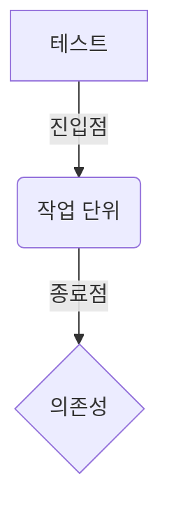
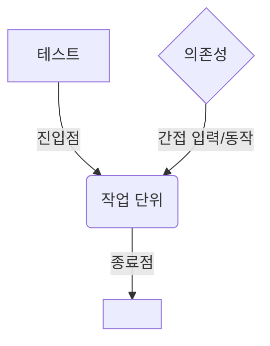
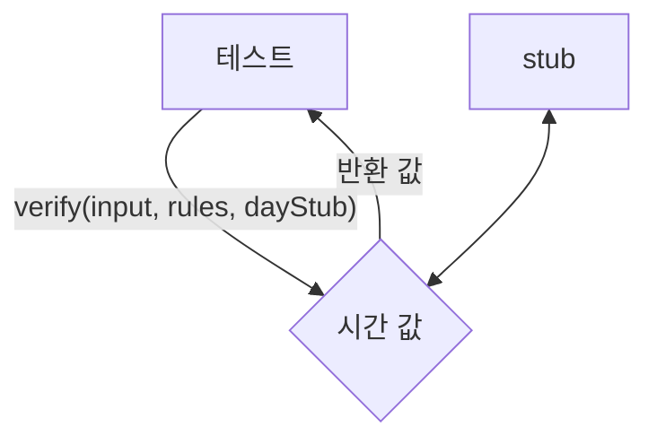

<!-- 단순한 책 내용만 정리하는 스터디에서 벗어나 자신의 생각을 정리하고, 그걸 바탕으로 실무에 적용할 수 있는 내용을 찾는 스터디가 되었으면 좋겠습니다. -->
<!-- 참고한 글 - https://tech.kakaopay.com/post/frontend-study-journey/ -->

> [!NOTE]   
> ch3 의존성 분리와 스텁 (p120 ~ p153)

## Summary
<!-- 한 줄 요약을 통해 발표자는 본인이 주제를 정확하게 이해했는지 점검하고, 스터디원들은 한 눈에 주제를 파악할 수 있습니다. -->
- 외부로 나가는 의존성이란 데이터베이스 저장, 로거, 외부 API 호출 등 종료점을 나타내는 의존성이다.
- 내부로 들어오는 의존성이란 데이터베이스 쿼리 결과, 파일 시스템의 내용 등 종료점을 나타내지 않는 의존성이다.
- stub은 내부로 들어오는 의존성을 끊어준다. 
- mock은 외부로 나가는 의존성을 끊어준다.
- 의존성 주입을 사용해 코드의 의존성을 제어할 수 있게 설계하면 테스트가 쉬워진다.

## Concept
<!-- 책을 바탕으로 발표 주제의 이론적 개념 및 필요한 배경 지식을 설명합니다. -->
### 의존성 유형
- 외부로 나가는 의존성
  - 작업 단위의 종료점을 나타내는 의존성
  - 로거 함수 호출, 데이터베이스 저장, 외부 API 호출 등의 작업


- 내부로 들어오는 의존성
  - 종료점을 나타내지 않는 의존성
  - 데이터베이스 쿼리 결과, 네트워크 응답 결과 등 이전 작업의 결과로 작업 단위로 들어오는 수동적인 데이터 조각을 의미



#### stub/mock 용어정리
| 카테고리 | 패턴 | 목적 | 사용법 |
| ----- | -------- | ---- | -------- |
|  | 테스트 더블 | 스텁과 목을 포함한 일반적인 이름 | |
| 스텁(stub) | 더미 객체 | 테스트에서 사용될 값을 지정하는데 사용 | 진입점에 매개변수로 보내거나 준비 단계에서 사용 |
| 스텁(stub) | 테스트 스텁 | 다른 소프트웨어 구성 요소의 간접 입력에 의존할 때 독립적으로 로직을 검증하는데 사용 | 의존성으로 주입하고 SUT에 특정 값이나 동작을 반환하도록 구성|
| 목(mock) | 테스트 스파이 | 다른 소프트웨어 구성 요소에 간접 출력을 보낼 때 독립적으로 로직을 검증하는데 사용 | 실제 객체의 메서드를 오버라이드하고, 함수가 예상대로 호출되었는지 확인한다.|
| 목(mock) | 모의 객체 | 다른 소프트웨어 구성 요소에 대한 간접 출력에 의존하는 경우 독립적으로 로직을 검증하는데 사용 | 가짜 객체를 SUT 의존성으로 주입하고, 가짜 객체가 예상대로 호출되었는지 확인한다. |

- **stub은 내부로 들어오는 의존성을 끊어준다.**
  - 가짜 모듈, 객체, 데이터 등을 코드 내부로 보내는 가짜 함수
  - stub은 검증하지 않는다.
  - 하나의 테스트에서 여러개의 stub을 사용할 수 있다.
- **mock은 외부로 나가는 의존성을 끊어준다.**
  - mock은 단위 테스트에서 종료점을 나타낸다.
  - 하나의 테스트에 mock은 하나만 사용하는 것이 일반적이다.

### stub을 사용하는 이유 
```js
const moment = require('moment');
const SUNDAY = 0;
const SATURDAY = 6;

const verifyPassword = (input, rules) => {
    const dayOfWeek = moment().day();

    if ([SATURDAY, SUNDAY].includes(dayOfWeek)) {
        throw Error("It's the weekend!");
    }
    // other codes ..
    return [];
}
```

이러한 함수에 대한 단위 테스트를 구현할 때 가장 큰 문제점이 뭘까?
바로 테스트 코드가 특정 요일에만 동작한다는 문제다.
라이브러리 시간에 의존하게 되면서 테스트를 실행하는 날짜에 큰 영향을 받게 된다.
좋은 테스트 코드의 기준은 **언제 실행하든 같은 결과를 보장해야 한다.**

### stub 설계 방식
- 함수를 사용한 방식
- 모듈을 이용한 방식
- 객체 지향을 이용한 방식

`verifyPassword()` 에 시간을 제어해야하는 2가지 이유가 있다.
- 테스트의 변동성을 없애기 위해
- 시간과 관련된 시나리오를 쉽게 테스트하기 위해

=> **stub으로 만든 시간을 매개변수로 주입**함으로써 시간을 제어할 수 있다.


### 함수를 사용한 주입 방법
- `verifyPassword` 함수를 리팩터링 해본다.
```js
const verifyPassword = (input, rules, getDayFn) => {
    const dayOfWeek = getDayFn();
     if ([SATURDAY, SUNDAY].includes(dayOfWeek)) {
        throw Error("It's the weekend!");
    }
    // other codes ..
    return [];
}
```
- `dayOfWeek` 을 결정하는 함수를 외부에서 직접 주입 받는다.
- 이럴 경우 테스트 코드는 아래처럼 적성할 수 있다.

```js
describe('verifyPassword', () => {
    test('on weekend, throw exceptions', () => {
        const alwaysSunday = () => SUNDAY;
        expect(() => verifyPassword('anything', [], alwaysSunday))
            .thThrowError("It's the weekend!");
    })
})
```
- `dayOfWeek`을 함수 내부에서 결정하지 않고 외부에서 주입 받기 때문에 더미 값을 뱉는 함수를 전달해 언제나 같은 테스트 결과를 받을 수 있다.

#### 부분 적용을 이용한 의존성 주입
- 팩토리 함수는 미리 정의된 컨텍스트를 가진 함수를 반환하는 함수로 고차함수의 일종이다.
- `verifyPassword` 함수에 전달된 `rule`, `getDayFn` 이 팩토리 함수가 반환하는 새로운 함수의 컨텍스트에 포함된다.

```js
const makeVerifier = (rules, dayOfWeekFn) => {
  return function(input) => {
    if ([SATURDAY, SUNDAY].includes(dayOfWeekFn())) {
      throw new Error("It's the weekend!");
    }
  }
}

describe('verifier', () => {
  test('factory method: on weekends, throw exception', () => {
    const alwaysSunday = () => SUNDAY;
    const verifyPassword = makeVerifier([], alwaysSunday);

    expect(() => verifyPassword('anything')).toThrow("It's the weekend!");
  })
})
```
- 테스트 코드의 준비 단계에서 팩토리 함수를 사용해 반환된 함수를 실행 단계에서 호출할 수 있다.
- 준비 단계에서 `rules`, `getDayFn` 을 인수로 전달해 팩토리 함수가 반환한 새로운 함수가 이들을 참조하도록 설정한다.

### 모듈을 이용한 주입 방법
```js
const moment = require('moment');

const verifyPassword = (input, rules) => {
  const dayOfWeek = moment().day();
  if ([SATURDAY, SUNDAY].includes(dayOfWeek)) {
      throw Error("It's the weekend!");
  }
  // other codes ..
  return [];
}
```
- 위 코드처럼 모듈을 직접 가져오는 경우에는 의존성 주입을 어떻게 처리할 수 있을까?
  - 해결할 수 없다. 
  - 해당 의존성을 다른 것으로 대체할 수 있도록 코드를 바꿔야한다.
  - 의존성을 대체할 수 있는 `seam(심)`을 만들어야 한다.

```js
const originalDependencies = {
  moment: require('moment')
}

let dependencies = { ...originalDependencies }; // 실제 의존성과 가짜 의존성을 담는 객체

const inject = (fakes) => {
  Object.assign(dependencies, fakes); // 실제 의존성에 가짜 의존성 추가 
  return function reset() { // 실제 의존성으로 되돌리는 함수
    dependencies = { ...originalDependencies };
  }; 
}

const verifyPassword = (input, rules) => {
  const dayOfWeek = dependencies.moment().day(); // 의존성 객체로 함수 호출
  if ([SATURDAY, SUNDAY].includes(dayOfWeek)) {
      throw Error("It's the weekend!");
  }
  // other codes ..
  return [];
}

module.exports = { verifyPassword, inject };
```
- `moment` 모듈을 직접 불러와 호출하던 부분을 `dependencies` 객체를 사용해 직접적인 의존성을 끊어냈다.
- 테스트 코드는 아래처럼 사용한다.
```js
const { inject, verifyPassword } = require('./password-verifier.js');

// 테스트가 모듈 의존성을 끊을 수 있도록 도와주는 헬퍼 함수
const injectDate = (newDay) => {
  const reset = inject({ // inject 함수를 호출해  moment를 테스트에서 사용할 가짜 의존성으로 대체
    moment: function () { // moment.js API 위조
      return {
        day: () => newDay,
      };
    };
  });

  return reset;
}

describe('verifier', () => {
  test('on weekends, throw exception', () => {
    const reset = injectDate(SATURDAY); // 가짜 날짜 전달

    expect(() => verifyPassword('anything')).toThrow("It's the weekend!");

    reset(); // 테스트 종료시 작업 단위 내 의존성 원복
  })
});
```
- 이렇게 가짜 의존성을 만들어 테스트 할 경우 비교적 쉽게 의존성 문제를 확실히 해결해주는 장점이 있다.
- 다만, **가짜로 만든 의존성에 매우 강하게 묶이게 되는 단점**도 존재한다.
  - 기존 모듈의 의존성을 새로운 모듈로 변경할 경우, 테스트를 전부 수정해야한다.
  - 이런 경우를 막기 위해선 서드파티 의존성을 코드에 직접 가져오기 보다 항상 제어할 수 있는 중간 추상화를 사용해야 한다. (`port`, `adapter` a.k.a `hexagoonal`, `onion` architecture)
  - 혹은 모듈 의존성 주입이 아닌 생성자나 인터페이스를 사용하는 것도 방법이다.

### 객체 지향적으로 의존성 주입
```js
class PasswordVerifier {
  constructor(rules, timeProvider) {
    this.rules = rules;
    this.timeProvider = timeProvider;
  }

  verify(input) {
    if ([SATURDAY, SUNDAY].includes(this.timeProvider.getDay())) {
      throw new Error("It's the weekend!");
    }
  }
}
```
- 생성자에 객체를 주입 받아 동작하도록 클래스로 코드를 변경하였다.
```js
import moment from 'moment';

const RealTimeProvider = () => {
  this.getDay = () => moment().day();
}
```
- `PasswordVerifier` class에 시간을 주입하기 위한 `RealTimeProvider` 를 만들어준다.

```js
const passwordVerifierFactory = (rules) => {
  return new PasswordVerifier(new RealTimeProvider());
}
```
- `PasswordVerifier` class 생성자 함수에 날짜/시간 값을 반환하는 `RealTimeProvider` 를 의존성으로 주입하는 역할을 한다.
- 앞으로는 `passwordVerifierFactory` 함수를 호출하면 날짜/시간 값에 의존하는 `PasswordVerifier` 클래스를 만들 수 있다.

이런 경우에는 의존성 주입을 위해 테스트 코드에서는 가짜 객체를 생성자에 주입해야한다.

```js
// RealTimeProvider 역할을 하는 가짜 객체 생성 함수
function FakeTimeProvider(fakeDay) {
  this.getDay = function () {
    return fakeDay;
  }
}

describe('verifier', () => {
  test('on weekends, thorws exception', () => {
    const verifier = new PasswordVerifier([], new FakeTimeProvider(SUNDAY));
    expect(() => verifier.verify('anything')).toThrow("It's the weekend!");
  });
});
```
- 가짜 객체를 `PasswordVerifier` class에 주입함으로써 의존성을 대체해 테스트를 진행할 수 있다.
- 다만, 이러한 방식은 C나 JAVA 같은 강타입 언어일 경우 올바르게 동작하지 않을 수 있다.
- JS는 `RealTimeProvider` 가 반환하는 객체와 `FakeTimeProvider` 가 반환하는 가짜 객체가 완전히 다른 객체이지만 동일한 함수라고 판단하기 때문에 문제가 없다.

### 공통 인터페이스 추출
- 강타입 언어를 사용할 경우 공통 인터페이스를 사용해 의존성의 역할을 명확히 정의할 수 있다.
- 타입스크립트를 예제로 사용해보자.

```js
export interface TimeProviderInterface {
  getDay(): number;
}
```

```js
export class RealTimeProvider implements TimeProviderInterface {
  getDay(): number {
    return moment().day();
  }
}
```
- `RealTimeProvider` 클래스는 `TimeProviderInterface` 를 구현한다.
```js
export class PasswordVerifier {
  private _timeProvider: TimeProviderInterface;

  constructor(rules: any[], timeProvider: TimeProviderInterface) {
    this._timeProvider = timeProvider;
  }
}
```
- `PasswordVerifier` 클래스의 생성자 매개변수가 `TimeProviderInterface` 타입의 의존성을 받도록 구현한다.
- 이제 `RealTimeProvider`의 구현체보다는 `TimeProviderInterface` 를 만족하기만 하면 어떤 구현체가 오든 상관 없도록 만들 수 있다.

```js
class FakeTimeProvider implements TimeProviderInterface {
  fakeDay: number;
  getDay(): number {
    return this.fakeDay;
  }
}

describe('verify', () => {
  test('on weekends, throws exception', () => {
    const stubTimeProvider = new FakeTimeProvider();
    stubTimeProvider.fakeDay = SUNDAY;
    
    const verifier = new PasswordVerifier([], stubTimeProvider);

    expect(() => verifier.verify('anything')).toThrow("It's the weekend!");
  });
});
```
- 이제 테스트 코드에서는 `TimeProviderInterface` 를 구현하는 가짜 구현체 `FakeTimeProvider`를 주입해 항상 원하는 날짜로 코드를 실행할 수 있게 된다.
- 공통 인터페이스를 추출하고, 인터페이스를 만족하는 구현체를 주입하는 방식을 통해 타입 언어에서도 사용할 수 있게 되었다.
## Advantages
<!-- (선택) 발표 주제를 적용했을 때 얻을 수 있는 이점이나 해결할 수 있는 문제 상황들에 대해 설명합니다. -->
- 제어 할 수 없는 의존성을 함수 내부가 아닌 외부에서 주입하는 방식으로 코드를 리팩터링해 테스트 코드가 의존성에 구애받지 않고 동작할 수 있게 한다. 
- 함수, 모듈, 객체 지향 등 다양한 방식으로 stub을 만들어 실제 프로젝트의 코드 스타일에 맞게 stub을 설계할 수 있다.

## Disadvantages 
<!-- (선택) 발표 주제를 적용했을 때 발생할 수 있는 side effect나 trade-off에 대해 설명합니다. -->

## Example Case
<!-- 발표 주제가 적용되어 있는 라이브러리, 실제 업무에 적용되어 있는 코드, 직접 만든 예시 코드, 자신의 느낀점 등을 첨부하여 이해를 돕습니다. -->
- 외부로 나가는 의존성은 함수의 종료점을 나타내기 때문에 테스트에서 1개의 mock만 사용한다는 실제 내가 만드는 테스트 코드는 무지성 mocking 중이어서 반성하게 되었다.
- stub과 mock에 대한 차이를 잘 모르고 있었는데 외부로 나가는 의존성 / 내부로 들어오는 의존성 개념에 따라 stub/mock을 분리해서 사용해야한다는 점을 이제 이해하게 되었다!
- 평소에 Nest.js를 사용하면서 의존성 주입을 당연하게 쓰고 있었는데, 의존성 주입 / 제어 역전을 프레임워크 단에서 다 해주고 있어서 크게 못 느꼈던 것 같다. 3장을 읽으며, 프레임워크 없이 직접 의존성 주입을 해보며 의존성을 제어할 수 있도록 코드를 작성하는게 테스트 코드를 더욱 쉽게 만든다는 걸 많이 느끼게 되었다.

## Wrap-up
<!-- 발표를 마무리하며 발표 주제를 다시 요약하고 정리합니다. -->
- stub은 내부로 들어오는 의존성을 끊어준다.
- mock은 외부로 나가는 의존성을 끊어준다.
- 제어할 수 없는 의존성을 외부에서 주입 받는 방식으로 제어를 역전해 테스트 코드를 일관성 있게 작성할 수 있다. 